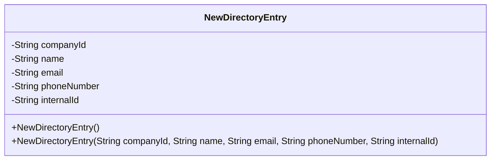
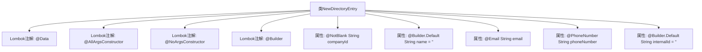

# 基础信息

|      |      |
|------|------|
| 名称 | NewDirectoryEntry |
| 编码语言 | .java |
| 代码路径 | staffjoy/company-api/src/main/java/xyz/staffjoy/company/dto/NewDirectoryEntry.java |
| 包名 | xyz.staffjoy.company.dto |
| 依赖项 | ['lombok.AllArgsConstructor', 'lombok.Builder', 'lombok.Data', 'lombok.NoArgsConstructor', 'xyz.staffjoy.common.validation.PhoneNumber', 'javax.validation.constraints.Email', 'javax.validation.constraints.NotBlank', 'javax.validation.constraints.NotEmpty'] |
| 概述说明 | Java类NewDirectoryEntry定义，包含公司ID、名称、邮箱、电话和内ID字段，使用Lombok注解简化代码。 |

# 说明

该内容定义了一个名为NewDirectoryEntry的Java类，使用了Lombok注解简化代码。类包含五个字段：companyId（非空字符串）、name（默认空字符串）、email（需符合邮箱格式）、phoneNumber（需符合电话号码格式）和internalId（默认空字符串）。通过@AllArgsConstructor和@NoArgsConstructor生成全参和无参构造器，@Builder提供建造者模式支持。字段验证通过@NotBlank、@Email和@PhoneNumber注解实现。

# 类列表 Class Summary

| 名称   | 类型  | 说明 |
|-------|------|-------------|
| NewDirectoryEntry | class | Java类NewDirectoryEntry，包含公司ID、名称、邮箱、电话和内ID字段，使用Lombok注解简化代码。 |

## 类 NewDirectoryEntry

|      |      |
|------|------|
| 访问范围 | @Data;@AllArgsConstructor;@NoArgsConstructor;@Builder;public |
| 类型 | class |
| 名称 | NewDirectoryEntry |
| 说明 | Java类NewDirectoryEntry，包含公司ID、名称、邮箱、电话和内ID字段，使用Lombok注解简化代码。 |

### UML类图

这段类图展示了一个名为NewDirectoryEntry的数据实体类，使用Lombok注解简化了代码结构。该类包含5个私有字段：必填的公司ID(companyId)、默认为空的名称(name)、需符合邮箱格式的email、需符合电话号码格式的phoneNumber以及默认为空的内部ID(internalId)。通过@Builder注解提供了建造者模式，@AllArgsConstructor和@NoArgsConstructor分别生成全参数和无参构造函数。整体设计用于存储目录条目信息，强调数据校验和灵活的对象构建方式。

### 内部方法调用关系图

该流程图展示了NewDirectoryEntry类的结构，包括其属性和Lombok注解。类包含五个属性：companyId（非空校验）、name（默认空字符串）、email（邮箱格式校验）、phoneNumber（电话号码格式校验）和internalId（默认空字符串）。类使用了Lombok的@Data、@AllArgsConstructor、@NoArgsConstructor和@Builder注解，自动生成getter/setter、全参构造器、无参构造器和建造者模式支持。

### 字段列表 Field List

| 名称  | 类型  | 说明 |
|-------|-------|------|
| companyId | String | 私有字符串类型变量companyId，非空。 |
| phoneNumber | String | 私有字符串类型电话号码变量。 |
| internalId = "" | String | 默认字符串internalId初始为空。 |
| email | String | 定义私有字符串类型变量email |
| name = "" | String | 默认字符串name初始化为空。 |

### 方法列表 Method List

| 名称  | 类型  | 说明 |
|-------|-------|------|

