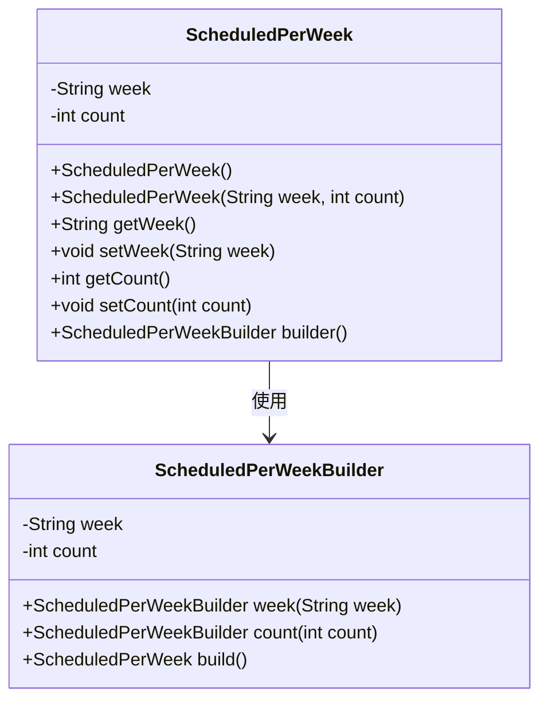
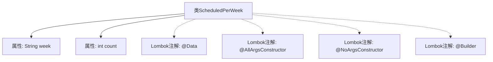

# 基础信息

|      |      |
|------|------|
| 名称 | ScheduledPerWeek |
| 编码语言 | .java |
| 代码路径 | staffjoy/company-api/src/main/java/xyz/staffjoy/company/dto/ScheduledPerWeek.java |
| 包名 | xyz.staffjoy.company.dto |
| 依赖项 | ['lombok.AllArgsConstructor', 'lombok.Builder', 'lombok.Data', 'lombok.NoArgsConstructor'] |
| 概述说明 | Java类ScheduledPerWeek，含week和count字段，支持全参无参构造及Builder模式。 |

# 说明

这是一个名为ScheduledPerWeek的Java类，使用了Lombok库的注解来简化代码。类中包含两个字段：week（字符串类型）和count（整型）。通过@AllArgsConstructor和@NoArgsConstructor注解自动生成全参和无参构造函数，@Builder注解提供了建造者模式支持。该类用于记录每周的调度次数统计信息。

# 类列表 Class Summary

| 名称   | 类型  | 说明 |
|-------|------|-------------|
| ScheduledPerWeek | class | 每周计划类，含周次和次数字段，支持全参、无参构造和建造者模式。 |

## 类 ScheduledPerWeek

|      |      |
|------|------|
| 访问范围 | @Data;@AllArgsConstructor;@NoArgsConstructor;@Builder;public |
| 类型 | class |
| 名称 | ScheduledPerWeek |
| 说明 | 每周计划类，含周次和次数字段，支持全参、无参构造和建造者模式。 |

### UML类图

这段代码定义了一个名为ScheduledPerWeek的Java类，使用了Lombok注解自动生成构造器、getter/setter和builder模式。类包含两个私有字段：week（字符串类型）和count（整型），通过@AllArgsConstructor和@NoArgsConstructor生成全参和无参构造器，@Builder注解为其添加了建造者模式支持。类图展示了主类与内部建造者类的关系，建造者类用于链式调用创建ScheduledPerWeek实例。整个结构适用于需要灵活创建具有周次和计数字段对象的场景。

### 内部方法调用关系图

这段代码定义了一个使用Lombok注解的ScheduledPerWeek类，包含week字符串和count整型两个属性。通过@Data自动生成getter/setter/equals等方法，@AllArgsConstructor和@NoArgsConstructor分别生成全参和无参构造器，@Builder提供建造者模式支持。流程图展示了类结构与注解的关联关系，体现了Lombok简化POJO类开发的特性。

### 字段列表 Field List

| 名称  | 类型  | 说明 |
|-------|-------|------|
| count | int | 私有整型变量count |
| week | String | 私有字符串变量week |

### 方法列表 Method List

| 名称  | 类型  | 说明 |
|-------|-------|------|

