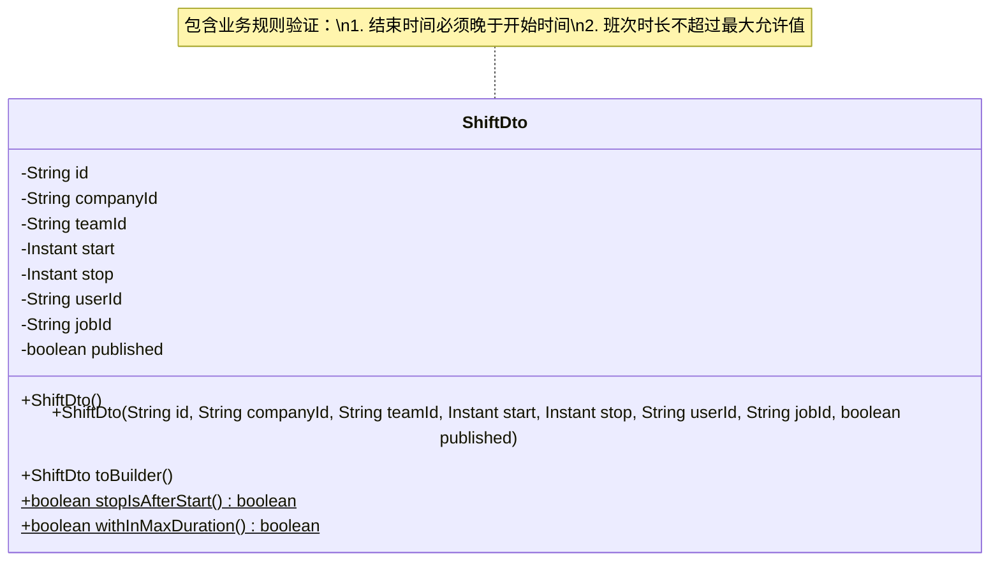
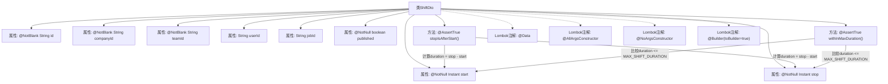

# 基础信息

|      |      |
|------|------|
| 名称 | ShiftDto |
| 编码语言 | .java |
| 代码路径 | staffjoy/company-api/src/main/java/xyz/staffjoy/company/dto/ShiftDto.java |
| 包名 | xyz.staffjoy.company.dto |
| 依赖项 | ['lombok.AllArgsConstructor', 'lombok.Builder', 'lombok.Data', 'lombok.NoArgsConstructor', 'javax.validation.constraints.AssertTrue', 'javax.validation.constraints.NotBlank', 'javax.validation.constraints.NotNull', 'java.time.Instant', 'xyz.staffjoy.company.dto.CreateShiftRequest.MAX_SHIFT_DURATION'] |
| 概述说明 | ShiftDto类包含班次ID、公司ID、团队ID、起止时间等字段，验证起止时间逻辑和最大时长限制。 |

# 说明

这是一个名为ShiftDto的Java类，用于表示班次数据传输对象。类中包含以下字段：必填的id、companyId、teamId，非空的start和stop时间戳，可选的userId和jobId，以及必须为true的published标志。类提供了全参构造器、无参构造器和建造器模式支持。包含两个验证方法：stopIsAfterStart确保结束时间晚于开始时间，withInMaxDuration检查班次时长不超过最大允许值。类使用了Lombok注解简化代码，并包含JSR303校验注解确保数据有效性。

# 类列表 Class Summary

| 名称   | 类型  | 说明 |
|-------|------|-------------|
| ShiftDto | class | ShiftDto类包含班次ID、公司ID、团队ID、起止时间、用户ID、岗位ID和发布状态，验证起止时间逻辑。 |

## 类 ShiftDto

|      |      |
|------|------|
| 访问范围 | @Data;@AllArgsConstructor;@NoArgsConstructor;@Builder(toBuilder=true);public |
| 类型 | class |
| 名称 | ShiftDto |
| 说明 | ShiftDto类包含班次ID、公司ID、团队ID、起止时间、用户ID、岗位ID和发布状态，验证起止时间逻辑。 |

### UML类图

类图描述：
ShiftDto是一个使用Lombok注解的数据传输对象，包含班次的核心字段如id、公司/团队标识、起止时间等。该类通过@Builder支持链式构建，并内置两个关键业务验证：stopIsAfterStart()确保时间顺序正确，withInMaxDuration()检查班次时长是否合规。私有字段通过注解实现非空校验，整体设计体现了领域模型的约束条件与DTO的数据传输特性。

### 内部方法调用关系图

这段代码定义了一个使用Lombok注解的ShiftDto类，包含多个带验证约束的字段和两个业务校验方法。流程图展示了类结构，包括8个核心属性（其中5个有非空校验）、两个验证方法（检查起止时间顺序和最大时长限制）以及Lombok提供的四个注解（自动生成getter/setter、构造器和建造者模式）。箭头连接显示了字段与方法间的数据依赖关系，特别是校验方法需要访问start和stop字段进行计算。

### 字段列表 Field List

| 名称  | 类型  | 说明 |
|-------|-------|------|
| published | boolean | 非空布尔类型变量published |
| jobId | String | 私有字符串类型变量jobId |
| start | Instant | 非空私有Instant类型变量start |
| id | String | 非空字符串ID字段 |
| teamId | String | 非空团队ID字符串字段。 |
| stop | Instant | 非空私有Instant变量stop |
| userId | String | 私有用户ID字符串变量。 |
| companyId | String | 私有字符串类型公司ID |

### 方法列表 Method List

| 名称  | 类型  | 说明 |
|-------|-------|------|
| stopIsAfterStart | boolean | 验证停止时间晚于开始时间 |
| withInMaxDuration | boolean | 检查班次时长是否超过最大允许值。 |

