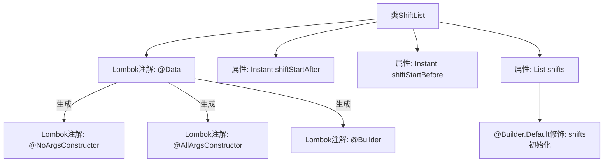

# 基础信息

|      |      |
|------|------|
| 名称 | ShiftList |
| 编码语言 | .java |
| 代码路径 | staffjoy/company-api/src/main/java/xyz/staffjoy/company/dto/ShiftList.java |
| 包名 | xyz.staffjoy.company.dto |
| 依赖项 | [None, 'java.time.Instant', 'java.util.ArrayList', 'java.util.List'] |
| 概述说明 | ShiftList类包含班次列表和起止时间。 |

# 说明

这是一个名为ShiftList的Java类定义，使用了Lombok库的注解来简化代码。类中包含三个主要字段：一个ShiftDto类型的列表（默认初始化为空ArrayList），以及两个Instant类型的时间戳字段shiftStartAfter和shiftStartBefore。类通过注解自动生成了无参构造函数、全参构造函数和建造者模式构造器。整个类结构用于存储和管理一组排班数据，并通过时间范围进行筛选。

# 类列表 Class Summary

| 名称   | 类型  | 说明 |
|-------|------|-------------|
| ShiftList | class | ShiftList类包含班次列表和起止时间。 |


## 类 ShiftList

|      |      |
|------|------|
| 访问范围 | @Data;@NoArgsConstructor;@AllArgsConstructor;@Builder;public |
| 类型 | class |
| 名称 | ShiftList |
| 说明 | ShiftList类包含班次列表和起止时间。 |


### UML类图

```mermaid
classDiagram
    class ShiftList {
        -List~ShiftDto~ shifts
        -Instant shiftStartAfter
        -Instant shiftStartBefore
        +ShiftList()
        +ShiftList(List~ShiftDto~ shifts, Instant shiftStartAfter, Instant shiftStartBefore)
        +List~ShiftDto~ getShifts()
        +void setShifts(List~ShiftDto~ shifts)
        +Instant getShiftStartAfter()
        +void setShiftStartAfter(Instant shiftStartAfter)
        +Instant getShiftStartBefore()
        +void setShiftStartBefore(Instant shiftStartBefore)
    }

    // ShiftList 使用 Lombok 注解自动生成构造器、getter/setter 和 builder 模式
    // 泛型 List~ShiftDto~ 表示包含 ShiftDto 对象的集合
    // Instant 类型用于存储时间戳，表示班次开始时间的过滤范围
```

这段代码定义了一个名为 `ShiftList` 的类，用于管理班次（Shift）数据集合及相关时间范围条件。类中包含三个核心字段：存储班次列表的 `shifts` 集合（默认初始化为空 ArrayList），以及两个时间戳字段 `shiftStartAfter` 和 `shiftStartBefore` 用于筛选班次起始时间范围。通过 Lombok 注解自动生成全参数/无参数构造器、所有字段的 getter/setter 方法，并支持 Builder 模式创建对象。该类适用于需要按时间范围查询班次数据的业务场景。


### 内部方法调用关系图



这段代码定义了一个使用Lombok注解的ShiftList类，包含三个主要属性：shifts列表（带默认初始化）、shiftStartAfter和shiftStartBefore时间戳。通过@Data注解自动生成getter/setter等方法，@Builder支持链式构造，@NoArgsConstructor和@AllArgsConstructor分别提供无参和全参构造函数。流程图清晰展示了类结构与Lombok注解的生成关系，突出了@Builder.Default对shifts列表的初始化控制。

### 字段列表 Field List

| 名称  | 类型  | 说明 |
|-------|-------|------|
| shifts = new ArrayList<>() | List<ShiftDto> | 默认初始化shifts为空列表。 |
| shiftStartAfter | Instant | 私有变量shiftStartAfter，类型为Instant。 |
| shiftStartBefore | Instant | 私有Instant变量shiftStartBefore |

### 方法列表 Method List

| 名称  | 类型  | 说明 |
|-------|-------|------|


