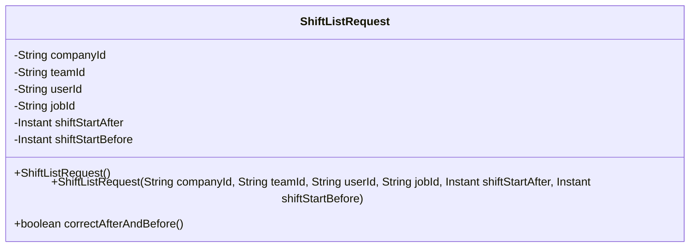
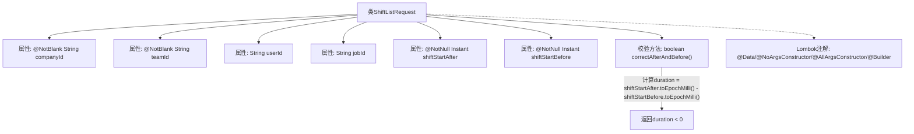

# 基础信息

|      |      |
|------|------|
| 名称 | ShiftListRequest |
| 编码语言 | .java |
| 代码路径 | staffjoy/company-api/src/main/java/xyz/staffjoy/company/dto/ShiftListRequest.java |
| 包名 | xyz.staffjoy.company.dto |
| 依赖项 | ['lombok.AllArgsConstructor', 'lombok.Builder', 'lombok.Data', 'lombok.NoArgsConstructor', 'java.time.Instant', 'javax.validation.constraints.AssertTrue', 'javax.validation.constraints.NotBlank', 'javax.validation.constraints.NotNull'] |
| 概述说明 | Java类ShiftListRequest，含公司、团队、用户、岗位ID及班次起止时间，验证时间逻辑。 |

# 说明

该内容定义了一个名为ShiftListRequest的Java类，用于请求排班列表数据。类中包含五个必填字段：公司ID、团队ID、用户ID、岗位ID以及排班开始时间的起止范围。类使用Lombok注解自动生成构造器和建造者模式，并通过校验注解确保字段非空。类内还定义了一个校验方法，确保排班开始时间的起始点必须早于结束点，否则会抛出验证错误信息。整体结构清晰，专注于排班查询条件的封装与校验。

# 类列表 Class Summary

| 名称   | 类型  | 说明 |
|-------|------|-------------|
| ShiftListRequest | class | 班次查询请求类，含公司、团队、用户、岗位ID及班次时间范围校验。 |

## 类 ShiftListRequest

|      |      |
|------|------|
| 访问范围 | @Data;@NoArgsConstructor;@AllArgsConstructor;@Builder;public |
| 类型 | class |
| 名称 | ShiftListRequest |
| 说明 | 班次查询请求类，含公司、团队、用户、岗位ID及班次时间范围校验。 |

### UML类图

这段代码定义了一个名为`ShiftListRequest`的类，用于表示排班列表请求的数据结构。该类包含6个私有字段：公司ID、团队ID、用户ID、职位ID、排班开始时间下限和上限，其中前两个字段有`@NotBlank`注解，时间字段有`@NotNull`注解。类提供了无参构造器、全参构造器，并通过Lombok注解实现了建造者模式。特别包含一个验证方法`correctAfterAndBefore()`，用于检查时间范围的合理性（开始下限必须早于上限），该方法使用`@AssertTrue`进行校验。整体设计符合请求参数验证的典型模式。

### 内部方法调用关系图

这段代码定义了一个使用Lombok注解的ShiftListRequest类，包含6个字段和1个校验方法。类通过@Data生成getter/setter，@Builder提供建造者模式，包含对companyId、teamId的非空校验，以及shiftStartAfter/Before的时间戳比对逻辑。correctAfterAndBefore()方法会验证shiftStartAfter必须早于shiftStartBefore，否则返回false并触发校验错误消息。整体结构清晰体现了请求参数的约束条件和业务规则验证。

### 字段列表 Field List

| 名称  | 类型  | 说明 |
|-------|-------|------|
| shiftStartAfter | Instant | 非空私有Instant类型变量shiftStartAfter |
| jobId | String | 私有字符串类型变量jobId。 |
| userId | String | 私有用户ID字符串变量。 |
| teamId | String | 非空团队ID字符串 |
| companyId | String | 非空公司ID字符串字段 |
| shiftStartBefore | Instant | 非空私有Instant类型变量shiftStartBefore |

### 方法列表 Method List

| 名称  | 类型  | 说明 |
|-------|-------|------|
| correctAfterAndBefore | boolean | 校验shift_start_after必须早于shift_start_before |

