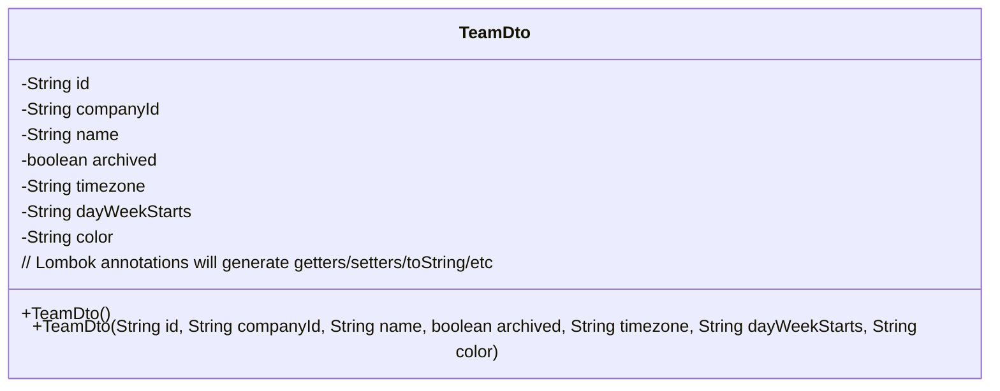
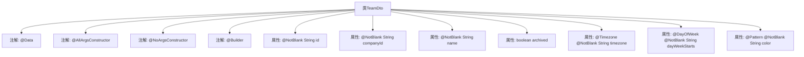

# 基础信息

|      |      |
|------|------|
| 名称 | TeamDto |
| 编码语言 | .java |
| 代码路径 | staffjoy/company-api/src/main/java/xyz/staffjoy/company/dto/TeamDto.java |
| 包名 | xyz.staffjoy.company.dto |
| 依赖项 | ['lombok.AllArgsConstructor', 'lombok.Builder', 'lombok.Data', 'lombok.NoArgsConstructor', 'xyz.staffjoy.common.validation.DayOfWeek', 'xyz.staffjoy.common.validation.Timezone', 'javax.validation.constraints.NotBlank', 'javax.validation.constraints.NotEmpty', 'javax.validation.constraints.NotNull', 'javax.validation.constraints.Pattern'] |
| 概述说明 | 团队数据传输对象，含ID、公司ID、名称、时区、周起始日、颜色等字段，带校验注解。 |

# 说明

这是一个名为TeamDto的Java数据传输对象类，用于表示团队信息。类中包含以下字段：id（非空字符串）、companyId（非空字符串）、name（非空字符串）、archived（布尔值）、timezone（带时区校验的非空字符串）、dayWeekStarts（带星期校验的非空字符串）、color（带十六进制颜色码校验的非空字符串）。类使用了Lombok注解自动生成全参构造器、无参构造器和建造器模式，方便对象创建和操作。所有字符串字段都标注了非空校验，部分字段还包含特定的格式校验。

# 类列表 Class Summary

| 名称   | 类型  | 说明 |
|-------|------|-------------|
| TeamDto | class | 团队数据传输对象，包含ID、公司ID、名称、时区、工作日起始、颜色等字段，支持构建器和校验。 |

## 类 TeamDto

|      |      |
|------|------|
| 访问范围 | @Data;@AllArgsConstructor;@NoArgsConstructor;@Builder;public |
| 类型 | class |
| 名称 | TeamDto |
| 说明 | 团队数据传输对象，包含ID、公司ID、名称、时区、工作日起始、颜色等字段，支持构建器和校验。 |

### UML类图

这段代码定义了一个名为TeamDto的Java数据传输对象类，使用了Lombok注解简化代码。该类包含7个字段：id、companyId、name、archived、timezone、dayWeekStarts和color，其中多个字段使用了验证注解如@NotBlank、@Timezone、@DayOfWeek和@Pattern来确保数据有效性。类上标注的@Builder、@AllArgsConstructor和@NoArgsConstructor注解表明Lombok会自动生成建造者模式和两种构造函数。这个类主要用于团队相关数据的传输和验证，字段设计涵盖了团队的基本信息、状态标志和显示偏好设置。

### 内部方法调用关系图

该流程图展示了TeamDto类的结构，包含7个属性和4个类级注解。所有字符串属性都标记了@NotBlank验证，timezone和dayWeekStarts有额外格式验证，color属性使用正则表达式验证十六进制颜色值。类通过Lombok注解实现了数据对象的标准功能（getter/setter、构造方法、builder等），体现了DTO(Data Transfer Object)的典型设计模式，用于在不同层之间传输结构化数据。

### 字段列表 Field List

| 名称  | 类型  | 说明 |
|-------|-------|------|
| timezone | String | 时区字段，非空字符串。 |
| companyId | String | 非空公司ID字符串 |
| archived | boolean | 私有布尔型变量archived |
| name | String | 非空字符串字段name |
| id | String | 非空字符串ID字段 |
| dayWeekStarts | String | 非空字符串字段，表示周起始日。 |
| color | String | 校验颜色字符串格式，非空且为十六进制值。 |

### 方法列表 Method List

| 名称  | 类型  | 说明 |
|-------|-------|------|

