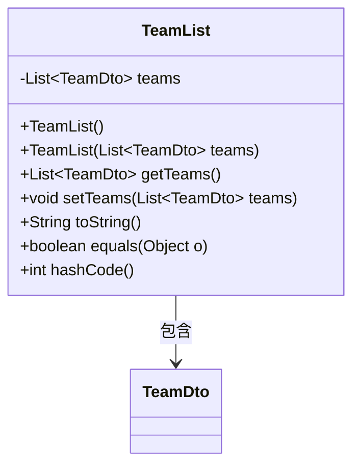
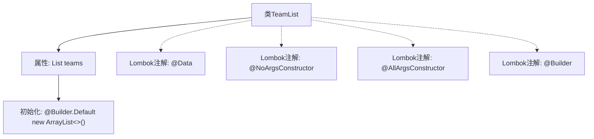

# 基础信息

|      |      |
|------|------|
| 名称 | TeamList |
| 编码语言 | .java |
| 代码路径 | staffjoy/company-api/src/main/java/xyz/staffjoy/company/dto/TeamList.java |
| 包名 | xyz.staffjoy.company.dto |
| 依赖项 | [None, 'java.util.ArrayList', 'java.util.List'] |
| 概述说明 | Java类TeamList，使用Lombok注解生成构造器和建造者模式，包含默认初始化的TeamDto列表。 |

# 说明

这是一个名为TeamList的Java类定义，使用了Lombok库的注解来简化代码。类中包含一个名为teams的私有成员变量，类型为TeamDto对象的列表，初始化为空的ArrayList。通过@NoArgsConstructor生成无参构造函数，@AllArgsConstructor生成全参构造函数，@Builder提供建造者模式支持，且teams字段用@Builder.Default指定了默认值。整个类设计用于存储和管理TeamDto对象的集合。

# 类列表 Class Summary

| 名称   | 类型  | 说明 |
|-------|------|-------------|
| TeamList | class | Java类TeamList，包含团队列表，使用Lombok注解简化代码。 |

## 类 TeamList

|      |      |
|------|------|
| 访问范围 | @Data;@NoArgsConstructor;@AllArgsConstructor;@Builder;public |
| 类型 | class |
| 名称 | TeamList |
| 说明 | Java类TeamList，包含团队列表，使用Lombok注解简化代码。 |

### UML类图

该类图展示了一个使用Lombok注解的TeamList类，它包含一个TeamDto类型的泛型列表。通过@Data注解自动生成getter/setter、toString、equals和hashCode方法，@NoArgsConstructor和@AllArgsConstructor分别生成无参和全参构造函数，@Builder提供建造者模式支持。类与TeamDto之间存在组合关系，表示TeamList由多个TeamDto对象组成。

### 内部方法调用关系图

这段流程图描述了TeamList类的结构，它是一个使用Lombok注解的POJO类。类包含一个泛型为TeamDto的List类型属性teams，该属性通过@Builder.Default注解初始化为空ArrayList。类上标注了@Data、@NoArgsConstructor、@AllArgsConstructor和@Builder四个Lombok注解，分别自动生成getter/setter、无参构造器、全参构造器和建造者模式相关代码。流程图清晰展示了类与属性、注解之间的从属关系。

### 字段列表 Field List

| 名称  | 类型  | 说明 |
|-------|-------|------|
| teams = new ArrayList<TeamDto>() | List<TeamDto> | 初始化团队列表为空ArrayList。 |

### 方法列表 Method List

| 名称  | 类型  | 说明 |
|-------|-------|------|

