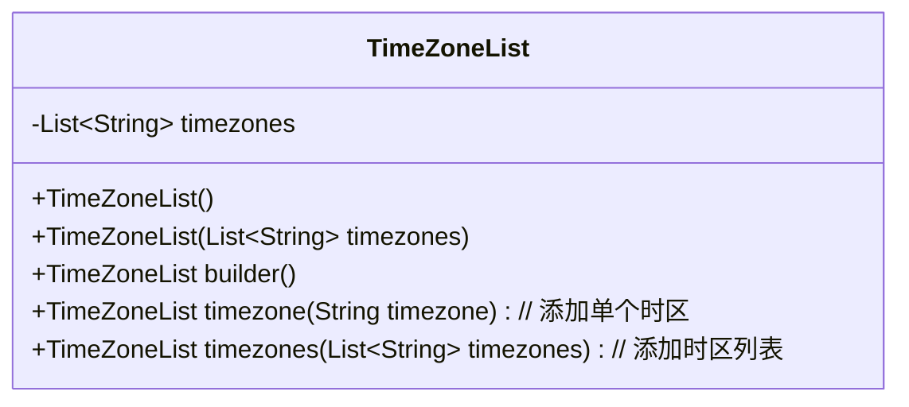
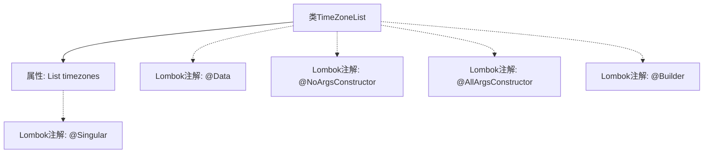

# 基础信息

|      |      |
|------|------|
| 名称 | TimeZoneList |
| 编码语言 | .java |
| 代码路径 | staffjoy/company-api/src/main/java/xyz/staffjoy/company/dto/TimeZoneList.java |
| 包名 | xyz.staffjoy.company.dto |
| 依赖项 | [None, 'java.util.List'] |
| 概述说明 | Java类TimeZoneList，包含时区列表，支持构造和构建。 |

# 说明

该内容描述了一个名为TimeZoneList的Java类，使用了Lombok库的注解简化代码。类中包含一个名为timezones的字符串列表属性，用于存储时区信息。通过@NoArgsConstructor生成无参构造器，@AllArgsConstructor生成全参构造器，@Builder提供建造者模式支持，@Singular允许逐个添加列表元素。这些注解自动生成常用方法，减少了样板代码。

# 类列表 Class Summary

| 名称   | 类型  | 说明 |
|-------|------|-------------|
| TimeZoneList | class | Java类TimeZoneList，包含时区列表，支持构造和构建操作。 |

## 类 TimeZoneList

|      |      |
|------|------|
| 访问范围 | @Data;@NoArgsConstructor;@AllArgsConstructor;@Builder;public |
| 类型 | class |
| 名称 | TimeZoneList |
| 说明 | Java类TimeZoneList，包含时区列表，支持构造和构建操作。 |

### UML类图

这段类图展示了使用Lombok注解的`TimeZoneList`类，该类用于管理时区列表。通过`@Builder`、`@NoArgsConstructor`和`@AllArgsConstructor`注解自动生成构造器和建造者模式方法，`@Singular`注解则提供了添加单个时区或批量添加时区的方法。类中核心字段是存储字符串类型时区的私有列表，通过Lombok简化了常规的getter/setter和构造器代码。

### 内部方法调用关系图

该流程图展示了TimeZoneList类的结构，这是一个使用Lombok注解简化代码的Java类。核心属性是存储时区字符串的List，通过@Data自动生成getter/setter，@NoArgsConstructor和@AllArgsConstructor分别提供无参和全参构造，@Builder支持建造者模式，@Singular用于优雅地处理集合元素添加。所有注解都通过Lombok在编译时生成对应代码，显著减少了样板代码量。

### 字段列表 Field List

| 名称  | 类型  | 说明 |
|-------|-------|------|
| timezones | List<String> | 定义私有时区字符串列表。 |

### 方法列表 Method List

| 名称  | 类型  | 说明 |
|-------|-------|------|

