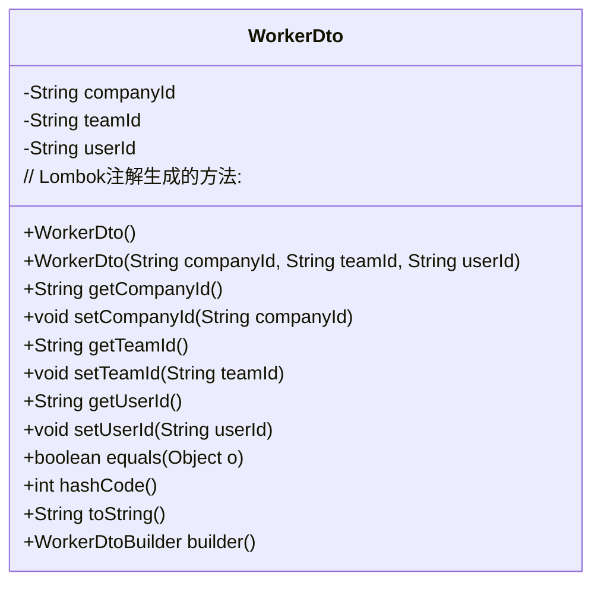
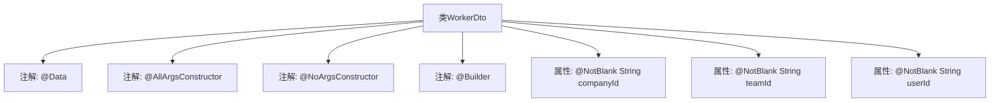

# 基础信息

|      |      |
|------|------|
| 名称 | WorkerDto |
| 编码语言 | .java |
| 代码路径 | staffjoy/company-api/src/main/java/xyz/staffjoy/company/dto/WorkerDto.java |
| 包名 | xyz.staffjoy.company.dto |
| 依赖项 | ['lombok.AllArgsConstructor', 'lombok.Builder', 'lombok.Data', 'lombok.NoArgsConstructor', 'javax.validation.constraints.NotBlank', 'javax.validation.constraints.NotEmpty'] |
| 概述说明 | WorkerDto类包含公司、团队和用户ID字段，使用Lombok注解简化代码。 |

# 说明

这是一个名为WorkerDto的Java数据传输对象类，使用了Lombok库的注解简化代码。类中包含三个非空字符串字段：companyId、teamId和userId。通过@AllArgsConstructor生成全参构造函数，@NoArgsConstructor生成无参构造函数，@Builder提供建造者模式支持。所有字段都标注了@NotBlank注解，确保传入值不能为null或空字符串。

# 类列表 Class Summary

| 名称   | 类型  | 说明 |
|-------|------|-------------|
| WorkerDto | class | WorkerDto类包含公司、团队和用户ID字段，使用Lombok注解简化代码。 |

## 类 WorkerDto

|      |      |
|------|------|
| 访问范围 | @Data;@AllArgsConstructor;@NoArgsConstructor;@Builder;public |
| 类型 | class |
| 名称 | WorkerDto |
| 说明 | WorkerDto类包含公司、团队和用户ID字段，使用Lombok注解简化代码。 |

### UML类图

该类图展示了WorkerDto的数据传输对象结构，通过Lombok注解自动生成全参/无参构造器、建造者模式以及Getter/Setter方法。类包含三个非空字符串字段：companyId、teamId和userId，用于表示工人的组织归属信息。注解驱动的设计简化了代码但隐含了编译器生成的11个标准方法，体现了DTO在Spring框架中简化数据传递的典型用法。

### 内部方法调用关系图

该流程图展示了WorkerDto类的结构，它是一个使用Lombok注解的数据传输对象。类包含三个非空字符串属性（companyId、teamId、userId），并通过@Data自动生成getter/setter，@AllArgsConstructor/@NoArgsConstructor提供全参和无参构造，@Builder支持建造者模式。所有属性均用@NotBlank注解确保非空验证，适用于企业级应用中的工人信息封装场景。

### 字段列表 Field List

| 名称  | 类型  | 说明 |
|-------|-------|------|
| companyId | String | 私有字符串类型公司ID |
| teamId | String | 非空团队ID字符串字段 |
| userId | String | 私有字符串类型用户ID |

### 方法列表 Method List

| 名称  | 类型  | 说明 |
|-------|-------|------|

