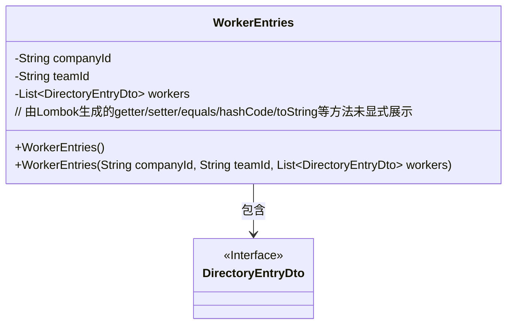
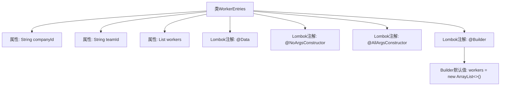

# 基础信息

|      |      |
|------|------|
| 名称 | WorkerEntries |
| 编码语言 | .java |
| 代码路径 | staffjoy/company-api/src/main/java/xyz/staffjoy/company/dto/WorkerEntries.java |
| 包名 | xyz.staffjoy.company.dto |
| 依赖项 | [None, 'java.util.ArrayList', 'java.util.List'] |
| 概述说明 | WorkerEntries类包含公司ID、团队ID和工人列表，支持无参、全参和构建器构造。 |

# 说明

这是一个名为WorkerEntries的Java类，使用了Lombok库的注解简化代码。类包含三个字段：companyId（公司ID，字符串类型）、teamId（团队ID，字符串类型）和workers（工人目录条目列表，初始化为空ArrayList）。通过@NoArgsConstructor生成无参构造器，@AllArgsConstructor生成全参构造器，@Builder提供建造者模式支持，其中workers字段使用@Builder.Default指定默认值。整个类用于存储与公司团队相关的工人条目数据。

# 类列表 Class Summary

| 名称   | 类型  | 说明 |
|-------|------|-------------|
| WorkerEntries | class | WorkerEntries类包含公司ID、团队ID和工人列表，支持无参、全参和构建器构造。 |

## 类 WorkerEntries

|      |      |
|------|------|
| 访问范围 | @Data;@NoArgsConstructor;@AllArgsConstructor;@Builder;public |
| 类型 | class |
| 名称 | WorkerEntries |
| 说明 | WorkerEntries类包含公司ID、团队ID和工人列表，支持无参、全参和构建器构造。 |

### UML类图

这段类图展示了WorkerEntries类及其与DirectoryEntryDto接口的关系。WorkerEntries是一个使用Lombok注解的数据类，包含公司ID、团队ID和工人列表三个核心字段，其中workers字段是DirectoryEntryDto接口的泛型列表。类通过@NoArgsConstructor和@AllArgsConstructor提供了无参和全参构造函数，@Builder支持链式构建模式。值得注意的是，workers字段通过@Builder.Default设置了空ArrayList作为默认值，体现了对集合初始化的防御性编程思想。

### 内部方法调用关系图

这段代码定义了一个使用Lombok注解的WorkerEntries类，包含companyId、teamId两个字符串属性和一个DirectoryEntryDto类型的列表workers。通过@Data自动生成getter/setter等方法，@NoArgsConstructor和@AllArgsConstructor分别生成无参和全参构造方法，@Builder提供建造者模式支持，并通过@Builder.Default将workers初始化为空ArrayList。该设计简化了POJO类的样板代码，便于快速创建包含默认值的对象实例。

### 字段列表 Field List

| 名称  | 类型  | 说明 |
|-------|-------|------|
| companyId | String | 私有字符串变量companyId |
| teamId | String | 私有字符串类型变量teamId |
| workers = new ArrayList<>() | List<DirectoryEntryDto> | 初始化空的DirectoryEntryDto列表workers。 |

### 方法列表 Method List

| 名称  | 类型  | 说明 |
|-------|-------|------|

