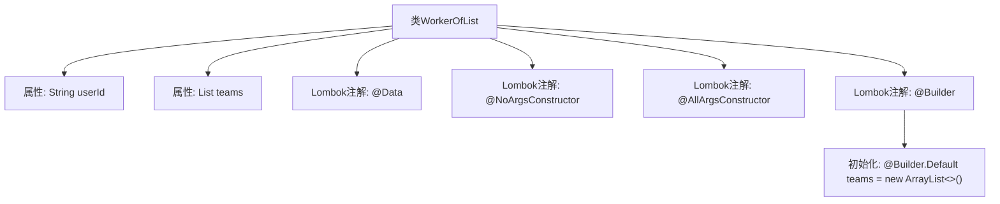

# 基础信息

|      |      |
|------|------|
| 名称 | WorkerOfList |
| 编码语言 | .java |
| 代码路径 | staffjoy/company-api/src/main/java/xyz/staffjoy/company/dto/WorkerOfList.java |
| 包名 | xyz.staffjoy.company.dto |
| 依赖项 | [None, 'java.util.ArrayList', 'java.util.List'] |
| 概述说明 | WorkerOfList类：含userId和默认空teams列表的构建类。 |

# 说明

这是一个名为WorkerOfList的Java类，使用了Lombok库的注解来简化代码。类中包含两个字段：userId（字符串类型）和teams（TeamDto类型的列表，默认初始化为空ArrayList）。类提供了无参构造器、全参构造器，并支持Builder模式创建对象。teams字段通过@Builder.Default设置了默认值。整个类设计用于表示包含用户ID及其所属团队列表的数据结构。

# 类列表 Class Summary

| 名称   | 类型  | 说明 |
|-------|------|-------------|
| WorkerOfList | class | WorkerOfList类：包含userId和teams列表，支持无参、全参构造和Builder模式。 |


## 类 WorkerOfList

|      |      |
|------|------|
| 访问范围 | @Data;@NoArgsConstructor;@AllArgsConstructor;@Builder;public |
| 类型 | class |
| 名称 | WorkerOfList |
| 说明 | WorkerOfList类：包含userId和teams列表，支持无参、全参构造和Builder模式。 |


### UML类图

```mermaid
classDiagram
    class WorkerOfList {
        -String userId
        -List~TeamDto~ teams
        +WorkerOfList()
        +WorkerOfList(String userId, List~TeamDto~ teams)
        +String getUserId()
        +void setUserId(String userId)
        +List~TeamDto~ getTeams()
        +void setTeams(List~TeamDto~ teams)
        +String toString()
        +boolean equals(Object o)
        +int hashCode()
    }
    // WorkerOfList 使用 Lombok 注解自动生成构造器、getter/setter 和 builder 模式
    // teams 字段通过 @Builder.Default 初始化为空 ArrayList
```

WorkerOfList 是一个使用 Lombok 注解的 Java 类，包含 userId 字符串和 TeamDto 泛型列表 teams 两个字段。通过 @Builder 支持链式构造，@Builder.Default 确保 teams 默认初始化为空 ArrayList。类自动生成无参/全参构造器、getter/setter、toString、equals 和 hashCode 方法，简化了 POJO 的样板代码。


### 内部方法调用关系图



这段代码展示了一个使用Lombok注解的Java类WorkerOfList，包含userId字符串属性和TeamDto列表属性。通过@Data自动生成getter/setter，@NoArgsConstructor/@AllArgsConstructor提供构造方法，@Builder实现建造者模式，并用@Builder.Default初始化teams为空ArrayList。流程图清晰呈现了类结构与注解间的层级关系。

### 字段列表 Field List

| 名称  | 类型  | 说明 |
|-------|-------|------|
| teams = new ArrayList<TeamDto>() | List<TeamDto> | 初始化团队列表为空数组。 |
| userId | String | 私有字符串变量userId |

### 方法列表 Method List

| 名称  | 类型  | 说明 |
|-------|-------|------|


