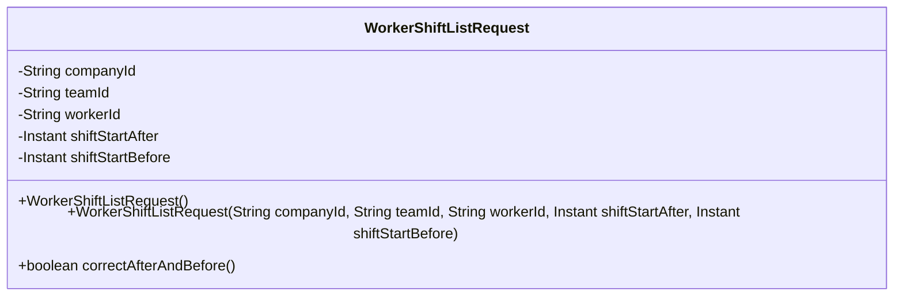
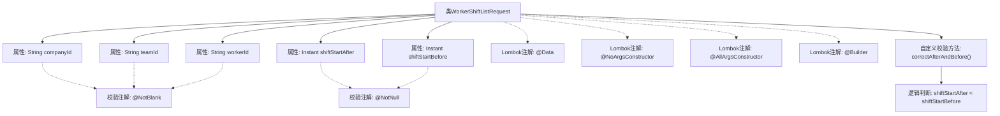

# 基础信息

|      |      |
|------|------|
| 名称 | WorkerShiftListRequest |
| 编码语言 | .java |
| 代码路径 | staffjoy/company-api/src/main/java/xyz/staffjoy/company/dto/WorkerShiftListRequest.java |
| 包名 | xyz.staffjoy.company.dto |
| 依赖项 | ['lombok.AllArgsConstructor', 'lombok.Builder', 'lombok.Data', 'lombok.NoArgsConstructor', 'javax.validation.constraints.AssertTrue', 'javax.validation.constraints.NotBlank', 'javax.validation.constraints.NotNull', 'java.time.Instant'] |
| 概述说明 | WorkerShiftListRequest类：含公司、团队、员工ID及班次时间范围校验。 |

# 说明

该内容定义了一个名为WorkerShiftListRequest的Java类，用于请求工人班次列表数据。类中包含五个必填字段：companyId（公司ID）、teamId（团队ID）、workerId（工人ID）、shiftStartAfter（班次开始时间下限）和shiftStartBefore（班次开始时间上限），均标注了非空校验注解。类还包含一个自定义校验方法correctAfterAndBefore，确保shiftStartAfter时间早于shiftStartBefore。类使用了Lombok注解自动生成无参构造器、全参构造器和建造者模式。

# 类列表 Class Summary

| 名称   | 类型  | 说明 |
|-------|------|-------------|
| WorkerShiftListRequest | class | WorkerShiftListRequest类：含公司、团队、员工ID及班次时间范围校验。 |

## 类 WorkerShiftListRequest

|      |      |
|------|------|
| 访问范围 | @Data;@NoArgsConstructor;@AllArgsConstructor;@Builder;public |
| 类型 | class |
| 名称 | WorkerShiftListRequest |
| 说明 | WorkerShiftListRequest类：含公司、团队、员工ID及班次时间范围校验。 |

### UML类图

该代码定义了一个名为WorkerShiftListRequest的类，用于表示工人班次列表请求。类中包含五个私有字段：companyId、teamId、workerId、shiftStartAfter和shiftStartBefore，分别表示公司ID、团队ID、工人ID、班次开始时间和班次结束时间。类提供了无参构造方法和全参构造方法，以及一个验证方法correctAfterAndBefore，用于确保shiftStartAfter时间早于shiftStartBefore时间。该类使用了Lombok注解简化代码，包括@Data、@NoArgsConstructor、@AllArgsConstructor和@Builder。

### 内部方法调用关系图

该流程图展示了WorkerShiftListRequest类的结构，包含5个核心属性和4个Lombok注解。关键点在于通过@NotBlank和@NotNull进行参数校验，以及自定义的correctAfterAndBefore方法验证时间顺序。方法内部通过比较shiftStartAfter和shiftStartBefore的时间戳确保开始时间早于结束时间，所有属性校验和业务规则验证形成完整的请求对象验证流程。

### 字段列表 Field List

| 名称  | 类型  | 说明 |
|-------|-------|------|
| shiftStartAfter | Instant | 非空字段，记录班次开始时间。 |
| shiftStartBefore | Instant | 非空私有Instant类型变量shiftStartBefore |
| teamId | String | 非空团队ID字符串 |
| companyId | String | 私有字符串类型公司ID |
| workerId | String | 非空字符串类型workerId字段 |

### 方法列表 Method List

| 名称  | 类型  | 说明 |
|-------|-------|------|
| correctAfterAndBefore | boolean | 检查shift_start_after是否早于shift_start_before。 |

