# 基础信息

|      |      |
|------|------|
| 名称 | xyz |
| 编码语言 | .java |
| 代码路径 | staffjoy/company-svc/src/main/java/xyz |
| 包名 | staffjoy.docs.company-svc.src.main.java.xyz |
| 概述说明 | 公司管理服务模块，包含实体类、控制器、服务、配置、仓库接口和启动类，支持组织架构、人员权限、班次调度等核心功能，采用Java、JPA、Lombok等技术实现。 |

# 说明

## 概述  
该代码模块是`company-svc`服务的完整实现，采用Java语言开发，基于Spring Boot框架构建。模块采用分层架构设计，包含以下核心组件：  
1. **实体层**：使用JPA进行持久化，通过Lombok简化代码，主键采用UUID策略生成。  
2. **控制层**：提供REST API接口，遵循权限验证流程，返回标准化响应。  
3. **服务层**：实现业务逻辑，集成Sentry监控和DTO转换。  
4. **数据访问层**：基于Spring Data JPA，提供CRUD和复杂查询功能。  
5. **配置层**：处理Swagger文档生成和异步任务配置。  

模块通过Feign客户端与其他服务（如Account、Bot）交互，并采用统一的异常处理和审计日志机制。

## 主要业务场景  
1. **公司基础信息管理**  
   - 公司创建、查询、更新及归档状态管理  
   - 多角色访问控制（用户/内部服务/认证用户）  

2. **组织架构管理**  
   - 团队创建与维护（含时区、颜色标识）  
   - 岗位(Job)设置与分类管理  
   - 成员目录(Directory)维护与账户同步  

3. **人员权限管理**  
   - 员工(Worker)入职与团队分配  
   - 管理员(Admin)权限分配与验证  
   - 细粒度的层级权限控制（公司→团队→成员）  

4. **班次调度管理**  
   - 班次(Shift)全生命周期管理（创建/发布/更新）  
   - 多维度查询（团队/用户/职位）  
   - 批量操作与变更通知推送  

5. **系统支撑功能**  
   - Swagger API文档自动生成  
   - 异步任务处理（线程池配置）  
   - 错误监控(Sentry)与审计日志  

**总结**：该模块为企业提供了一套完整的组织架构和人员管理解决方案，覆盖从基础信息维护到复杂排班调度的全业务流程，兼具功能完备性和系统可靠性。

### 包内部结构视图

```mermaid
graph TD
    company --> CompanyApplication.java
    company --> model
    company --> controller
    company --> service
    company --> config
    company --> repo
    model --> Directory.java
    model --> Shift.java
    model --> Team.java
    model --> Company.java
    model --> Admin.java
    model --> Worker.java
    model --> Job.java
    controller --> DirectoryController.java
    controller --> AdminController.java
    controller --> JobController.java
    controller --> TeamController.java
    controller --> CompanyController.java
    controller --> WorkerController.java
    controller --> ShiftController.java
    service --> helper
    service --> PermissionService.java
    service --> DirectoryService.java
    service --> InternalService.java
    service --> ShiftService.java
    service --> AdminService.java
    service --> WorkerService.java
    service --> TeamService.java
    service --> TimeZoneService.java
    service --> JobService.java
    service --> CompanyService.java
    helper --> ServiceHelper.java
    helper --> ShiftHelper.java
    config --> SwaggerConfig.java
    config --> AppConfig.java
    repo --> TeamRepo.java
    repo --> WorkerRepo.java
    repo --> ShiftRepo.java
    repo --> CompanyRepo.java
    repo --> JobRepo.java
    repo --> DirectoryRepo.java
    repo --> AdminRepo.java
```

该流程图展示了company-svc项目的核心结构，包含7个主模块：模型、控制器、服务、配置、仓库等。模型层定义了公司、团队、职位等核心实体；控制器层处理各类业务请求；服务层包含业务逻辑和辅助工具；配置层管理应用设置；仓库层负责数据持久化。各模块间通过清晰的层级关系组织，形成完整的微服务架构。

# 文件列表 File List

| 名称   | 类型  | 说明 |
|-------|------|-------------|
| [staffjoy](staffjoy/_module.md) | package | 公司管理服务模块，包含实体类、控制器、服务、配置、仓库接口和启动类，支持组织架构、人员权限、班次调度等核心功能，采用Java、JPA、Lombok等技术实现。 |

