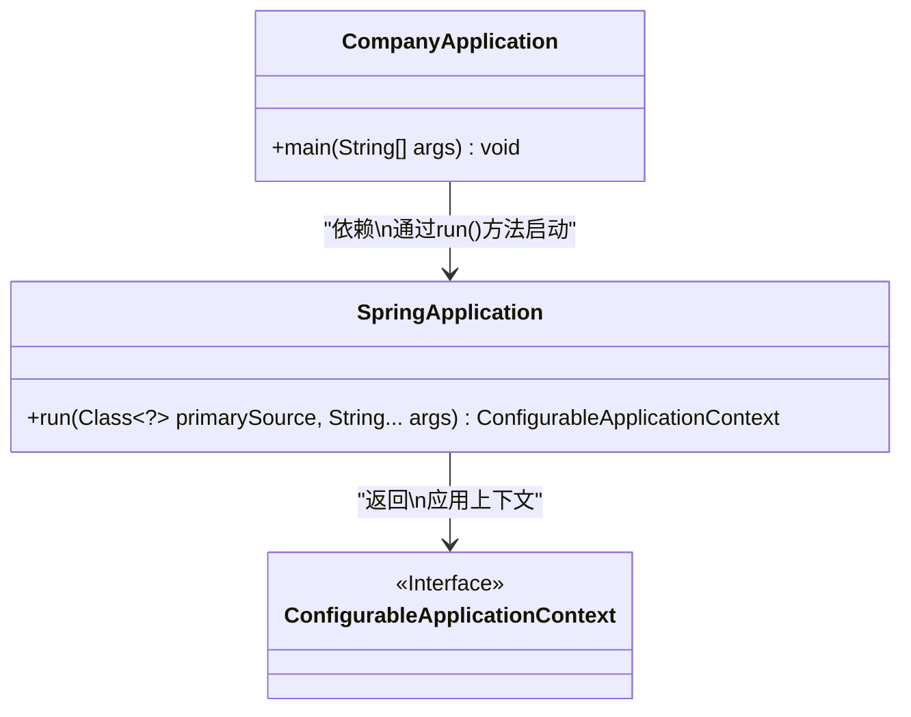
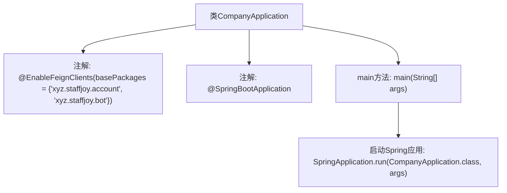

# 基础信息

|      |      |
|------|------|
| 名称 | CompanyApplication |
| 编码语言 | .java |
| 代码路径 | staffjoy/company-svc/src/main/java/xyz/staffjoy/company/CompanyApplication.java |
| 包名 | xyz.staffjoy.company |
| 依赖项 | ['org.springframework.boot.SpringApplication', 'org.springframework.boot.autoconfigure.SpringBootApplication', 'org.springframework.cloud.openfeign.EnableFeignClients', 'org.springframework.context.annotation.ComponentScan'] |
| 概述说明 | SpringBoot应用启用FeignClients扫描指定包路径。 |

# 说明

这是一个Spring Boot应用程序的启动类，名为CompanyApplication。类上标注了@SpringBootApplication注解，表明这是一个Spring Boot应用的主配置类。同时使用了@EnableFeignClients注解，指定了要扫描Feign客户端的两个基础包路径：xyz.staffjoy.account和xyz.staffjoy.bot。main方法是程序入口，通过SpringApplication.run启动整个应用。整个类结构简洁，主要完成应用初始化和Feign客户端启用的功能。

# 类列表 Class Summary

| 名称   | 类型  | 说明 |
|-------|------|-------------|
| CompanyApplication | class | SpringBoot应用启用Feign客户端扫描指定包路径。 |

## 类 CompanyApplication

|      |      |
|------|------|
| 访问范围 | @EnableFeignClients(basePackages = {"xyz.staffjoy.account", "xyz.staffjoy.bot"});@SpringBootApplication;public |
| 类型 | class |
| 名称 | CompanyApplication |
| 说明 | SpringBoot应用启用Feign客户端扫描指定包路径。 |

### UML类图

这段类图展示了Spring Boot应用的启动过程。CompanyApplication作为主类，通过SpringApplication.run()方法启动应用，该方法返回一个实现了ConfigurableApplicationContext接口的应用上下文对象。@EnableFeignClients注解表明该应用启用了Feign客户端功能，用于服务间通信。整个结构体现了Spring Boot应用的典型启动流程和核心组件间的交互关系。

### 内部方法调用关系图

这段代码是一个Spring Boot应用的启动类，使用@EnableFeignClients注解启用Feign客户端功能并指定扫描的基础包路径，同时通过@SpringBootApplication标记为Spring Boot应用入口。main方法中调用SpringApplication.run启动应用，该流程图清晰地展示了类结构、注解配置和启动流程的层级关系。

### 字段列表 Field List

| 名称  | 类型  | 说明 |
|-------|-------|------|

### 方法列表 Method List

| 名称  | 类型  | 说明 |
|-------|-------|------|
| main | void | Java启动Spring应用的main方法。 |

