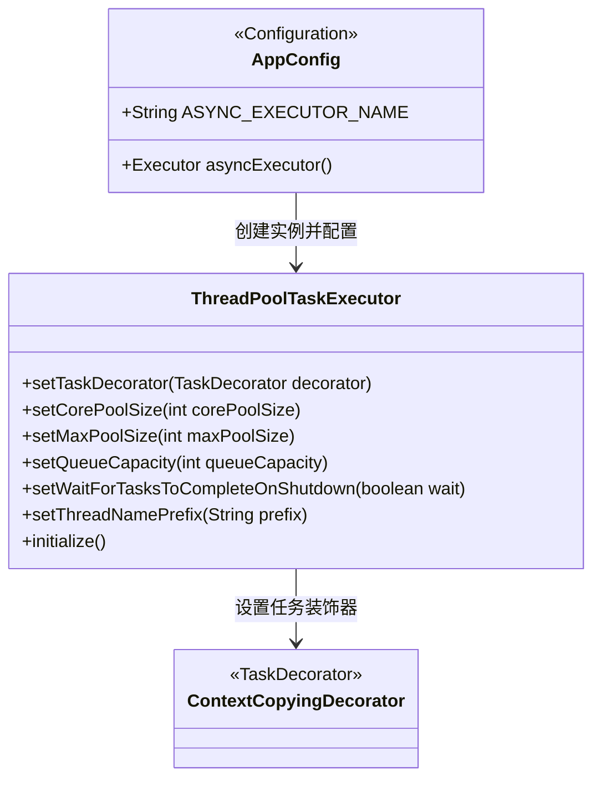
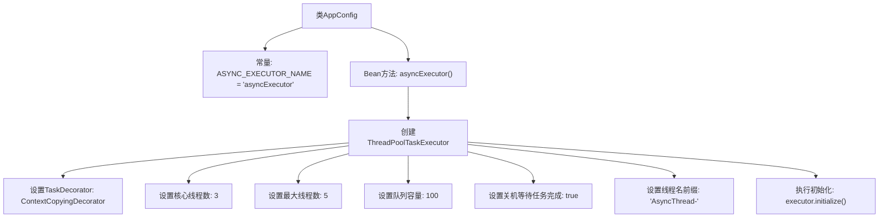

# 基础信息

|      |      |
|------|------|
| 名称 | AppConfig |
| 编码语言 | .java |
| 代码路径 | staffjoy/company-svc/src/main/java/xyz/staffjoy/company/config/AppConfig.java |
| 包名 | xyz.staffjoy.company.config |
| 依赖项 | ['org.springframework.context.annotation.Bean', 'org.springframework.context.annotation.Configuration', 'org.springframework.context.annotation.Import', 'org.springframework.scheduling.annotation.EnableAsync', 'org.springframework.scheduling.concurrent.ThreadPoolTaskExecutor', 'xyz.staffjoy.common.async.ContextCopyingDecorator', 'xyz.staffjoy.common.config.StaffjoyRestConfig', 'java.util.concurrent.Executor'] |
| 概述说明 | 配置类启用异步，定义线程池执行器，核心3最大5队列100。 |

# 说明

这是一个名为AppConfig的Java配置类，主要用于配置异步任务执行器。类上标注了@Configuration、@EnableAsync和@Import注解，表示这是一个配置类，启用了异步支持，并导入了StaffjoyRestConfig配置。类中定义了一个名为asyncExecutor的线程池任务执行器Bean，其线程名前缀为AsyncThread-，核心线程数为3，最大线程数为5，队列容量为100，并设置了任务关闭等待和上下文复制装饰器。该执行器通过ASYNC_EXECUTOR_NAME常量进行标识。

# 类列表 Class Summary

| 名称   | 类型  | 说明 |
|-------|------|-------------|
| AppConfig | class | 配置类启用异步，定义线程池执行器，核心3最大5队列100。 |

## 类 AppConfig

|      |      |
|------|------|
| 访问范围 | @Configuration;@EnableAsync;@Import(value = {StaffjoyRestConfig.class});@SuppressWarnings(value = "Duplicates");public |
| 类型 | class |
| 名称 | AppConfig |
| 说明 | 配置类启用异步，定义线程池执行器，核心3最大5队列100。 |

### UML类图

这段类图展示了Spring配置类AppConfig的结构及其依赖关系。AppConfig作为配置类，通过@Bean方法创建并配置ThreadPoolTaskExecutor线程池实例，设置了核心线程数、最大线程数等参数，并使用ContextCopyingDecorator装饰器来传递上下文。ThreadPoolTaskExecutor是Spring提供的线程池实现类，ContextCopyingDecorator实现了TaskDecorator接口用于任务装饰。整个结构体现了异步任务执行器的Spring配置方式，通过合理的线程池参数配置确保异步任务高效执行。

### 内部方法调用关系图

这段代码是一个Spring配置类AppConfig，主要功能是配置一个异步执行器ThreadPoolTaskExecutor。通过@Bean注解定义了一个名为"asyncExecutor"的线程池，设置了核心线程数3、最大线程数5、队列容量100等参数，并配置了线程名前缀和关机行为。特别的是使用了ContextCopyingDecorator来传递请求上下文，确保异步任务能获取到调用线程的上下文信息。整个流程从配置类开始，逐步完成线程池的创建和参数设置，最终返回初始化好的执行器实例。

### 字段列表 Field List

| 名称  | 类型  | 说明 |
|-------|-------|------|
| ASYNC_EXECUTOR_NAME = "asyncExecutor" | String | 异步执行器名称定义为asyncExecutor。 |

### 方法列表 Method List

| 名称  | 类型  | 说明 |
|-------|-------|------|
| asyncExecutor | Executor | 创建异步线程池，核心3最大5，队列100，支持上下文复制和优雅关闭。 |

