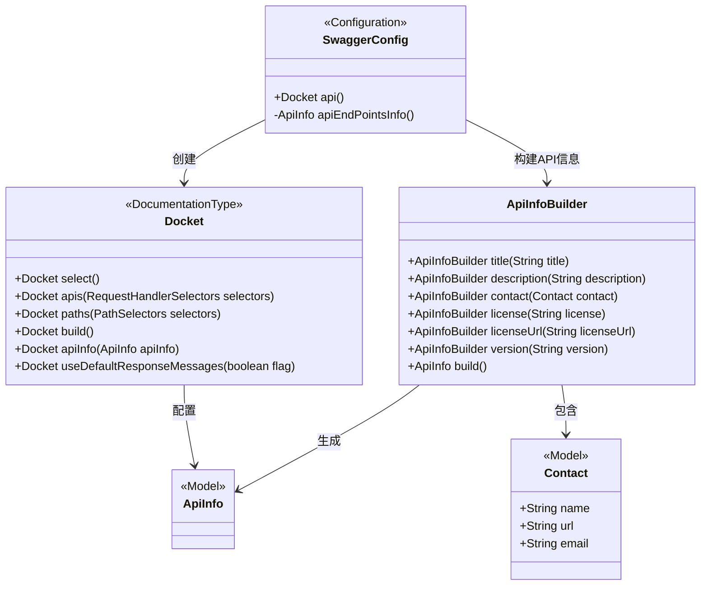
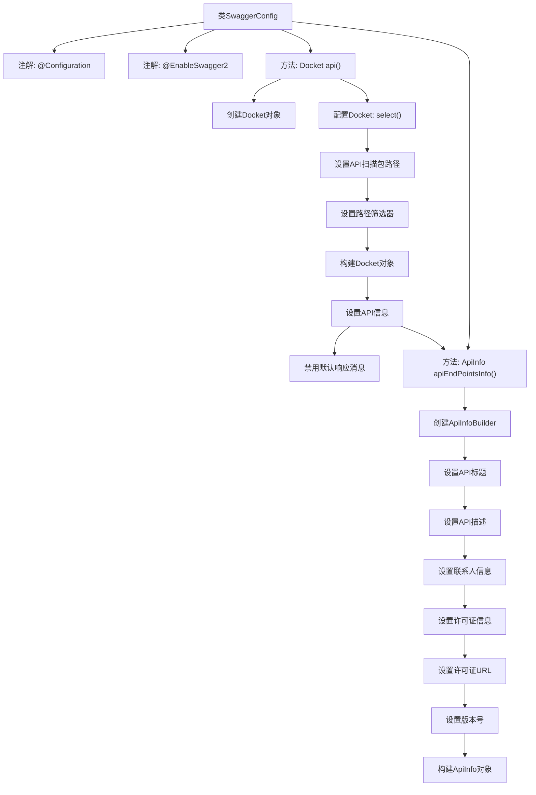

# 基础信息

|      |      |
|------|------|
| 名称 | SwaggerConfig |
| 编码语言 | .java |
| 代码路径 | staffjoy/company-svc/src/main/java/xyz/staffjoy/company/config/SwaggerConfig.java |
| 包名 | xyz.staffjoy.company.config |
| 依赖项 | ['org.springframework.context.annotation.Bean', 'org.springframework.context.annotation.Configuration', 'springfox.documentation.builders.ApiInfoBuilder', 'springfox.documentation.builders.PathSelectors', 'springfox.documentation.builders.RequestHandlerSelectors', 'springfox.documentation.service.ApiInfo', 'springfox.documentation.service.Contact', 'springfox.documentation.spi.DocumentationType', 'springfox.documentation.spring.web.plugins.Docket', 'springfox.documentation.swagger2.annotations.EnableSwagger2'] |
| 概述说明 | Swagger配置类，定义API文档信息及扫描路径。 |

# 说明

这是一个Swagger配置类，用于生成API文档。它启用了Swagger2功能，定义了一个Docket Bean来配置API的基本信息。该配置指定了扫描xyz.staffjoy.company.controller包下的所有控制器，包含所有路径，并禁用了默认的响应消息。API信息包括标题"Company REST API"、描述、联系人信息（姓名bobo、GitHub链接和邮箱）、MIT许可证及链接、版本号V2。整个配置简洁明了，提供了必要的API文档元数据。

# 类列表 Class Summary

| 名称   | 类型  | 说明 |
|-------|------|-------------|
| SwaggerConfig | class | Swagger配置类，定义Company REST API文档信息及扫描路径。 |

## 类 SwaggerConfig

|      |      |
|------|------|
| 访问范围 | @Configuration;@EnableSwagger2;public |
| 类型 | class |
| 名称 | SwaggerConfig |
| 说明 | Swagger配置类，定义Company REST API文档信息及扫描路径。 |

### UML类图

这段代码是一个Spring Boot的Swagger配置类，用于生成API文档。SwaggerConfig类通过@EnableSwagger2注解启用Swagger支持，并定义了两个方法：api()用于配置Docket对象（指定扫描的API包路径和全局设置），apiEndPointsInfo()用于构建API的元信息（如标题、描述、联系人等）。整个配置通过链式调用构建Swagger文档生成规则，最终生成标准化的REST API文档界面。

### 内部方法调用关系图

这段代码是一个Spring Boot的Swagger配置类，用于生成API文档。流程图展示了SwaggerConfig类的结构，包括两个主要方法：api()用于创建和配置Docket对象，apiEndPointsInfo()用于构建API的元数据信息。配置过程包括设置扫描路径、路径筛选器、API基本信息（如标题、描述、联系人、许可证等），并最终禁用默认响应消息。该配置类通过注解启用Swagger2功能，为Company模块的REST API生成标准化文档。

### 字段列表 Field List

| 名称  | 类型  | 说明 |
|-------|-------|------|

### 方法列表 Method List

| 名称  | 类型  | 说明 |
|-------|-------|------|
| api | Docket | 创建Swagger API文档配置，扫描指定包路径，禁用默认响应消息。 |
| apiEndPointsInfo | ApiInfo | 公司REST API，V2版，MIT许可，联系bobo@jskillcloud.com。 |

