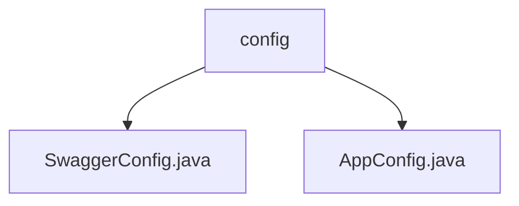

# 基础信息

|      |      |
|------|------|
| 名称 | config |
| 编码语言 | .java |
| 代码路径 | staffjoy/company-svc/src/main/java/xyz/staffjoy/company/config |
| 包名 | staffjoy.docs.company-svc.src.main.java.xyz.staffjoy.company.config |
| 概述说明 | Swagger配置类启用Swagger2，定义Docket Bean扫描控制器包，含API信息。AppConfig类配置异步执行器，核心线程3最大5队列100。 |

# 说明

## 概述

该代码模块是一个基于Java的配置模块，主要用于公司服务（company-svc）的基础配置和API文档生成。模块包含两个核心配置类：`SwaggerConfig`和`AppConfig`，分别负责Swagger API文档的生成和异步任务执行器的配置。模块通过简洁的配置提供了必要的功能支持，包括API文档元数据和异步任务处理能力。

## 主要业务场景

1. **API文档生成**：
   - 通过`SwaggerConfig`类启用Swagger2功能，生成公司服务的REST API文档。
   - 文档扫描`xyz.staffjoy.company.controller`包下的所有控制器，包含所有路径，并禁用了默认的响应消息。
   - 提供API的基本信息，包括标题（"Company REST API"）、描述、联系人信息（姓名、GitHub链接、邮箱）、MIT许可证及链接、版本号（V2）。

2. **异步任务处理**：
   - 通过`AppConfig`类配置异步任务执行器，支持异步任务的处理。
   - 定义了一个名为`asyncExecutor`的线程池任务执行器Bean，配置了线程名前缀（AsyncThread-）、核心线程数（3）、最大线程数（5）、队列容量（100）等参数。
   - 设置了任务关闭等待和上下文复制装饰器，确保异步任务的可靠执行和上下文一致性。

该模块为公司服务提供了基础的配置支持，涵盖了API文档化和异步任务处理两大核心功能，确保了服务的可维护性和高效性。

### 包内部结构视图

该流程图展示了company-svc项目中config目录下的文件结构关系。顶层节点为config文件夹，包含两个Java配置文件：SwaggerConfig.java用于Swagger接口文档配置，AppConfig.java为应用基础配置。结构清晰展示了配置文件的组织方式，符合典型Spring Boot项目的配置目录规范。

# 文件列表 File List

| 名称   | 类型  | 说明 |
|-------|------|-------------|
| [AppConfig.java](AppConfig.md) | file | 配置类启用异步，定义线程池执行器，核心3最大5队列100。 |
| [SwaggerConfig.java](SwaggerConfig.md) | file | Swagger配置类，定义API文档信息及扫描路径。 |

