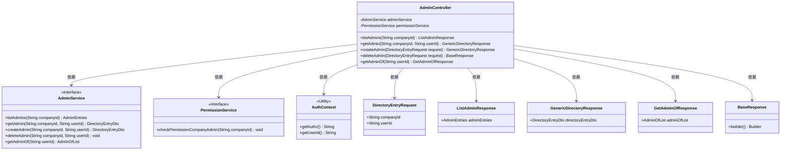

# 基础信息

|      |      |
|------|------|
| 名称 | AdminController |
| 编码语言 | .java |
| 代码路径 | staffjoy/company-svc/src/main/java/xyz/staffjoy/company/controller/AdminController.java |
| 包名 | xyz.staffjoy.company.controller |
| 依赖项 | ['org.springframework.beans.factory.annotation.Autowired', 'org.springframework.validation.annotation.Validated', 'org.springframework.web.bind.annotation', 'xyz.staffjoy.common.api.BaseResponse', 'xyz.staffjoy.common.api.ResultCode', 'xyz.staffjoy.common.auth.AuthConstant', 'xyz.staffjoy.common.auth.AuthContext', 'xyz.staffjoy.common.auth.Authorize', 'xyz.staffjoy.common.auth.PermissionDeniedException', 'xyz.staffjoy.common.error.ServiceException', 'xyz.staffjoy.company.dto', 'xyz.staffjoy.company.service.AdminService', 'xyz.staffjoy.company.service.PermissionService'] |
| 概述说明 | 公司管理员控制器，包含列表、查询、创建、删除及所属公司查询功能，需权限验证。 |

# 说明

这是一个名为AdminController的REST控制器类，负责处理公司管理员相关操作。它包含五个API端点：listAdmins用于列出指定公司的管理员列表；getAdmin用于获取特定管理员信息；createAdmin用于创建新管理员；deleteAdmin用于删除管理员；getAdminOf用于查询用户管理的公司列表。所有端点都进行了权限验证，不同端点要求不同的授权角色，包括认证用户、支持用户和内部服务等。对于认证用户，还会检查其是否具有公司管理员权限。控制器通过AdminService和PermissionService实现业务逻辑和权限控制。

# 类列表 Class Summary

| 名称   | 类型  | 说明 |
|-------|------|-------------|
| AdminController | class | 公司管理员接口，包含列表、查询、创建、删除及所属查询功能，需权限验证。 |

## 类 AdminController

|      |      |
|------|------|
| 访问范围 | @RestController;@RequestMapping("/v1/company/admin");@Validated;public |
| 类型 | class |
| 名称 | AdminController |
| 说明 | 公司管理员接口，包含列表、查询、创建、删除及所属查询功能，需权限验证。 |

### UML类图

该代码是一个Spring Boot控制器类，用于处理公司管理员相关的HTTP请求。AdminController依赖于AdminService和PermissionService来执行业务逻辑和权限检查。它提供了五个API端点：列出管理员、获取管理员信息、创建管理员、删除管理员以及获取用户管理的公司列表。每个端点都有特定的权限要求，通过@Authorize注解和AuthContext进行验证。控制器将请求参数传递给服务层，并将结果封装成相应的响应对象返回给客户端。

### 内部方法调用关系图

```mermaid
graph TD
    A["AdminController类"]
    B["依赖注入: AdminService adminService"]
    C["依赖注入: PermissionService permissionService"]
    D["GET /list方法: listAdmins(String companyId)"]
    E["GET /get方法: getAdmin(String companyId, String userId)"]
    F["POST /create方法: createAdmin(DirectoryEntryRequest request)"]
    G["DELETE /delete方法: deleteAdmin(DirectoryEntryRequest request)"]
    H["GET /admin_of方法: getAdminOf(String userId)"]
    I["权限检查: permissionService.checkPermissionCompanyAdmin"]
    J["服务调用: adminService.listAdmins"]
    K["服务调用: adminService.getAdmin"]
    L["服务调用: adminService.createAdmin"]
    M["服务调用: adminService.deleteAdmin"]
    N["服务调用: adminService.getAdminOf"]
    O["返回响应: ListAdminResponse"]
    P["返回响应: GenericDirectoryResponse"]
    Q["返回响应: BaseResponse"]
    R["返回响应: GetAdminOfResponse"]
    S["异常处理: ServiceException"]
    T["异常处理: PermissionDeniedException"]

    A --> B
    A --> C
    A --> D
    A --> E
    A --> F
    A --> G
    A --> H
    D --> I
    D --> J
    D --> O
    E --> I
    E --> K
    E --> P
    E --> S
    F --> I
    F --> L
    F --> P
    G --> I
    G --> M
    G --> Q
    H --> T
    H --> N
    H --> R
```

这段代码是一个Spring Boot的REST控制器，主要用于管理公司管理员的相关操作。控制器包含五个主要端点：获取管理员列表、获取单个管理员信息、创建管理员、删除管理员以及获取用户管理的公司列表。每个端点都进行了权限验证，对于AUTHENTICATED_USER类型的请求会检查用户是否有公司管理员权限。控制器通过AdminService和PermissionService两个服务类实现业务逻辑，并根据不同操作返回相应的响应对象或抛出异常。

### 字段列表 Field List

| 名称  | 类型  | 说明 |
|-------|-------|------|
| permissionService | PermissionService | 自动注入权限服务实例 |
| adminService | AdminService | 自动注入AdminService实例 |

### 方法列表 Method List

| 名称  | 类型  | 说明 |
|-------|-------|------|
| createAdmin | GenericDirectoryResponse | 创建管理员接口，需认证用户权限，校验公司权限后返回结果。 |
| getAdmin | GenericDirectoryResponse | 获取管理员信息的API，需认证用户权限，返回指定公司用户的管理员数据。 |
| listAdmins | ListAdminResponse | 获取管理员列表接口，需认证用户或支持人员权限，返回指定公司管理员列表。 |
| deleteAdmin | BaseResponse | 删除管理员接口，需认证用户或支持用户权限，校验权限后执行删除操作。 |
| getAdminOf | GetAdminOfResponse | 获取用户管理权限接口，需特定授权，验证用户身份后返回管理列表。 |

