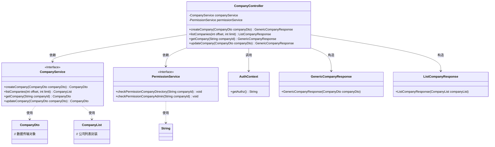
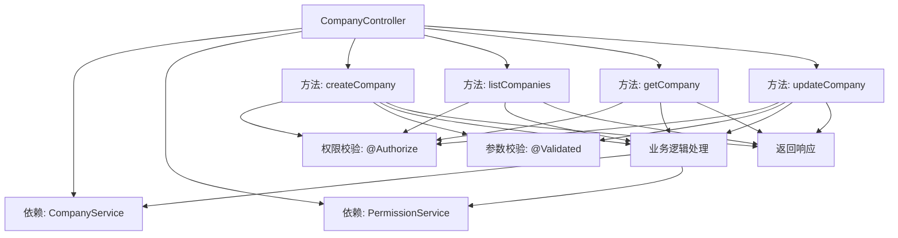
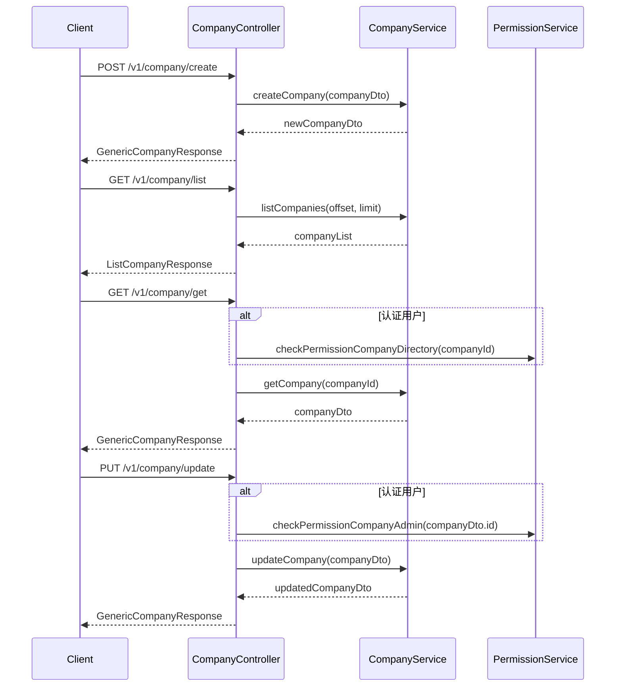

# 基础信息

|      |      |
|------|------|
| 名称 | CompanyController |
| 编码语言 | .java |
| 代码路径 | staffjoy/company-svc/src/main/java/xyz/staffjoy/company/controller/CompanyController.java |
| 包名 | xyz.staffjoy.company.controller |
| 依赖项 | ['org.springframework.beans.factory.annotation.Autowired', 'org.springframework.validation.annotation.Validated', 'org.springframework.web.bind.annotation', 'xyz.staffjoy.common.auth.AuthConstant', 'xyz.staffjoy.common.auth.AuthContext', 'xyz.staffjoy.common.auth.Authorize', 'xyz.staffjoy.common.validation.Group1', 'xyz.staffjoy.common.validation.Group2', 'xyz.staffjoy.company.dto.CompanyDto', 'xyz.staffjoy.company.dto.CompanyList', 'xyz.staffjoy.company.dto.ListCompanyResponse', 'xyz.staffjoy.company.dto.GenericCompanyResponse', 'xyz.staffjoy.company.service.CompanyService', 'xyz.staffjoy.company.service.PermissionService'] |
| 概述说明 | 公司控制器：创建、列表、查询、更新公司信息，含权限校验。 |

# 说明

这是一个公司管理相关的REST控制器类，提供创建、查询、更新公司信息的API。控制器包含四个主要端点：创建公司（/create）需要支持用户或WWW服务权限；获取公司列表（/list）仅限支持用户；查询单个公司（/get）允许多种服务及认证用户访问，认证用户需检查目录权限；更新公司（/update）允许认证用户和支持用户操作，认证用户需检查管理员权限。所有端点都进行了权限验证，部分请求参数和请求体使用了分组验证。

# 类列表 Class Summary

| 名称   | 类型  | 说明 |
|-------|------|-------------|
| CompanyController | class | 公司控制器，含创建、查询、更新接口，支持多种权限验证。 |

## 类 CompanyController

|      |      |
|------|------|
| 访问范围 | @RestController;@RequestMapping("/v1/company");@Validated;public |
| 类型 | class |
| 名称 | CompanyController |
| 说明 | 公司控制器，含创建、查询、更新接口，支持多种权限验证。 |

### UML类图

该代码是一个Spring Boot的REST控制器，用于处理公司相关的CRUD操作。CompanyController依赖CompanyService处理业务逻辑，依赖PermissionService进行权限校验。控制器包含四个主要端点：创建公司、列出公司、获取单个公司和更新公司信息，每个端点都有特定的权限控制。返回类型使用GenericCompanyResponse和ListCompanyResponse进行统一封装，确保响应格式一致性。权限校验通过AuthContext获取当前授权信息，并根据不同服务类型进行差异化处理。

### 内部方法调用关系图

这段代码是一个Spring Boot的RESTful控制器，主要处理公司相关的CRUD操作。流程图展示了控制器与服务的依赖关系和方法调用链，时序图详细描述了四个API端点（创建、列表查询、详情获取、更新）的完整调用过程，包括权限校验和服务层交互。控制器通过注解实现权限控制和参数验证，业务逻辑委托给CompanyService处理，对于认证用户还会通过PermissionService进行额外权限检查。

### 字段列表 Field List

| 名称  | 类型  | 说明 |
|-------|-------|------|
| companyService | CompanyService | 自动注入公司服务实例 |
| permissionService | PermissionService | 自动注入权限服务实例 |

### 方法列表 Method List

| 名称  | 类型  | 说明 |
|-------|-------|------|
| listCompanies | ListCompanyResponse | 获取公司列表接口，需支持用户权限，参数为偏移量和数量限制。 |
| getCompany | GenericCompanyResponse | 获取公司信息的GET接口，需授权访问，返回公司数据。 |
| createCompany | GenericCompanyResponse | 创建公司接口，需授权支持用户或WWW服务，验证请求体后返回新公司数据。 |
| updateCompany | GenericCompanyResponse | 更新公司信息的API，需认证用户或支持人员权限，返回更新后的公司数据。 |

