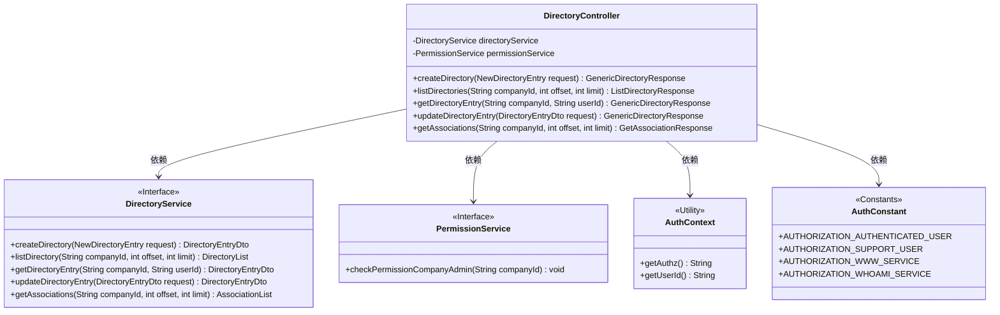
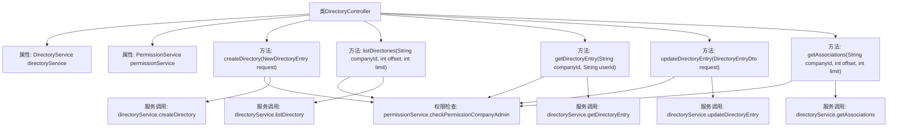

# 基础信息

|      |      |
|------|------|
| 名称 | DirectoryController |
| 编码语言 | .java |
| 代码路径 | staffjoy/company-svc/src/main/java/xyz/staffjoy/company/controller/DirectoryController.java |
| 包名 | xyz.staffjoy.company.controller |
| 依赖项 | ['org.springframework.beans.factory.annotation.Autowired', 'org.springframework.validation.annotation.Validated', 'org.springframework.web.bind.annotation', 'xyz.staffjoy.common.auth.AuthConstant', 'xyz.staffjoy.common.auth.AuthContext', 'xyz.staffjoy.common.auth.Authorize', 'xyz.staffjoy.company.dto', 'xyz.staffjoy.company.service.DirectoryService', 'xyz.staffjoy.company.service.PermissionService'] |
| 概述说明 | 公司目录控制器，提供创建、查询、更新目录及关联信息功能，需权限验证。 |

# 说明

该内容描述了一个名为DirectoryController的REST控制器，处理公司目录相关操作。控制器包含五个端点：create用于创建目录条目，list获取目录列表，get获取单个目录条目，update更新目录条目，get_associations获取关联信息。所有端点都进行了权限验证，不同角色（认证用户、支持用户、服务账户）拥有不同访问权限。认证用户需通过公司管理员权限检查才能执行敏感操作。控制器依赖DirectoryService和PermissionService完成业务逻辑和权限校验。每个端点都返回特定响应对象，包含相应操作结果。

# 类列表 Class Summary

| 名称   | 类型  | 说明 |
|-------|------|-------------|
| DirectoryController | class | 公司目录控制器，包含创建、查询、更新目录及关联信息功能，需权限验证。 |

## 类 DirectoryController

|      |      |
|------|------|
| 访问范围 | @RestController;@RequestMapping("/v1/company/directory");@Validated;public |
| 类型 | class |
| 名称 | DirectoryController |
| 说明 | 公司目录控制器，包含创建、查询、更新目录及关联信息功能，需权限验证。 |

### UML类图

这段代码描述了一个企业目录管理系统的REST控制器，主要处理目录项的创建、查询、更新和关联关系获取等操作。控制器通过依赖注入使用DirectoryService处理业务逻辑，通过PermissionService进行权限校验，并支持多种认证方式（普通用户、支持用户、服务账号等）。所有接口都通过@Authorize注解进行权限控制，并对认证用户进行额外的公司管理员权限校验。

### 内部方法调用关系图

这段代码是一个Spring Boot的REST控制器，主要负责处理公司目录相关的操作。控制器包含五个主要方法：创建目录、列出目录、获取目录条目、更新目录条目和获取关联信息。每个方法都进行了权限验证，确保只有授权用户才能执行相应操作。权限验证通过PermissionService完成，具体业务逻辑则委托给DirectoryService处理。控制器使用了Spring的依赖注入和注解来简化开发，包括@Autowired、@PostMapping、@GetMapping等。

### 字段列表 Field List

| 名称  | 类型  | 说明 |
|-------|-------|------|
| permissionService | PermissionService | 自动注入权限服务实例 |
| directoryService | DirectoryService | 自动注入DirectoryService服务实例。 |

### 方法列表 Method List

| 名称  | 类型  | 说明 |
|-------|-------|------|
| createDirectory | GenericDirectoryResponse | 创建目录接口，需认证用户权限，返回目录数据。 |
| getDirectoryEntry | GenericDirectoryResponse | 获取目录条目接口，需认证用户权限，支持多种角色访问，返回指定用户条目。 |
| listDirectories | ListDirectoryResponse | 获取目录列表接口，需认证用户权限，支持分页查询。 |
| updateDirectoryEntry | GenericDirectoryResponse | 授权用户或支持用户可通过API更新目录条目，需验证权限并返回结果。 |
| getAssociations | GetAssociationResponse | 获取公司关联信息接口，需认证用户或支持人员权限，管理员需验证，支持分页查询。 |

