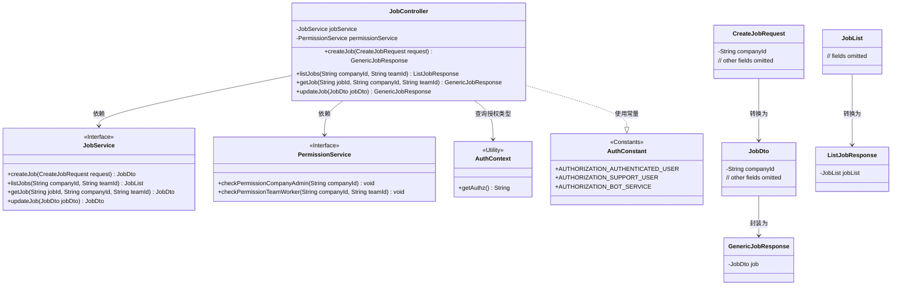
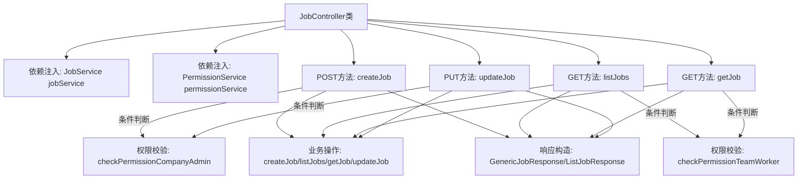

# 基础信息

|      |      |
|------|------|
| 名称 | JobController |
| 编码语言 | .java |
| 代码路径 | staffjoy/company-svc/src/main/java/xyz/staffjoy/company/controller/JobController.java |
| 包名 | xyz.staffjoy.company.controller |
| 依赖项 | ['org.springframework.beans.factory.annotation.Autowired', 'org.springframework.validation.annotation.Validated', 'org.springframework.web.bind.annotation', 'xyz.staffjoy.common.auth.AuthConstant', 'xyz.staffjoy.common.auth.AuthContext', 'xyz.staffjoy.common.auth.Authorize', 'xyz.staffjoy.company.dto', 'xyz.staffjoy.company.service.JobService', 'xyz.staffjoy.company.service.PermissionService'] |
| 概述说明 | JobController提供创建、查询、更新职位接口，需权限验证。 |

# 说明

这是一个名为JobController的REST控制器类，负责处理与工作相关的HTTP请求。它包含四个主要端点：create用于创建工作，list用于列出工作，get用于获取单个工作详情，update用于更新工作信息。每个端点都有权限控制，支持认证用户、支持用户和机器人服务（仅get端点）三种角色。对于认证用户，会检查公司管理员或团队成员权限。所有操作都通过JobService处理业务逻辑，并返回统一格式的响应对象。

# 类列表 Class Summary

| 名称   | 类型  | 说明 |
|-------|------|-------------|
| JobController | class | JobController提供创建、查询、更新职位接口，需权限验证。 |

## 类 JobController

|      |      |
|------|------|
| 访问范围 | @RestController;@RequestMapping("/v1/company/job");@Validated;public |
| 类型 | class |
| 名称 | JobController |
| 说明 | JobController提供创建、查询、更新职位接口，需权限验证。 |

### UML类图

该类图展示了JobController作为REST控制器，通过JobService处理业务逻辑，依赖PermissionService进行权限验证的核心结构。控制器包含四个主要端点：创建职位、列出职位、获取职位详情和更新职位，每个端点都涉及不同的请求/响应DTO转换。系统通过AuthContext获取当前授权类型，并引用AuthConstant中的权限常量进行验证。整体设计遵循了分层架构，职责分离清晰，接口与实现分离良好。

### 内部方法调用关系图

该流程图展示了JobController的核心结构和处理流程。控制器通过四个REST端点处理职位相关操作，每个端点都包含权限校验和业务处理两个主要阶段。权限校验根据调用方身份（认证用户/支持用户/机器人服务）动态选择验证策略，业务操作委托给JobService完成，最后统一包装成响应对象。流程体现了清晰的权限控制层和服务调用层的分离。

### 字段列表 Field List

| 名称  | 类型  | 说明 |
|-------|-------|------|
| jobService | JobService | 自动注入JobService实例 |
| permissionService | PermissionService | 自动注入权限服务实例 |

### 方法列表 Method List

| 名称  | 类型  | 说明 |
|-------|-------|------|
| listJobs | ListJobResponse | 获取任务列表接口，需认证用户或支持人员权限，校验团队权限后返回任务列表。 |
| createJob | GenericJobResponse | 创建作业接口，需认证用户或支持用户权限，公司管理员需额外校验权限。 |
| getJob | GenericJobResponse | 获取任务接口，需认证用户、支持用户或机器人服务权限，返回任务数据。 |
| updateJob | GenericJobResponse | 更新职位接口，需认证用户或支持人员权限，校验权限后返回更新结果。 |

