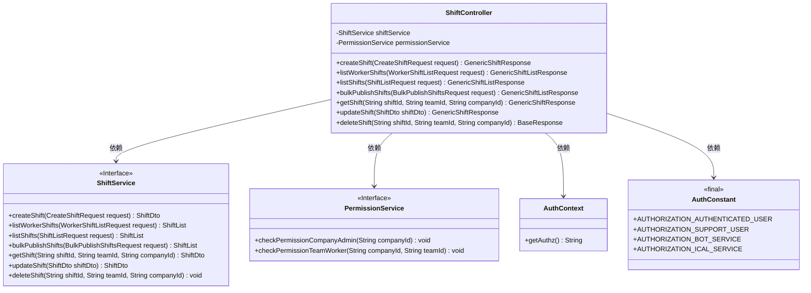

# 基础信息

|      |      |
|------|------|
| 名称 | ShiftController |
| 编码语言 | .java |
| 代码路径 | staffjoy/company-svc/src/main/java/xyz/staffjoy/company/controller/ShiftController.java |
| 包名 | xyz.staffjoy.company.controller |
| 依赖项 | ['org.springframework.beans.factory.annotation.Autowired', 'org.springframework.validation.annotation.Validated', 'org.springframework.web.bind.annotation', 'xyz.staffjoy.common.api.BaseResponse', 'xyz.staffjoy.common.auth.AuthConstant', 'xyz.staffjoy.common.auth.AuthContext', 'xyz.staffjoy.common.auth.Authorize', 'xyz.staffjoy.company.dto', 'xyz.staffjoy.company.service.PermissionService', 'xyz.staffjoy.company.service.ShiftService'] |
| 概述说明 | 公司班次管理API，包含创建、查询、批量发布、更新和删除班次功能，需权限验证。 |

# 说明

该内容描述了一个名为ShiftController的Java类，用于管理公司班次相关操作。该类包含多个API端点，分别处理班次的创建、查询、批量发布、更新和删除。每个端点都进行了权限验证，确保只有认证用户、支持用户或特定服务可以访问。权限检查包括验证用户是否为公司管理员或团队成员。主要功能包括创建班次、列出员工班次、列出班次、批量发布班次、获取班次详情、更新班次和删除班次。所有请求和响应都经过验证，确保数据有效性。

# 类列表 Class Summary

| 名称   | 类型  | 说明 |
|-------|------|-------------|
| ShiftController | class | ShiftController提供班次管理API，包括创建、查询、批量发布、更新和删除班次，支持多种权限验证。 |

## 类 ShiftController

|      |      |
|------|------|
| 访问范围 | @RestController;@RequestMapping("/v1/company/shift");@Validated;public |
| 类型 | class |
| 名称 | ShiftController |
| 说明 | ShiftController提供班次管理API，包括创建、查询、批量发布、更新和删除班次，支持多种权限验证。 |

### UML类图

该代码展示了一个REST控制器ShiftController，用于管理公司班次相关操作。控制器依赖ShiftService处理班次业务逻辑，依赖PermissionService进行权限验证。通过AuthContext和AuthConstant实现不同角色的授权控制。控制器提供创建、查询、批量发布、更新和删除班次等端点，每个操作都进行权限校验并返回标准化响应。类图清晰地展示了各组件间的依赖关系和接口定义。

### 内部方法调用关系图

```mermaid
graph TD
    A["ShiftController"]
    B["依赖: ShiftService"]
    C["依赖: PermissionService"]
    D["方法: createShift"]
    E["方法: listWorkerShifts"]
    F["方法: listShifts"]
    G["方法: bulkPublishShifts"]
    H["方法: getShift"]
    I["方法: updateShift"]
    J["方法: deleteShift"]

    A --> B
    A --> C
    A --> D
    A --> E
    A --> F
    A --> G
    A --> H
    A --> I
    A --> J

    D --> D1["权限检查: permissionService.checkPermissionCompanyAdmin"]
    D --> D2["业务操作: shiftService.createShift"]
    D --> D3["返回: GenericShiftResponse"]

    E --> E1["权限检查: permissionService.checkPermissionTeamWorker"]
    E --> E2["业务操作: shiftService.listWorkerShifts"]
    E --> E3["返回: GenericShiftListResponse"]

    F --> F1["权限检查: permissionService.checkPermissionTeamWorker"]
    F --> F2["业务操作: shiftService.listShifts"]
    F --> F3["返回: GenericShiftListResponse"]

    G --> G1["权限检查: permissionService.checkPermissionTeamWorker"]
    G --> G2["业务操作: shiftService.bulkPublishShifts"]
    G --> G3["返回: GenericShiftListResponse"]

    H --> H1["权限检查: permissionService.checkPermissionTeamWorker"]
    H --> H2["业务操作: shiftService.getShift"]
    H --> H3["返回: GenericShiftResponse"]

    I --> I1["权限检查: permissionService.checkPermissionCompanyAdmin"]
    I --> I2["业务操作: shiftService.updateShift"]
    I --> I3["返回: GenericShiftResponse"]

    J --> J1["权限检查: permissionService.checkPermissionTeamWorker"]
    J --> J2["业务操作: shiftService.deleteShift"]
    J --> J3["返回: BaseResponse"]
```

这段代码是一个Spring Boot的REST控制器，主要负责处理与公司班次相关的各种HTTP请求。控制器包含7个主要方法，分别对应创建、查询、批量发布、更新和删除班次等操作。每个方法都遵循相似的流程：首先进行权限验证（通过PermissionService），然后执行业务逻辑（通过ShiftService），最后返回相应的响应对象。所有方法都使用了自定义的授权注解进行访问控制，并根据不同的用户类型执行不同的权限检查逻辑。

### 字段列表 Field List

| 名称  | 类型  | 说明 |
|-------|-------|------|
| permissionService | PermissionService | 自动注入权限服务实例 |
| shiftService | ShiftService | 自动注入ShiftService服务实例 |

### 方法列表 Method List

| 名称  | 类型  | 说明 |
|-------|-------|------|
| updateShift | GenericShiftResponse | 更新班次的API，需认证用户或支持用户权限，公司管理员需验证权限，返回更新后的班次数据。 |
| listShifts | GenericShiftListResponse | 接口：列出班次，需认证用户或支持用户权限，校验团队权限后返回班次列表。 |
| listWorkerShifts | GenericShiftListResponse | API：获取员工班次列表，需认证用户权限，返回班次数据。 |
| deleteShift | BaseResponse | 删除班次接口，需认证用户或支持人员权限，校验权限后执行删除操作。 |
| getShift | GenericShiftResponse | 获取班次信息的API，需认证用户或支持人员权限，返回班次数据。 |
| bulkPublishShifts | GenericShiftListResponse | 后端接口：批量发布班次，需认证用户或支持人员权限，校验团队权限后返回班次列表。 |
| createShift | GenericShiftResponse | 创建班次的API，需认证用户或支持人员权限，管理员需验证公司权限，返回班次数据。 |

