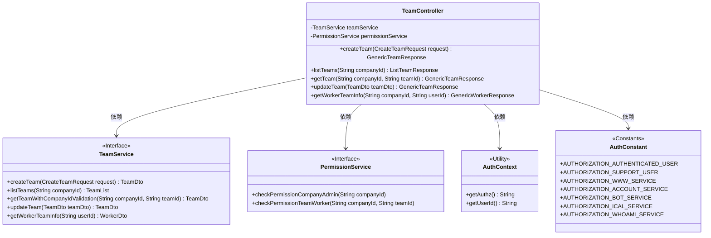
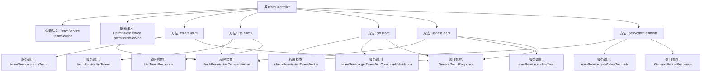

# 基础信息

|      |      |
|------|------|
| 名称 | TeamController |
| 编码语言 | .java |
| 代码路径 | staffjoy/company-svc/src/main/java/xyz/staffjoy/company/controller/TeamController.java |
| 包名 | xyz.staffjoy.company.controller |
| 依赖项 | ['org.springframework.beans.factory.annotation.Autowired', 'org.springframework.util.StringUtils', 'org.springframework.validation.annotation.Validated', 'org.springframework.web.bind.annotation', 'xyz.staffjoy.common.api.ResultCode', 'xyz.staffjoy.common.auth.AuthConstant', 'xyz.staffjoy.common.auth.AuthContext', 'xyz.staffjoy.common.auth.Authorize', 'xyz.staffjoy.company.dto', 'xyz.staffjoy.company.service.PermissionService', 'xyz.staffjoy.company.service.TeamService'] |
| 概述说明 | 团队管理API：创建、查询、更新团队及成员信息，需权限验证。 |

# 说明

这是一个团队管理控制器类，提供了创建、查询、更新团队及获取成员信息的功能。创建团队需要公司管理员权限，支持三种授权类型。查询团队列表和详情分别需要公司管理员和团队成员权限，支持多种服务调用。更新团队需公司管理员权限。获取成员信息允许用户查看自己的数据或公司管理员查看他人数据，需提供公司ID参数。所有方法均进行权限验证并返回标准化响应对象。

# 类列表 Class Summary

| 名称   | 类型  | 说明 |
|-------|------|-------------|
| TeamController | class | 团队控制器，提供创建、查询、更新团队及获取成员信息功能，包含权限校验。 |

## 类 TeamController

|      |      |
|------|------|
| 访问范围 | @RestController;@RequestMapping("/v1/company/team");@Validated;public |
| 类型 | class |
| 名称 | TeamController |
| 说明 | 团队控制器，提供创建、查询、更新团队及获取成员信息功能，包含权限校验。 |

### UML类图

这段代码展示了一个Spring Boot的团队管理控制器，主要处理团队创建、查询、更新和成员信息获取等操作。控制器通过依赖注入使用TeamService处理业务逻辑，并通过PermissionService进行权限验证。AuthContext和AuthConstant提供认证相关功能。该设计遵循RESTful风格，每个端点都有明确的权限控制，通过注解实现请求映射和参数验证，体现了清晰的职责分离和安全控制机制。

### 内部方法调用关系图

该流程图展示了TeamController类的核心结构和主要方法调用关系。控制器通过依赖注入获取TeamService和PermissionService实例，包含5个主要API端点：创建团队、列出团队、获取团队详情、更新团队和获取工作者团队信息。每个方法都涉及权限验证和服务调用，最终返回不同类型的响应对象。权限检查和服务调用形成清晰的层级关系，体现了控制器的核心业务流程和安全控制机制。

### 字段列表 Field List

| 名称  | 类型  | 说明 |
|-------|-------|------|
| teamService | TeamService | 自动注入TeamService实例。 |
| permissionService | PermissionService | 自动注入权限服务实例 |

### 方法列表 Method List

| 名称  | 类型  | 说明 |
|-------|-------|------|
| createTeam | GenericTeamResponse | 创建团队的API，需认证用户、支持用户或WWW服务权限，管理员需验证公司权限，返回团队信息。 |
| getTeam | GenericTeamResponse | 获取团队信息的API，需认证用户或服务权限，验证公司ID和团队ID后返回团队数据。 |
| listTeams | ListTeamResponse | 获取团队列表接口，需认证用户或支持人员权限，公司管理员需额外校验权限。 |
| updateTeam | GenericTeamResponse | 更新团队信息的API，需认证用户或支持用户权限，公司管理员需验证权限，返回更新后的团队数据。 |
| getWorkerTeamInfo | GenericWorkerResponse | 获取员工团队信息接口，需认证用户权限，校验参数和公司管理员权限后返回团队数据。 |

