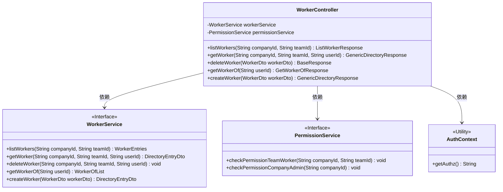

# 基础信息

|      |      |
|------|------|
| 名称 | WorkerController |
| 编码语言 | .java |
| 代码路径 | staffjoy/company-svc/src/main/java/xyz/staffjoy/company/controller/WorkerController.java |
| 包名 | xyz.staffjoy.company.controller |
| 依赖项 | ['org.springframework.beans.factory.annotation.Autowired', 'org.springframework.validation.annotation.Validated', 'org.springframework.web.bind.annotation', 'xyz.staffjoy.common.api.BaseResponse', 'xyz.staffjoy.common.auth.AuthConstant', 'xyz.staffjoy.common.auth.AuthContext', 'xyz.staffjoy.common.auth.Authorize', 'xyz.staffjoy.company.dto', 'xyz.staffjoy.company.service.PermissionService', 'xyz.staffjoy.company.service.WorkerService'] |
| 概述说明 | WorkerController提供员工管理API，包括查询、创建、删除等功能，支持多种权限验证。 |

# 说明

该内容描述了一个WorkerController类，用于处理与公司员工相关的REST API请求。类中包含五个端点：listWorkers用于列出指定公司和团队的员工列表；getWorker用于获取单个员工信息；deleteWorker用于删除员工；getWorkerOf用于获取员工所属信息；createWorker用于创建新员工。每个端点都有特定的权限控制，包括认证用户、支持用户等不同角色，部分操作需检查公司或团队权限。所有端点均返回结构化响应数据。

# 类列表 Class Summary

| 名称   | 类型  | 说明 |
|-------|------|-------------|
| WorkerController | class | WorkerController提供员工管理API，包括列表、查询、创建、删除及所属查询功能，支持多种权限验证。 |

## 类 WorkerController

|      |      |
|------|------|
| 访问范围 | @RestController;@RequestMapping("/v1/company/worker");@Validated;public |
| 类型 | class |
| 名称 | WorkerController |
| 说明 | WorkerController提供员工管理API，包括列表、查询、创建、删除及所属查询功能，支持多种权限验证。 |

### UML类图

这段代码展示了一个Spring Boot的REST控制器WorkerController，它处理与公司员工相关的各种HTTP请求。控制器依赖于WorkerService和PermissionService两个服务接口，分别用于业务逻辑处理和权限验证。通过AuthContext工具类获取当前认证信息，并根据不同权限级别执行相应操作。控制器提供了员工列表查询、单个员工查询、员工删除、员工所属关系查询和员工创建等端点，每个端点都有特定的权限要求。

### 内部方法调用关系图

这段代码展示了一个Spring Boot的WorkerController类，包含5个RESTful端点方法，分别处理工人列表查询、单个工人查询、删除工人、查询工人所属关系以及创建工人操作。每个方法都通过@Authorize注解进行权限控制，部分方法会调用PermissionService进行细粒度权限校验，并通过WorkerService执行核心业务逻辑。流程图清晰地展示了控制器与两个服务类之间的调用关系，以及各方法内部的权限检查和业务处理流程。

### 字段列表 Field List

| 名称  | 类型  | 说明 |
|-------|-------|------|
| permissionService | PermissionService | 自动注入权限服务实例 |
| workerService | WorkerService | 自动注入WorkerService服务实例。 |

### 方法列表 Method List

| 名称  | 类型  | 说明 |
|-------|-------|------|
| deleteWorker | BaseResponse | 删除员工接口，需认证用户或支持用户权限，管理员需验证公司权限，成功后返回删除信息。 |
| getWorker | GenericDirectoryResponse | 获取员工信息的API，需认证用户权限，返回目录条目数据。 |
| listWorkers | ListWorkerResponse | 获取团队成员列表接口，需认证用户或支持人员权限，校验权限后返回结果。 |
| getWorkerOf | GetWorkerOfResponse | 获取用户所属工作组接口，需认证权限，返回用户关联工作组列表。 |
| createWorker | GenericDirectoryResponse | 创建Worker的API，需认证用户权限，校验公司管理员权限后生成目录条目并返回。 |

