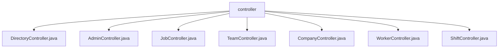

# 基础信息

|      |      |
|------|------|
| 名称 | controller |
| 编码语言 | .java |
| 代码路径 | staffjoy/company-svc/src/main/java/xyz/staffjoy/company/controller |
| 包名 | staffjoy.docs.company-svc.src.main.java.xyz.staffjoy.company.controller |
| 概述说明 | 多个REST控制器处理公司相关操作，包括目录、管理员、工作、团队、公司和员工管理，各端点均进行权限验证。 |

# 说明

## 概述
该代码模块是一个公司管理服务（company-svc）的核心组件，提供了一套完整的REST API接口，用于处理企业组织架构、人员管理、工作安排等核心业务功能。模块采用分层架构设计，包含多个控制器类，每个控制器专注于特定业务领域，通过权限服务进行统一访问控制，并依赖各自的业务服务实现核心逻辑。

## 主要业务场景
1. **公司基础信息管理**
   - 公司创建、查询、更新等基础操作
   - 支持多角色访问（支持用户、内部服务、认证用户）
   - 认证用户需进行公司管理员权限验证

2. **组织架构管理**
   - 团队创建、查询、更新及成员管理
   - 目录条目管理（员工基础信息）
   - 管理员账号的CRUD操作
   - 严格的层级权限控制（公司→团队→成员）

3. **人力资源调配**
   - 员工(Worker)的增删改查
   - 员工-团队关联关系管理
   - 跨部门人员信息查询

4. **工作排班管理**
   - 职位(Job)的创建与维护
   - 班次(Shift)的CRUD操作
   - 批量班次发布功能
   - 团队成员排班查看权限控制

5. **权限控制系统**
   - 统一的权限验证机制
   - 支持多种角色（认证用户/支持用户/服务账户）
   - 细粒度的操作权限检查（公司/团队级别）
   - 通过PermissionService集中处理权限逻辑

所有业务场景都遵循严格的权限验证流程，返回标准化的响应对象，确保数据安全性和接口一致性。系统特别强调公司管理员的权限验证，对敏感操作实施额外权限检查。

### 包内部结构视图

该流程图展示了company-svc项目中controller目录下的7个控制器文件。所有Java控制器文件都直接隶属于controller目录，没有更深层级的子目录结构。这些控制器包括DirectoryController、AdminController、JobController等，共同构成了该服务的API端点实现层。

# 文件列表 File List

| 名称   | 类型  | 说明 |
|-------|------|-------------|
| [ShiftController.java](ShiftController.md) | file | 公司班次管理API，包含创建、查询、批量发布、更新和删除班次功能，需权限验证。 |
| [WorkerController.java](WorkerController.md) | file | WorkerController提供员工管理API，包括查询、创建、删除等功能，支持多种权限验证。 |
| [CompanyController.java](CompanyController.md) | file | 公司控制器：创建、列表、查询、更新公司信息，含权限校验。 |
| [TeamController.java](TeamController.md) | file | 团队管理API：创建、查询、更新团队及成员信息，需权限验证。 |
| [JobController.java](JobController.md) | file | JobController提供创建、查询、更新职位接口，需权限验证。 |
| [AdminController.java](AdminController.md) | file | 公司管理员控制器，包含列表、查询、创建、删除及所属公司查询功能，需权限验证。 |
| [DirectoryController.java](DirectoryController.md) | file | 公司目录控制器，提供创建、查询、更新目录及关联信息功能，需权限验证。 |

