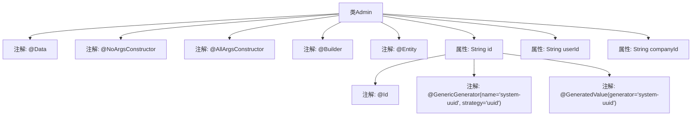

# 基础信息

|      |      |
|------|------|
| 名称 | Admin |
| 编码语言 | .java |
| 代码路径 | staffjoy/company-svc/src/main/java/xyz/staffjoy/company/model/Admin.java |
| 包名 | xyz.staffjoy.company.model |
| 依赖项 | ['lombok.AllArgsConstructor', 'lombok.Builder', 'lombok.Data', 'lombok.NoArgsConstructor', 'org.hibernate.annotations.GenericGenerator', 'javax.persistence.Entity', 'javax.persistence.GeneratedValue', 'javax.persistence.Id'] |
| 概述说明 | Java实体类Admin，使用Lombok注解和JPA，包含UUID主键、用户ID和公司ID字段。 |

# 说明

该内容描述了一个名为Admin的Java实体类，使用了Lombok注解简化代码，包含无参构造器、全参构造器和建造者模式支持。类标记为JPA实体，主键id采用UUID策略自动生成。包含三个字段：id作为主键，userId和companyId存储用户与公司关联信息。整体结构简洁，符合JPA实体规范。

# 类列表 Class Summary

| 名称   | 类型  | 说明 |
|-------|------|-------------|
| Admin | class | Java实体类Admin，含ID、用户ID和公司ID字段，使用Lombok和JPA注解。 |


## 类 Admin

|      |      |
|------|------|
| 访问范围 | @Data;@NoArgsConstructor;@AllArgsConstructor;@Builder;@Entity;public |
| 类型 | class |
| 名称 | Admin |
| 说明 | Java实体类Admin，含ID、用户ID和公司ID字段，使用Lombok和JPA注解。 |


### UML类图

```mermaid
classDiagram
    class Admin {
        -String id
        -String userId
        -String companyId
        +Admin()
        +Admin(String id, String userId, String companyId)
    }
    // 类标注了JPA实体注解@Entity，表明映射数据库表
    // 使用Lombok生成构造器、建造者模式等方法
    // ID字段通过UUID策略自动生成
```

这段类图描述了一个名为Admin的JPA实体类，包含三个私有字段：id（使用UUID策略自动生成）、userId和companyId。类通过Lombok注解自动生成了无参构造器、全参构造器以及建造者模式支持。作为数据库实体，该类通过@Entity注解表明其与数据库表的映射关系，其中@Id标注的主键字段采用UUID生成策略确保唯一性。整个结构简洁清晰地展现了实体类的核心属性和框架级特性。


### 内部方法调用关系图



该流程图展示了Java类Admin的结构，该类使用了Lombok注解@Data、@NoArgsConstructor、@AllArgsConstructor和@Builder来简化代码，同时标记为@Entity表示它是一个JPA实体。类中包含三个属性：id、userId和companyId，其中id属性使用了@Id标注为主键，并通过@GenericGenerator和@GeneratedValue注解配置了UUID生成策略。整个结构清晰地反映了类的注解层次和属性关系。

### 字段列表 Field List

| 名称  | 类型  | 说明 |
|-------|-------|------|
| userId | String | 私有字符串变量userId |
| id | String | 使用UUID策略生成系统唯一ID。 |
| companyId | String | 私有字符串变量companyId |

### 方法列表 Method List

| 名称  | 类型  | 说明 |
|-------|-------|------|


