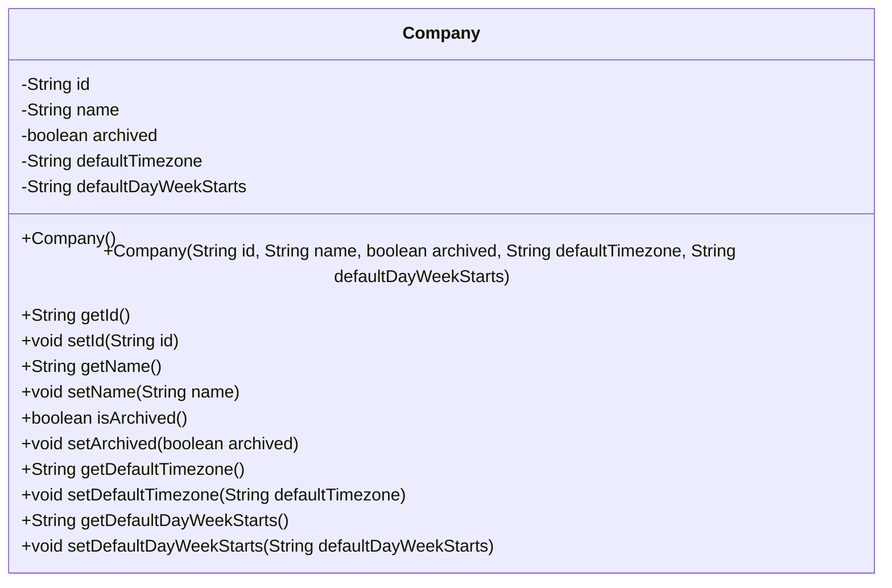
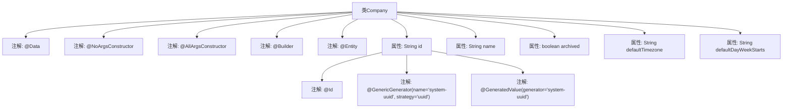

# 基础信息

|      |      |
|------|------|
| 名称 | Company |
| 编码语言 | .java |
| 代码路径 | staffjoy/company-svc/src/main/java/xyz/staffjoy/company/model/Company.java |
| 包名 | xyz.staffjoy.company.model |
| 依赖项 | ['lombok.AllArgsConstructor', 'lombok.Builder', 'lombok.Data', 'lombok.NoArgsConstructor', 'org.hibernate.annotations.GenericGenerator', 'xyz.staffjoy.common.validation.DayOfWeek', 'xyz.staffjoy.common.validation.Group1', 'xyz.staffjoy.common.validation.Timezone', 'javax.persistence.Entity', 'javax.persistence.GeneratedValue', 'javax.persistence.Id', 'javax.validation.constraints.NotBlank', 'javax.validation.constraints.NotEmpty', 'javax.validation.constraints.NotNull', 'java.util.UUID'] |
| 概述说明 | 公司实体类，含ID、名称、归档状态、默认时区和周起始日字段。 |

# 说明

这是一个名为Company的JPA实体类，使用Lombok注解简化代码。类中包含四个字段：id（使用UUID策略生成的主键）、name（公司名称）、archived（归档状态布尔值）、defaultTimezone（默认时区）和defaultDayWeekStarts（默认周起始日）。类上标注了@Entity表示它是持久化实体，同时使用了@Builder、@NoArgsConstructor和@AllArgsConstructor来自动生成构造器和建造者模式。整个类结构简洁，专注于存储公司基本信息。

# 类列表 Class Summary

| 名称   | 类型  | 说明 |
|-------|------|-------------|
| Company | class | 公司实体类，含ID、名称、归档状态、默认时区和周起始日字段。 |

## 类 Company

|      |      |
|------|------|
| 访问范围 | @Data;@NoArgsConstructor;@AllArgsConstructor;@Builder;@Entity;public |
| 类型 | class |
| 名称 | Company |
| 说明 | 公司实体类，含ID、名称、归档状态、默认时区和周起始日字段。 |

### UML类图

这段代码定义了一个名为Company的JPA实体类，使用Lombok注解自动生成构造器、getter/setter和建造者模式方法。类包含五个私有字段：id（使用UUID策略生成）、name、archived状态标志、defaultTimezone和defaultDayWeekStarts。通过@Entity注解表明这是一个持久化实体，@Builder提供流畅的创建接口，@NoArgsConstructor和@AllArgsConstructor分别生成无参和全参构造器。类图完整展示了其属性和方法结构。

### 内部方法调用关系图

这段代码定义了一个名为Company的JPA实体类，使用了Lombok的@Data、@NoArgsConstructor、@AllArgsConstructor和@Builder注解来简化代码。类中包含id、name、archived、defaultTimezone和defaultDayWeekStarts等属性，其中id属性使用了UUID生成策略作为主键。该实体类通过注解配置实现了自动生成getter/setter、构造方法以及构建器模式的功能，适用于数据库持久化操作。

### 字段列表 Field List

| 名称  | 类型  | 说明 |
|-------|-------|------|
| id | String | 使用UUID策略生成系统唯一ID。 |
| defaultDayWeekStarts | String | 默认周起始日设置 |
| archived | boolean | 私有布尔类型变量archived，表示归档状态。 |
| defaultTimezone | String | 私有字符串变量默认时区 |
| name | String | 私有字符串变量name |

### 方法列表 Method List

| 名称  | 类型  | 说明 |
|-------|-------|------|

