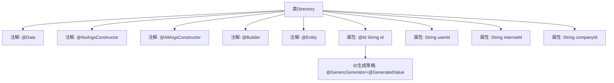

# 基础信息

|      |      |
|------|------|
| 名称 | Directory |
| 编码语言 | .java |
| 代码路径 | staffjoy/company-svc/src/main/java/xyz/staffjoy/company/model/Directory.java |
| 包名 | xyz.staffjoy.company.model |
| 依赖项 | ['lombok.AllArgsConstructor', 'lombok.Builder', 'lombok.Data', 'lombok.NoArgsConstructor', 'org.hibernate.annotations.GenericGenerator', 'javax.persistence.Entity', 'javax.persistence.GeneratedValue', 'javax.persistence.Id'] |
| 概述说明 | 目录实体类，含ID、用户ID、内部ID和公司ID字段，支持Lombok注解和UUID生成策略。 |

# 说明

这是一个名为Directory的Java实体类，使用了Lombok注解简化代码，包含无参构造器、全参构造器和建造者模式支持。类上有JPA的@Entity注解，表示它是一个持久化实体。主键id使用UUID策略自动生成，其他字段包括userId、internalId和companyId。所有字段均为字符串类型。

# 类列表 Class Summary

| 名称   | 类型  | 说明 |
|-------|------|-------------|
| Directory | class | 目录实体类，包含ID、用户ID、内部ID和公司ID字段，使用UUID生成策略。 |


## 类 Directory

|      |      |
|------|------|
| 访问范围 | @Data;@NoArgsConstructor;@AllArgsConstructor;@Builder;@Entity;public |
| 类型 | class |
| 名称 | Directory |
| 说明 | 目录实体类，包含ID、用户ID、内部ID和公司ID字段，使用UUID生成策略。 |


### UML类图

```mermaid
classDiagram
    class Directory {
        -String id
        -String userId
        -String internalId
        -String companyId
        +Directory()
        +Directory(String id, String userId, String internalId, String companyId)
        // Lombok annotations generate getters/setters/toString/etc
    }

    Directory --> "UUID Generator" : 使用
    note for Directory "使用@GenericGenerator生成UUID主键"
```

该类图展示了Directory实体类结构，它是一个使用JPA和Lombok注解的数据库实体。类包含四个私有字段（id、userId、internalId、companyId），其中id字段通过UUID策略自动生成。通过Lombok的@Builder、@NoArgsConstructor和@AllArgsConstructor注解，该类自动获得了构建器模式、无参构造和全参构造函数。该类与UUID生成器存在依赖关系，通过JPA注解实现了主键的自动生成机制，适用于需要唯一标识的目录管理系统场景。


### 内部方法调用关系图



该流程图展示了Directory类的结构，它是一个使用Lombok注解和JPA注解的实体类。类包含四个字符串属性（id、userId、internalId、companyId），其中id字段通过UUID策略自动生成。注解@Data提供getter/setter，@Builder支持建造者模式，@Entity标记为JPA实体，构造方法注解自动生成无参和全参构造器。整体设计简洁，适合作为数据库实体模型。

### 字段列表 Field List

| 名称  | 类型  | 说明 |
|-------|-------|------|
| id | String | 使用UUID策略生成系统唯一ID。 |
| userId | String | 私有用户ID字符串变量。 |
| internalId | String | 私有字符串变量internalId |
| companyId | String | 私有字符串变量companyId |

### 方法列表 Method List

| 名称  | 类型  | 说明 |
|-------|-------|------|


