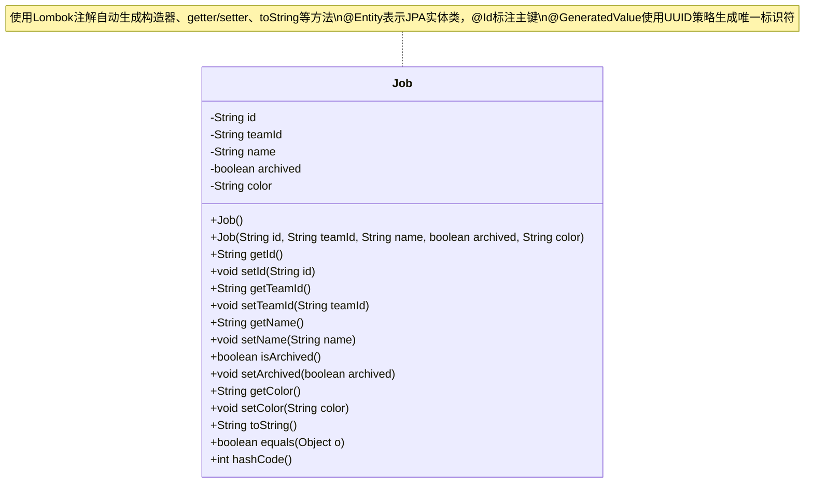
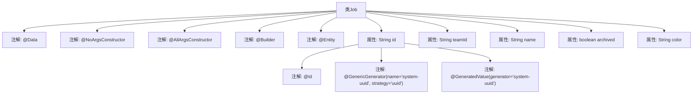

# 基础信息

|      |      |
|------|------|
| 名称 | Job |
| 编码语言 | .java |
| 代码路径 | staffjoy/company-svc/src/main/java/xyz/staffjoy/company/model/Job.java |
| 包名 | xyz.staffjoy.company.model |
| 依赖项 | ['lombok.AllArgsConstructor', 'lombok.Builder', 'lombok.Data', 'lombok.NoArgsConstructor', 'org.hibernate.annotations.GenericGenerator', 'javax.persistence.Entity', 'javax.persistence.GeneratedValue', 'javax.persistence.Id'] |
| 概述说明 | Job实体类，含ID、团队ID、名称、归档状态和颜色字段，支持构造器和建造者模式。 |

# 说明

这是一个名为Job的Java类，使用了Lombok和JPA注解。类中包含id、teamId、name、archived和color五个字段。id字段使用UUID策略自动生成，作为主键。Lombok提供了无参构造器、全参构造器和建造者模式支持。该类被标记为JPA实体，可通过@Entity注解进行持久化。

# 类列表 Class Summary

| 名称   | 类型  | 说明 |
|-------|------|-------------|
| Job | class | Job实体类，包含ID、团队ID、名称、归档状态和颜色字段，使用Lombok和JPA注解。 |

## 类 Job

|      |      |
|------|------|
| 访问范围 | @Data;@NoArgsConstructor;@AllArgsConstructor;@Builder;@Entity;public |
| 类型 | class |
| 名称 | Job |
| 说明 | Job实体类，包含ID、团队ID、名称、归档状态和颜色字段，使用Lombok和JPA注解。 |

### UML类图

这段代码定义了一个名为Job的JPA实体类，使用Lombok简化了样板代码的编写。该类包含id（UUID主键）、teamId、name、archived状态和color等字段，通过注解自动生成无参构造器、全参构造器、getter/setter、toString等方法。@Entity注解表明这是一个持久化实体，@Id和@GeneratedValue配合使用UUID策略自动生成唯一标识符。类设计符合JPA规范，适合用于数据库操作和业务逻辑处理。

### 内部方法调用关系图

该流程图展示了Java类Job的结构，这是一个使用Lombok和JPA注解的实体类。顶部标注了类级别的注解（如@Data、@Entity等），下方展示了所有属性及其关联的特定注解（如@Id、@GeneratedValue）。属性包括id（使用UUID生成策略）、teamId、name、archived状态和color字段，完整呈现了该实体类的数据结构和元数据配置。

### 字段列表 Field List

| 名称  | 类型  | 说明 |
|-------|-------|------|
| id | String | 使用UUID策略生成唯一ID。 |
| color | String | 私有字符串变量color |
| name | String | 私有字符串变量name |
| archived | boolean | 私有布尔型存档状态 |
| teamId | String | 私有字符串变量teamId |

### 方法列表 Method List

| 名称  | 类型  | 说明 |
|-------|-------|------|

