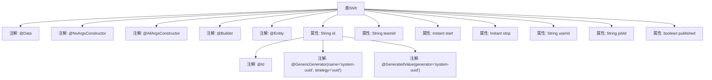

# 基础信息

|      |      |
|------|------|
| 名称 | Shift |
| 编码语言 | .java |
| 代码路径 | staffjoy/company-svc/src/main/java/xyz/staffjoy/company/model/Shift.java |
| 包名 | xyz.staffjoy.company.model |
| 依赖项 | ['lombok.AllArgsConstructor', 'lombok.Builder', 'lombok.Data', 'lombok.NoArgsConstructor', 'org.hibernate.annotations.GenericGenerator', 'javax.persistence.Entity', 'javax.persistence.GeneratedValue', 'javax.persistence.Id', 'java.time.Instant'] |
| 概述说明 | Shift类：UUID主键，含团队、用户、任务ID及起止时间，支持构建器模式。 |

# 说明

这是一个名为Shift的Java类，用于表示班次信息。该类使用了Lombok注解自动生成无参构造函数、全参构造函数和建造者模式。作为JPA实体类，它通过@Entity注解标记。主键id采用UUID策略自动生成。类包含teamId、start、stop、userId、jobId等字段，分别表示团队ID、开始时间、结束时间、用户ID和任务ID。published字段标记班次是否发布。所有字段均为私有属性，符合封装原则。

# 类列表 Class Summary

| 名称   | 类型  | 说明 |
|-------|------|-------------|
| Shift | class | Shift类：UUID主键，含团队、起止时间、用户、任务ID及发布状态。 |


## 类 Shift

|      |      |
|------|------|
| 访问范围 | @Data;@NoArgsConstructor;@AllArgsConstructor;@Builder;@Entity;public |
| 类型 | class |
| 名称 | Shift |
| 说明 | Shift类：UUID主键，含团队、起止时间、用户、任务ID及发布状态。 |


### UML类图

```mermaid
classDiagram
    class Shift {
        -String id
        -String teamId
        -Instant start
        -Instant stop
        -String userId
        -String jobId
        -boolean published
        +Shift()
        +Shift(String id, String teamId, Instant start, Instant stop, String userId, String jobId, boolean published)
    }
    // 该类使用了Lombok注解自动生成构造器和方法
    // @Entity注解表明这是一个JPA实体类
    // @Id和@GeneratedValue表示id是主键且自动生成
```

这段代码定义了一个名为Shift的JPA实体类，使用Lombok注解简化了代码编写。该类包含7个私有字段：id(主键)、teamId、start/stop时间戳、userId、jobId和published状态，并自动生成了无参构造器、全参构造器以及builder模式构造器。通过@Entity注解表明这是一个持久化实体，@Id和@GeneratedValue配置了UUID主键生成策略。该实体用于表示排班系统中的班次信息，包含班次时间、关联团队/用户/岗位等核心业务属性。


### 内部方法调用关系图



这段代码定义了一个名为Shift的实体类，使用了Lombok注解简化代码，包含@Data自动生成getter/setter，@NoArgsConstructor和@AllArgsConstructor生成无参和全参构造方法，@Builder提供建造者模式。类属性包括id（使用UUID策略生成）、teamId、start/stop时间戳、userId、jobId以及published状态，整体结构清晰展示了JPA实体与Lombok的结合使用方式。

### 字段列表 Field List

| 名称  | 类型  | 说明 |
|-------|-------|------|
| stop | Instant | 私有Instant变量stop |
| teamId | String | 私有字符串变量teamId |
| userId | String | 私有用户ID字符串变量 |
| start | Instant | 私有Instant类型变量start |
| id | String | 使用UUID策略生成唯一ID。 |
| jobId | String | 私有字符串类型变量jobId |
| published | boolean | 私有布尔变量published |

### 方法列表 Method List

| 名称  | 类型  | 说明 |
|-------|-------|------|


