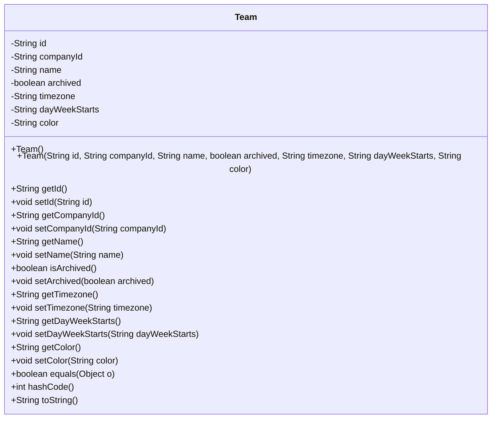
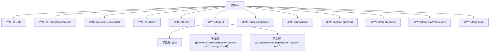

# 基础信息

|      |      |
|------|------|
| 名称 | Team |
| 编码语言 | .java |
| 代码路径 | staffjoy/company-svc/src/main/java/xyz/staffjoy/company/model/Team.java |
| 包名 | xyz.staffjoy.company.model |
| 依赖项 | ['lombok.AllArgsConstructor', 'lombok.Builder', 'lombok.Data', 'lombok.NoArgsConstructor', 'org.hibernate.annotations.GenericGenerator', 'javax.persistence.Entity', 'javax.persistence.GeneratedValue', 'javax.persistence.Id'] |
| 概述说明 | 团队实体类，包含ID、公司ID、名称、归档状态、时区、周起始日和颜色字段。 |

# 说明

这是一个名为Team的Java类，使用Lombok注解简化代码，包含无参构造器、全参构造器和建造者模式。作为JPA实体类，它使用UUID作为主键，通过系统生成的策略自动创建。类属性包括公司ID、团队名称、归档状态、时区、周起始日和颜色字段，用于存储团队相关的基本信息。所有字段均为私有，符合封装原则。

# 类列表 Class Summary

| 名称   | 类型  | 说明 |
|-------|------|-------------|
| Team | class | 团队实体类，包含ID、公司ID、名称、归档状态、时区、周起始日和颜色字段。 |

## 类 Team

|      |      |
|------|------|
| 访问范围 | @Data;@NoArgsConstructor;@AllArgsConstructor;@Builder;@Entity;public |
| 类型 | class |
| 名称 | Team |
| 说明 | 团队实体类，包含ID、公司ID、名称、归档状态、时区、周起始日和颜色字段。 |

### UML类图

这段代码定义了一个名为Team的JPA实体类，使用Lombok注解自动生成构造器、getter/setter和builder模式方法。类包含7个私有字段：id(使用UUID策略生成)、companyId、name、archived状态标志、timezone时区信息、dayWeekStarts周起始日以及color颜色标识。作为数据库实体，它具备完整的对象基本方法（equals/hashCode/toString）并通过注解简化了样板代码的编写，适用于团队管理系统的数据持久化场景。

### 内部方法调用关系图

这段代码定义了一个名为Team的JPA实体类，使用Lombok注解自动生成getter/setter、构造方法和建造者模式。类包含7个属性，其中id字段通过UUID策略自动生成。流程图展示了类结构、注解层级和属性关系，特别突出了id字段的三层注解配置（主键标识、UUID生成策略和值生成器），其他属性则保持简单映射。整个设计用于团队数据的持久化存储，支持全参数构造和无参构造两种初始化方式。

### 字段列表 Field List

| 名称  | 类型  | 说明 |
|-------|-------|------|
| timezone | String | 私有时区变量 |
| id | String | 使用UUID策略生成系统唯一ID。 |
| archived | boolean | 私有布尔型变量archived |
| name | String | 私有字符串变量name |
| companyId | String | 私有字符串类型变量companyId |
| dayWeekStarts | String | 私有变量dayWeekStarts，表示周起始日。 |
| color | String | 私有字符串变量color |

### 方法列表 Method List

| 名称  | 类型  | 说明 |
|-------|-------|------|

