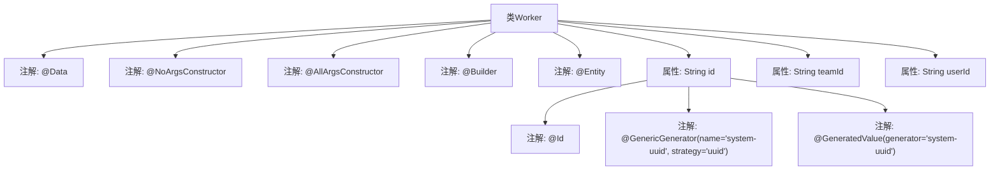

# 基础信息

|      |      |
|------|------|
| 名称 | Worker |
| 编码语言 | .java |
| 代码路径 | staffjoy/company-svc/src/main/java/xyz/staffjoy/company/model/Worker.java |
| 包名 | xyz.staffjoy.company.model |
| 依赖项 | ['lombok.AllArgsConstructor', 'lombok.Builder', 'lombok.Data', 'lombok.NoArgsConstructor', 'org.hibernate.annotations.GenericGenerator', 'javax.persistence.Entity', 'javax.persistence.GeneratedValue', 'javax.persistence.Id'] |
| 概述说明 | Worker实体类，含ID、teamId、userId字段，支持构造器和UUID生成。 |

# 说明

这是一个名为Worker的Java实体类，使用了Lombok注解简化代码。类中包含三个字段：id、teamId和userId。id字段使用UUID策略自动生成，作为主键标识。类提供了无参构造器、全参构造器和建造者模式支持。通过JPA的@Entity注解标记为持久化实体。整体结构简洁，用于表示工作者信息及其所属团队关系。

# 类列表 Class Summary

| 名称   | 类型  | 说明 |
|-------|------|-------------|
| Worker | class | Worker类：含ID、teamId、userId，支持构造器和UUID生成。 |


## 类 Worker

|      |      |
|------|------|
| 访问范围 | @Data;@NoArgsConstructor;@AllArgsConstructor;@Builder;@Entity;public |
| 类型 | class |
| 名称 | Worker |
| 说明 | Worker类：含ID、teamId、userId，支持构造器和UUID生成。 |


### UML类图

```mermaid
classDiagram
    class Worker {
        -String id
        -String teamId
        -String userId
        +Worker()
        +Worker(String id, String teamId, String userId)
        +String getId()
        +void setId(String id)
        +String getTeamId()
        +void setTeamId(String teamId)
        +String getUserId()
        +void setUserId(String userId)
        +WorkerBuilder builder()
    }

    // Lombok注解生成的构建器类
    class WorkerBuilder {
        -String id
        -String teamId
        -String userId
        +WorkerBuilder id(String id)
        +WorkerBuilder teamId(String teamId)
        +WorkerBuilder userId(String userId)
        +Worker build()
    }

    Worker --> WorkerBuilder : 使用
```

这段代码定义了一个Worker实体类，使用Lombok注解自动生成构造器、getter/setter和建造者模式。类包含三个私有字段：id（使用UUID策略生成）、teamId和userId，通过@Entity标记为JPA实体。WorkerBuilder是Lombok生成的内部建造者类，用于链式设置属性并创建Worker实例。类图展示了Worker的核心属性和方法，以及它与建造者类的关系，体现了简洁的POJO设计和ORM集成能力。


### 内部方法调用关系图



该流程图展示了Worker类的结构，这是一个使用Lombok和JPA注解的实体类。类通过@Data自动生成getter/setter，@Builder提供建造者模式，@Entity标记为JPA实体。核心属性id被@Id标注为主键，并通过UUID策略自动生成。teamId和userId作为普通字段存储，整体设计用于简化数据库操作和对象构建。

### 字段列表 Field List

| 名称  | 类型  | 说明 |
|-------|-------|------|
| id | String | 使用UUID策略生成系统唯一ID。 |
| teamId | String | 私有字符串类型变量teamId |
| userId | String | 私有字符串变量userId |

### 方法列表 Method List

| 名称  | 类型  | 说明 |
|-------|-------|------|


