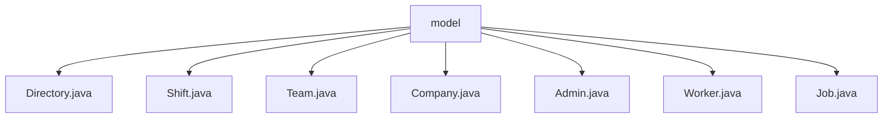

# 基础信息

|      |      |
|------|------|
| 名称 | model |
| 编码语言 | .java |
| 代码路径 | staffjoy/company-svc/src/main/java/xyz/staffjoy/company/model |
| 包名 | staffjoy.docs.company-svc.src.main.java.xyz.staffjoy.company.model |
| 概述说明 | Java实体类集合，含Directory、Shift、Team、Company、Admin、Worker、Job，均使用Lombok和JPA注解，UUID主键，支持建造者模式。 |

# 说明

## 概述  
该代码模块属于`company-svc`服务，主要包含与公司管理相关的核心实体类。所有类均采用Java编写，使用JPA（Java Persistence API）进行持久化，并通过Lombok注解简化代码（如自动生成构造器、建造者模式等）。实体类的主键均采用UUID策略自动生成，确保唯一性。模块设计遵循封装原则，所有字段均为私有属性，并通过标准化的命名和结构维护数据一致性。

## 主要业务场景  
1. **公司基础信息管理**  
   - `Company`类存储公司名称、默认时区、周起始日等核心信息，支持归档状态标记，适用于公司注册、信息维护及全局配置管理场景。  

2. **团队与岗位管理**  
   - `Team`类表示公司下属团队，包含团队名称、时区、颜色等属性，支持归档操作，用于团队创建、分组及可视化标识。  
   - `Job`类定义团队内的具体岗位，记录岗位名称、颜色及归档状态，适用于岗位设置与分类管理。  

3. **人员与权限管理**  
   - `Directory`类关联用户ID与公司ID，可能用于公司成员目录或基础身份映射。  
   - `Admin`类建立用户与公司的管理权限关系，支持管理员角色的分配与验证。  
   - `Worker`类表示团队成员，通过`teamId`和`userId`关联用户与团队，适用于成员分配与团队协作场景。  

4. **班次调度管理**  
   - `Shift`类描述班次信息，包括起止时间、关联的任务（`jobId`）和执行人（`userId`），支持发布状态标记，用于排班系统、工时统计及任务分配。  

**总结**：该模块为公司服务提供了一套完整的实体模型，覆盖公司组织架构、人员权限、岗位设置及班次调度等核心业务场景，支撑企业级管理系统的数据持久化需求。

### 包内部结构视图

该流程图展示了company-svc项目中model目录下的所有Java类文件结构。根节点为model文件夹，包含7个直接子文件：Directory.java、Shift.java、Team.java、Company.java、Admin.java、Worker.java和Job.java。这些类文件均属于公司服务模块的核心数据模型，用于表示公司组织结构、员工排班等业务实体。整个结构为扁平化设计，所有模型类均直接位于model目录下。

# 文件列表 File List

| 名称   | 类型  | 说明 |
|-------|------|-------------|
| [Job.java](Job.md) | file | Job实体类，含ID、团队ID、名称、归档状态和颜色字段，支持构造器和建造者模式。 |
| [Worker.java](Worker.md) | file | Worker实体类，含ID、teamId、userId字段，支持构造器和UUID生成。 |
| [Admin.java](Admin.md) | file | Java实体类Admin，使用Lombok注解和JPA，包含UUID主键、用户ID和公司ID字段。 |
| [Team.java](Team.md) | file | 团队实体类，包含ID、公司ID、名称、归档状态、时区、周起始日和颜色字段。 |
| [Shift.java](Shift.md) | file | Shift类：UUID主键，含团队、用户、任务ID及起止时间，支持构建器模式。 |
| [Directory.java](Directory.md) | file | 目录实体类，含ID、用户ID、内部ID和公司ID字段，支持Lombok注解和UUID生成策略。 |
| [Company.java](Company.md) | file | 公司实体类，含ID、名称、归档状态、默认时区和周起始日字段。 |

