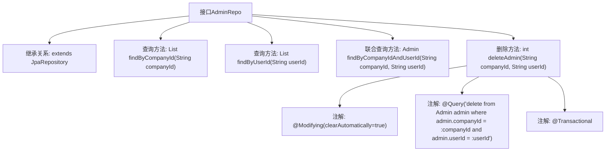

# 基础信息

|      |      |
|------|------|
| 名称 | AdminRepo |
| 编码语言 | .java |
| 代码路径 | staffjoy/company-svc/src/main/java/xyz/staffjoy/company/repo/AdminRepo.java |
| 包名 | xyz.staffjoy.company.repo |
| 依赖项 | ['org.springframework.data.jpa.repository.JpaRepository', 'org.springframework.data.jpa.repository.Modifying', 'org.springframework.data.jpa.repository.Query', 'org.springframework.data.repository.query.Param', 'org.springframework.stereotype.Repository', 'org.springframework.transaction.annotation.Transactional', 'xyz.staffjoy.company.model.Admin', 'java.util.List'] |
| 概述说明 | 管理仓库接口，含查询和删除方法，基于公司ID和用户ID操作。 |

# 说明

这是一个名为AdminRepo的Spring Data JPA仓库接口，继承自JpaRepository，用于管理Admin实体。接口提供了四个关键方法：通过公司ID查询管理员列表，通过用户ID查询管理员列表，通过公司ID和用户ID联合查询单个管理员，以及一个带事务的删除操作，根据公司ID和用户ID删除指定管理员记录。删除方法使用了JPQL自定义查询并自动清除缓存。

# 类列表 Class Summary

| 名称   | 类型  | 说明 |
|-------|------|-------------|
| AdminRepo | interface | 管理仓库接口，含查询和删除方法，基于公司ID和用户ID操作。 |


## 类 AdminRepo

|      |      |
|------|------|
| 访问范围 | @Repository;public |
| 类型 | interface |
| 名称 | AdminRepo |
| 说明 | 管理仓库接口，含查询和删除方法，基于公司ID和用户ID操作。 |


### UML类图

```mermaid
classDiagram
    class JpaRepository~T, ID~ {
        <<Interface>>
    }

    class AdminRepo {
        <<Interface>>
        +List~Admin~ findByCompanyId(String companyId)
        +List~Admin~ findByUserId(String userId)
        +Admin findByCompanyIdAndUserId(String companyId, String userId)
        +int deleteAdmin(String companyId, String userId)
    }

    JpaRepository <|-- AdminRepo : 继承
    // AdminRepo接口扩展了JpaRepository，提供针对Admin实体的自定义查询方法
    // 包含按公司ID、用户ID查询，以及联合删除操作
```

这段类图展示了AdminRepo接口继承自JpaRepository泛型接口的关系。AdminRepo作为数据访问层接口，定义了四个关键方法：通过公司ID查询管理员列表、通过用户ID查询管理员列表、通过公司和用户ID联合查询单个管理员，以及带事务的删除操作。所有方法都遵循Spring Data JPA的命名规范，其中deleteAdmin方法还包含@Modifying和@Transactional注解，确保操作的一致性和自动清除持久化上下文。


### 内部方法调用关系图



该流程图展示了Spring Data JPA接口AdminRepo的结构和功能。该接口继承JpaRepository提供基础CRUD操作，并扩展了四个自定义方法：两个单条件查询方法（按companyId和userId查询）、一个联合查询方法（同时按companyId和userId查询），以及一个带事务管理的删除方法。删除方法使用了@Modifying和@Query注解实现自定义JPQL删除语句，并通过@Transactional确保事务完整性。所有方法都遵循Spring Data JPA的命名约定自动生成查询逻辑。

### 字段列表 Field List

| 名称  | 类型  | 说明 |
|-------|-------|------|

### 方法列表 Method List

| 名称  | 类型  | 说明 |
|-------|-------|------|
| findByCompanyId | List<Admin> | 根据公司ID查询管理员列表。 |
| findByUserId | List<Admin> | 根据用户ID查询管理员列表。 |
| findByCompanyIdAndUserId | Admin | 根据公司ID和用户ID查找管理员。 |
| deleteAdmin | int | 删除指定公司和用户ID的管理员记录。 |


