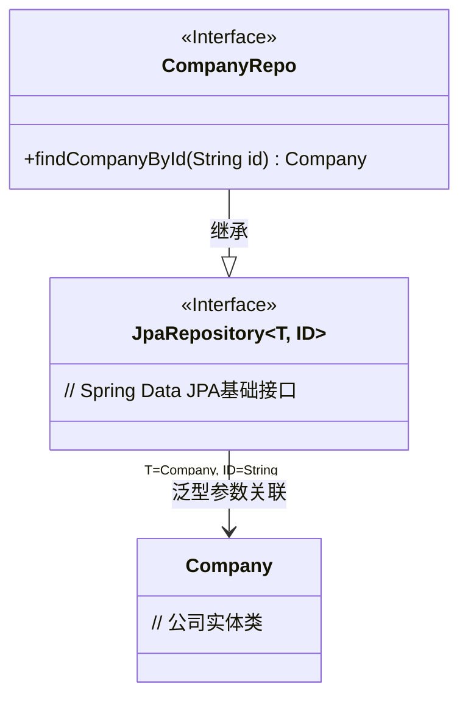
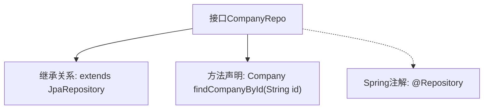

# 基础信息

|      |      |
|------|------|
| 名称 | CompanyRepo |
| 编码语言 | .java |
| 代码路径 | staffjoy/company-svc/src/main/java/xyz/staffjoy/company/repo/CompanyRepo.java |
| 包名 | xyz.staffjoy.company.repo |
| 依赖项 | ['org.springframework.data.jpa.repository.JpaRepository', 'org.springframework.stereotype.Repository', 'xyz.staffjoy.company.model.Company'] |
| 概述说明 | 公司仓库接口，继承JPA，含按ID查询方法。 |

# 说明

这是一个名为CompanyRepo的Spring Data JPA仓库接口，使用@Repository注解标注。该接口继承自JpaRepository，泛型参数指定了实体类型为Company，主键类型为String。接口中定义了一个查询方法findCompanyById，通过id参数查询并返回Company实体对象。这个仓库接口提供了对Company实体的基本CRUD操作以及自定义查询能力。

# 类列表 Class Summary

| 名称   | 类型  | 说明 |
|-------|------|-------------|
| CompanyRepo | interface | 公司仓库接口，继承JPA，提供按ID查询公司方法。 |

## 类 CompanyRepo

|      |      |
|------|------|
| 访问范围 | @Repository;public |
| 类型 | interface |
| 名称 | CompanyRepo |
| 说明 | 公司仓库接口，继承JPA，提供按ID查询公司方法。 |

### UML类图

这段类图展示了Spring Data JPA中一个典型的仓库接口设计。CompanyRepo接口继承自泛型接口JpaRepository<Company, String>，表明该仓库用于管理Company实体，主键类型为String。图中清晰体现了接口继承关系（使用三角箭头）和泛型参数绑定（通过注释说明），其中JpaRepository作为Spring Data的核心接口提供了基础的CRUD操作，而CompanyRepo通过添加findCompanyById方法扩展了特定查询能力。整个设计符合JPA仓库模式的标准规范。

### 内部方法调用关系图

这段流程图展示了Spring Data JPA中CompanyRepo接口的结构。该接口通过@Repository注解标记为持久层组件，并继承JpaRepository获得基础CRUD操作。自定义方法findCompanyById声明了按ID查询公司的能力，其返回值类型为Company实体类。整个设计遵循了Spring Data的Repository模式，通过方法名约定自动生成查询实现。

### 字段列表 Field List

| 名称  | 类型  | 说明 |
|-------|-------|------|

### 方法列表 Method List

| 名称  | 类型  | 说明 |
|-------|-------|------|
| findCompanyById | Company | 通过ID查找公司信息。 |

