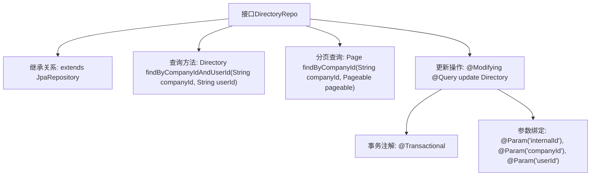

# 基础信息

|      |      |
|------|------|
| 名称 | DirectoryRepo |
| 编码语言 | .java |
| 代码路径 | staffjoy/company-svc/src/main/java/xyz/staffjoy/company/repo/DirectoryRepo.java |
| 包名 | xyz.staffjoy.company.repo |
| 依赖项 | ['org.springframework.data.domain.Page', 'org.springframework.data.domain.Pageable', 'org.springframework.data.jpa.repository.JpaRepository', 'org.springframework.data.jpa.repository.Modifying', 'org.springframework.data.jpa.repository.Query', 'org.springframework.data.repository.query.Param', 'org.springframework.stereotype.Repository', 'org.springframework.transaction.annotation.Transactional', 'xyz.staffjoy.company.model.Directory'] |
| 概述说明 | DirectoryRepo接口扩展JpaRepository，提供按公司ID和用户ID查询、分页查询及更新内部ID的方法。 |

# 说明

这是一个名为DirectoryRepo的Spring Data JPA仓库接口，继承自JpaRepository，用于操作Directory实体类。接口包含三个方法：1）通过公司ID和用户ID查询单个Directory记录；2）通过公司ID分页查询Directory记录；3）通过公司ID和用户ID更新internalId字段的修改方法，该方法使用JPQL语句并标记为事务性操作，执行后自动清除持久化上下文。

# 类列表 Class Summary

| 名称   | 类型  | 说明 |
|-------|------|-------------|
| DirectoryRepo | interface | DirectoryRepo接口扩展JpaRepository，提供按公司ID和用户ID查询目录、分页查询及更新内部ID功能。 |


## 类 DirectoryRepo

|      |      |
|------|------|
| 访问范围 | @Repository;public |
| 类型 | interface |
| 名称 | DirectoryRepo |
| 说明 | DirectoryRepo接口扩展JpaRepository，提供按公司ID和用户ID查询目录、分页查询及更新内部ID功能。 |


### UML类图

```mermaid
classDiagram
    class JpaRepository~T, ID~ {
        <<Interface>>
    }

    class DirectoryRepo {
        <<Interface>>
        +Directory findByCompanyIdAndUserId(String companyId, String userId)
        +Page~Directory~ findByCompanyId(String companyId, Pageable pageable)
        +int updateInternalIdByCompanyIdAndUserId(String internalId, String companyId, String userId)
    }

    DirectoryRepo --|> JpaRepository : 继承
    // DirectoryRepo接口扩展了JpaRepository，提供针对Directory实体的定制化数据库操作
    // 包含按公司ID和用户ID查询、分页查询以及更新internalId字段的方法
```

该类图展示了DirectoryRepo接口继承自JpaRepository泛型接口的关系。DirectoryRepo作为Spring Data JPA仓库接口，定义了三个核心方法：通过复合条件查询Directory对象、分页查询公司目录、以及使用JPQL语句批量更新internalId字段。注解@Repository和@Modifying表明这是一个Spring数据访问组件，具有自动清除持久化上下文和事务管理的特性。


### 内部方法调用关系图



这段代码定义了一个Spring Data JPA仓库接口DirectoryRepo，主要用于操作Directory实体。它继承了JpaRepository提供的基础CRUD功能，并添加了三个自定义方法：通过公司ID和用户ID查询单个目录、通过公司ID分页查询目录列表，以及通过公司ID和用户ID更新内部ID的修改操作。其中更新方法使用了@Modifying和@Transactional注解确保事务性，并通过JPQL语句实现批量更新。流程图清晰展示了接口的继承关系和方法之间的层级调用结构。

### 字段列表 Field List

| 名称  | 类型  | 说明 |
|-------|-------|------|

### 方法列表 Method List

| 名称  | 类型  | 说明 |
|-------|-------|------|
| findByCompanyIdAndUserId | Directory | 根据公司ID和用户ID查找目录。 |
| findByCompanyId | Page<Directory> | 根据公司ID分页查询目录 |
| updateInternalIdByCompanyIdAndUserId | int | 更新目录内部ID，根据公司ID和用户ID。 |


