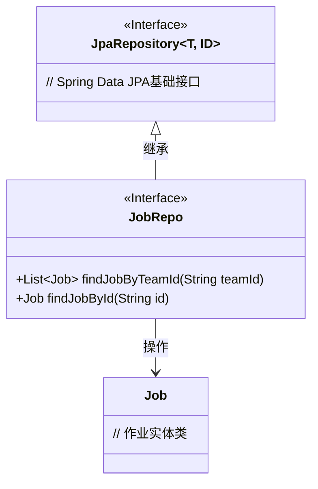
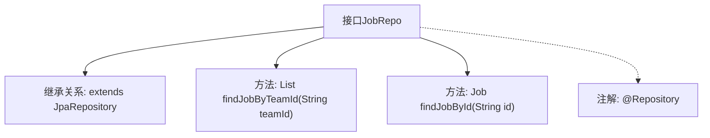

# 基础信息

|      |      |
|------|------|
| 名称 | JobRepo |
| 编码语言 | .java |
| 代码路径 | staffjoy/company-svc/src/main/java/xyz/staffjoy/company/repo/JobRepo.java |
| 包名 | xyz.staffjoy.company.repo |
| 依赖项 | ['org.springframework.data.jpa.repository.JpaRepository', 'org.springframework.stereotype.Repository', 'xyz.staffjoy.company.model.Job', 'java.util.List'] |
| 概述说明 | JobRepo接口扩展JpaRepository，提供按团队ID查询任务列表和按ID查询单个任务的方法。 |

# 说明

这是一个名为JobRepo的Spring Data JPA仓库接口，继承自JpaRepository泛型类，指定实体类型为Job，主键类型为String。该接口定义了两个查询方法：findJobByTeamId通过团队ID查询返回Job对象列表，findJobById通过ID查询返回单个Job对象。接口使用@Repository注解标识为Spring管理的仓库组件。

# 类列表 Class Summary

| 名称   | 类型  | 说明 |
|-------|------|-------------|
| JobRepo | interface | JobRepo接口继承JpaRepository，提供按团队ID查询任务列表和按ID查询单个任务的方法。 |

## 类 JobRepo

|      |      |
|------|------|
| 访问范围 | @Repository;public |
| 类型 | interface |
| 名称 | JobRepo |
| 说明 | JobRepo接口继承JpaRepository，提供按团队ID查询任务列表和按ID查询单个任务的方法。 |

### UML类图

该类图展示了Spring Data JPA中JobRepo接口的结构及其关联关系。JobRepo作为数据访问层接口，继承自泛型接口JpaRepository<Job, String>，表明其针对Job实体进行CRUD操作，主键类型为String。接口定义了两个查询方法：按团队ID查询作业列表和按ID查询单个作业。图中清晰体现了接口继承关系和实体操作依赖，符合JPA规范的设计模式。

### 内部方法调用关系图

该流程图展示了JobRepo接口的结构，它是一个Spring Data JPA仓库接口，继承自JpaRepository并泛型化为Job实体和String类型的主键。接口定义了两个查询方法：按团队ID查找多个Job的方法和按ID查找单个Job的方法，同时标注了@Repository注解表示这是一个Spring管理的持久层组件。整个结构清晰地反映了该接口在数据访问层的职责和功能。

### 字段列表 Field List

| 名称  | 类型  | 说明 |
|-------|-------|------|

### 方法列表 Method List

| 名称  | 类型  | 说明 |
|-------|-------|------|
| findJobById | Job | 通过ID查找并返回对应的工作信息。 |
| findJobByTeamId | List<Job> | 根据团队ID查询职位列表 |

