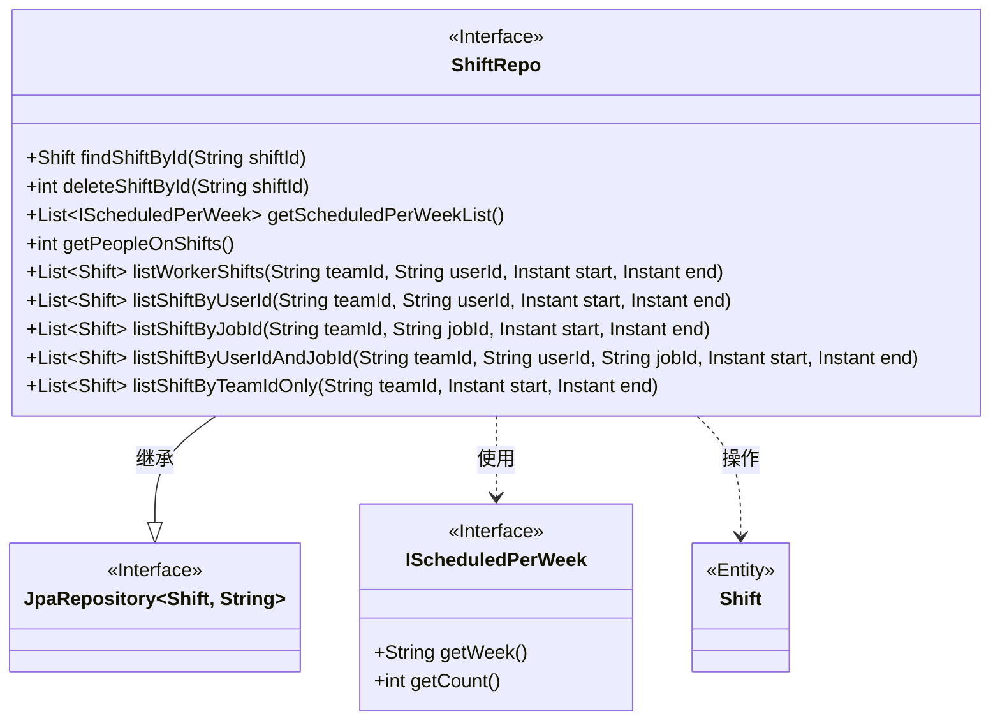

# 基础信息

|      |      |
|------|------|
| 名称 | ShiftRepo |
| 编码语言 | .java |
| 代码路径 | staffjoy/company-svc/src/main/java/xyz/staffjoy/company/repo/ShiftRepo.java |
| 包名 | xyz.staffjoy.company.repo |
| 依赖项 | ['org.springframework.data.jpa.repository.JpaRepository', 'org.springframework.data.jpa.repository.Modifying', 'org.springframework.data.jpa.repository.Query', 'org.springframework.data.repository.query.Param', 'org.springframework.stereotype.Repository', 'org.springframework.transaction.annotation.Transactional', 'xyz.staffjoy.company.model.Shift', 'java.time.Instant', 'java.util.List'] |
| 概述说明 | ShiftRepo接口扩展JpaRepository，提供班次查询、删除及统计功能，包括按ID查找、删除班次，按周统计排班人数，查询当前在岗人数及多种条件筛选班次列表。 |

# 说明

这是一个名为ShiftRepo的Spring Data JPA仓库接口，用于管理Shift实体。它提供了多种查询方法：通过ID查找班次、删除班次、获取每周排班统计、获取当前值班人数。还包含多个时间段查询方法，可按团队ID、用户ID、职位ID或其组合筛选班次，部分查询支持按开始时间排序。所有方法均使用JPA注解定义，包括原生SQL查询和JPQL查询。

# 类列表 Class Summary

| 名称   | 类型  | 说明 |
|-------|------|-------------|
| ShiftRepo | interface | ShiftRepo接口扩展JpaRepository，提供查询、删除班次及按周统计等功能。 |

## 类 ShiftRepo

|      |      |
|------|------|
| 访问范围 | @Repository;public |
| 类型 | interface |
| 名称 | ShiftRepo |
| 说明 | ShiftRepo接口扩展JpaRepository，提供查询、删除班次及按周统计等功能。 |

### UML类图

该代码展示了一个Spring Data JPA仓库接口ShiftRepo，它继承自JpaRepository并提供了多种查询Shift实体的方法。类图清晰地呈现了ShiftRepo与JpaRepository的继承关系，以及它与IScheduledPerWeek接口和Shift实体的交互。ShiftRepo包含8个查询方法，涵盖按ID查询、删除、复杂统计以及多种条件组合查询等功能，其中getScheduledPerWeekList()方法使用了嵌套接口IScheduledPerWeek作为返回类型。所有方法都通过@Query注解实现了自定义SQL或JPQL查询逻辑。

### 内部方法调用关系图

```mermaid
graph TD
    A["接口ShiftRepo"]
    B["继承: JpaRepository<Shift, String>"]
    C["方法: Shift findShiftById(String shiftId)"]
    D["方法: int deleteShiftById(String shiftId)"]
    E["方法: List<IScheduledPerWeek> getScheduledPerWeekList()"]
    F["方法: int getPeopleOnShifts()"]
    G["方法: List<Shift> listWorkerShifts(String teamId, String userId, Instant start, Instant end)"]
    H["方法: List<Shift> listShiftByUserId(String teamId, String userId, Instant start, Instant end)"]
    I["方法: List<Shift> listShiftByJobId(String teamId, String jobId, Instant start, Instant end)"]
    J["方法: List<Shift> listShiftByUserIdAndJobId(String teamId, String userId, String jobId, Instant start, Instant end)"]
    K["方法: List<Shift> listShiftByTeamIdOnly(String teamId, Instant start, Instant end)"]
    L["嵌套接口: IScheduledPerWeek"]
    M["方法: String getWeek()"]
    N["方法: int getCount()"]

    A --> B
    A --> C
    A --> D
    A --> E
    A --> F
    A --> G
    A --> H
    A --> I
    A --> J
    A --> K
    A -.-> L
    L --> M
    L --> N
```

这段代码是Spring Data JPA的Repository接口定义，主要包含对Shift实体的各种查询操作。流程图展示了接口继承关系和所有方法调用层级，包括6个主要查询方法和1个嵌套接口。每个方法都对应特定的数据库操作，如按ID查找/删除班次、获取每周排班统计、获取当前值班人数等。嵌套接口IScheduledPerWeek用于封装每周排班统计结果。所有方法都通过JPA注解实现了复杂的SQL查询逻辑。

### 字段列表 Field List

| 名称  | 类型  | 说明 |
|-------|-------|------|

### 方法列表 Method List

| 名称  | 类型  | 说明 |
|-------|-------|------|
| listShiftByTeamIdOnly | List<Shift> | 查询团队指定时间段的班次列表 |
| listShiftByUserId | List<Shift> | 查询用户指定团队和时间段的班次列表。 |
| deleteShiftById | int | 删除指定ID的班次记录，自动清除缓存，支持事务。 |
| listShiftByUserIdAndJobId | List<Shift> | 查询用户指定时间段内的班次记录 |
| listWorkerShifts | List<Shift> | 查询用户指定时间段内的排班记录。 |
| findShiftById | Shift | 通过ID查询班次信息。 |
| getPeopleOnShifts | int | 查询当前在岗员工数，排除空用户且仅统计已发布的班次。 |
| getScheduledPerWeekList | List<IScheduledPerWeek> | 查询每周排班人数，返回日期和最大人数。 |
| listShiftByJobId | List<Shift> | 查询指定团队、岗位及时间范围内的班次列表。 |

