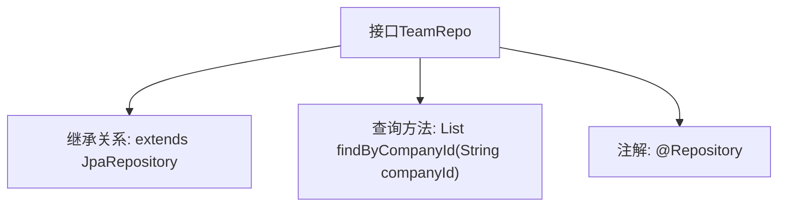

# 基础信息

|      |      |
|------|------|
| 名称 | TeamRepo |
| 编码语言 | .java |
| 代码路径 | staffjoy/company-svc/src/main/java/xyz/staffjoy/company/repo/TeamRepo.java |
| 包名 | xyz.staffjoy.company.repo |
| 依赖项 | ['org.springframework.data.jpa.repository.JpaRepository', 'org.springframework.stereotype.Repository', 'xyz.staffjoy.company.model.Team', 'java.util.List'] |
| 概述说明 | 团队仓库接口继承JPA，可按公司ID查询团队列表。 |

# 说明

该代码片段定义了一个名为TeamRepo的Spring Data JPA仓库接口，继承自JpaRepository泛型类，指定实体类型为Team，主键类型为String。接口中包含一个自定义查询方法findByCompanyId，通过公司ID查询对应的团队列表。该接口用于数据库访问操作，遵循Spring Data的命名规范自动生成查询实现。

# 类列表 Class Summary

| 名称   | 类型  | 说明 |
|-------|------|-------------|
| TeamRepo | interface | 团队仓库接口继承JPA，支持按公司ID查询团队列表。 |


## 类 TeamRepo

|      |      |
|------|------|
| 访问范围 | @Repository;public |
| 类型 | interface |
| 名称 | TeamRepo |
| 说明 | 团队仓库接口继承JPA，支持按公司ID查询团队列表。 |


### UML类图

```mermaid
classDiagram
    class Team {
        // Team实体类，具体属性未在代码中展示
    }

    class JpaRepository~T, ID~ {
        <<Interface>>
        // Spring Data JPA基础接口
    }

    class TeamRepo {
        <<Interface>>
        +List~Team~ findByCompanyId(String companyId)
    }

    TeamRepo --|> JpaRepository : 继承
    JpaRepository --> Team : 泛型参数T
    // TeamRepo通过继承JpaRepository获得基础CRUD能力，并扩展自定义查询方法
```

这段类图展示了Spring Data JPA中TeamRepo接口的层级关系。TeamRepo作为数据访问接口，继承自泛型接口JpaRepository<Team, String>，获得基础数据库操作能力，同时自定义了按companyId查询的方法。图中清晰体现了接口继承、泛型参数传递的关系，符合JPA规范的设计模式。


### 内部方法调用关系图



这段代码定义了一个Spring Data JPA仓库接口TeamRepo，该接口继承自JpaRepository并添加了自定义查询方法。流程图展示了接口的核心结构：通过@Repository注解标记为Spring组件，继承JpaRepository获得基础CRUD操作，并自定义了按companyId查询Team列表的方法。这种设计模式是Spring Data JPA的典型用法，通过方法命名约定自动生成查询实现，减少了样板代码的编写。

### 字段列表 Field List

| 名称  | 类型  | 说明 |
|-------|-------|------|

### 方法列表 Method List

| 名称  | 类型  | 说明 |
|-------|-------|------|
| findByCompanyId | List<Team> | 根据公司ID查询团队列表 |


