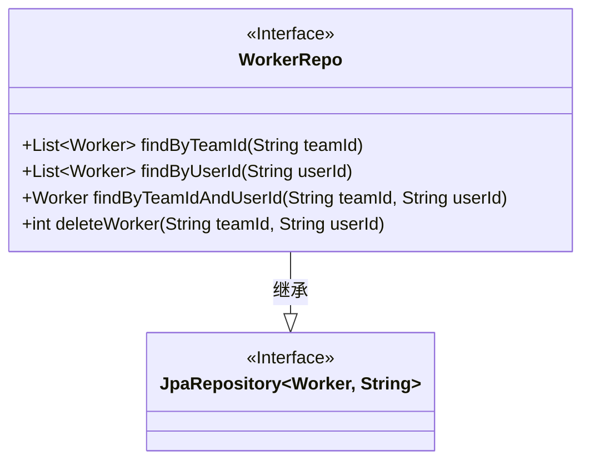
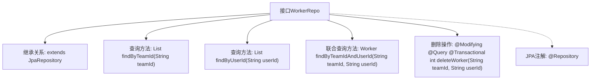

# 基础信息

|      |      |
|------|------|
| 名称 | WorkerRepo |
| 编码语言 | .java |
| 代码路径 | staffjoy/company-svc/src/main/java/xyz/staffjoy/company/repo/WorkerRepo.java |
| 包名 | xyz.staffjoy.company.repo |
| 依赖项 | ['org.springframework.data.jpa.repository.JpaRepository', 'org.springframework.data.jpa.repository.Modifying', 'org.springframework.data.jpa.repository.Query', 'org.springframework.data.repository.query.Param', 'org.springframework.stereotype.Repository', 'org.springframework.transaction.annotation.Transactional', 'xyz.staffjoy.company.model.Worker', 'java.util.List'] |
| 概述说明 | WorkerRepo接口扩展JpaRepository，提供按团队ID、用户ID查询及删除Worker的方法。 |

# 说明

这是一个名为WorkerRepo的Spring Data JPA仓库接口，扩展自JpaRepository，用于操作Worker实体类。接口提供了四个方法：通过团队ID查询工作者列表，通过用户ID查询工作者列表，通过团队ID和用户ID联合查询单个工作者，以及一个自定义删除操作。删除方法使用JPQL语句定义删除条件，并标注了事务和自动清除缓存特性。所有方法都围绕工作者与团队、用户的关联关系进行数据访问。

# 类列表 Class Summary

| 名称   | 类型  | 说明 |
|-------|------|-------------|
| WorkerRepo | interface | WorkerRepo接口扩展JpaRepository，提供按团队ID、用户ID查询及删除方法。 |

## 类 WorkerRepo

|      |      |
|------|------|
| 访问范围 | @Repository;public |
| 类型 | interface |
| 名称 | WorkerRepo |
| 说明 | WorkerRepo接口扩展JpaRepository，提供按团队ID、用户ID查询及删除方法。 |

### UML类图

这段代码展示了一个Spring Data JPA仓库接口WorkerRepo，它继承了JpaRepository接口并提供了对Worker实体的数据库操作能力。该接口包含四个方法：通过团队ID查询成员列表、通过用户ID查询工作记录、通过团队和用户ID联合查询特定记录，以及一个自定义的删除操作（使用JPQL语句并带有事务和自动清理特性）。类图清晰地展示了WorkerRepo与Spring Data JPA核心接口JpaRepository之间的继承关系，其中JpaRepository使用了泛型参数T(实体类型)和ID(主键类型)。

### 内部方法调用关系图

这段代码定义了一个Spring Data JPA仓库接口WorkerRepo，用于操作Worker实体类。该接口继承JpaRepository提供基础CRUD功能，并扩展了四个自定义方法：按团队ID查询、按用户ID查询、联合查询以及带条件删除操作。流程图展示了接口的核心结构，包括继承关系、查询方法和事务性删除操作，其中删除方法通过组合@Modifying、@Query和@Transactional注解实现数据库更新操作。所有方法均遵循Spring Data JPA的命名约定或自定义JPQL语句。

### 字段列表 Field List

| 名称  | 类型  | 说明 |
|-------|-------|------|

### 方法列表 Method List

| 名称  | 类型  | 说明 |
|-------|-------|------|
| findByUserId | List<Worker> | 根据用户ID查询工作者列表。 |
| findByTeamId | List<Worker> | 根据团队ID查询成员列表。 |
| findByTeamIdAndUserId | Worker | 根据团队ID和用户ID查询成员信息。 |
| deleteWorker | int | 删除指定团队和用户的Worker记录。 |

