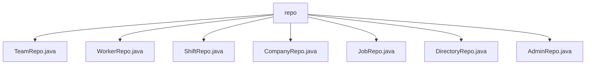

# 基础信息

|      |      |
|------|------|
| 名称 | repo |
| 编码语言 | .java |
| 代码路径 | staffjoy/company-svc/src/main/java/xyz/staffjoy/company/repo |
| 包名 | staffjoy.docs.company-svc.src.main.java.xyz.staffjoy.company.repo |
| 概述说明 | Spring Data JPA仓库接口集合，包含Team、Worker、Shift等实体的CRUD和自定义查询方法。 |

# 说明

## 概述
该代码模块是一个基于Spring Data JPA实现的公司服务数据访问层，包含多个仓库接口，用于管理公司相关的核心业务数据。模块通过继承`JpaRepository`接口提供了标准CRUD操作，同时针对不同业务实体定义了丰富的自定义查询方法。所有仓库接口都遵循Spring Data的命名规范，部分方法使用JPQL或原生SQL实现复杂查询，并合理应用了事务管理和缓存控制机制。

## 主要业务场景
1. **团队管理**  
   - 通过`TeamRepo`实现公司团队的基础管理，支持按公司ID查询团队列表
   - 结合`JobRepo`提供团队与职位的关联查询（按团队ID查询职位）

2. **员工管理**  
   - 使用`WorkerRepo`处理员工与团队的关联关系，支持多维查询（按团队/用户ID）和特殊删除操作
   - 通过`DirectoryRepo`管理公司员工目录，实现分页查询和内部ID更新功能

3. **排班管理**  
   - `ShiftRepo`提供完整的班次管理功能，包括时间段查询、值班统计和复杂条件筛选（支持团队/用户/职位多维度组合查询）

4. **公司基础信息管理**  
   - `CompanyRepo`处理公司实体的基础CRUD和ID查询
   - `AdminRepo`实现公司管理员管理，支持管理员列表查询和精确删除操作

5. **职位管理**  
   - 通过`JobRepo`维护职位信息，支持按团队或ID进行查询

各仓库接口之间存在紧密的业务关联，共同支撑公司服务中的组织架构管理、人员调度和权限控制等核心业务流程。

### 包内部结构视图

该流程图展示了company-svc项目中repo目录下的7个Java仓库接口文件，包括TeamRepo、WorkerRepo等，这些文件均直接隶属于repo目录，没有更深层级的嵌套结构。所有文件均以.java结尾，表明它们是Java接口或类文件，用于数据库操作相关功能。

# 文件列表 File List

| 名称   | 类型  | 说明 |
|-------|------|-------------|
| [AdminRepo.java](AdminRepo.md) | file | 管理仓库接口，含查询和删除方法，基于公司ID和用户ID操作。 |
| [DirectoryRepo.java](DirectoryRepo.md) | file | DirectoryRepo接口扩展JpaRepository，提供按公司ID和用户ID查询、分页查询及更新内部ID的方法。 |
| [JobRepo.java](JobRepo.md) | file | JobRepo接口扩展JpaRepository，提供按团队ID查询任务列表和按ID查询单个任务的方法。 |
| [CompanyRepo.java](CompanyRepo.md) | file | 公司仓库接口，继承JPA，含按ID查询方法。 |
| [WorkerRepo.java](WorkerRepo.md) | file | WorkerRepo接口扩展JpaRepository，提供按团队ID、用户ID查询及删除Worker的方法。 |
| [TeamRepo.java](TeamRepo.md) | file | 团队仓库接口继承JPA，可按公司ID查询团队列表。 |
| [ShiftRepo.java](ShiftRepo.md) | file | ShiftRepo接口扩展JpaRepository，提供班次查询、删除及统计功能，包括按ID查找、删除班次，按周统计排班人数，查询当前在岗人数及多种条件筛选班次列表。 |

