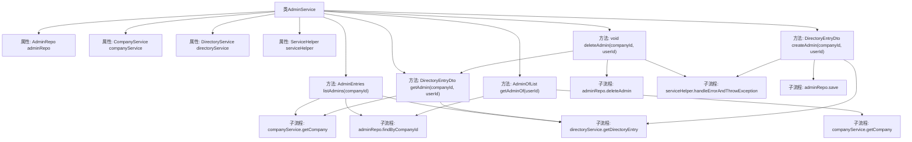

# 基础信息

|      |      |
|------|------|
| 名称 | AdminService |
| 编码语言 | .java |
| 代码路径 | staffjoy/company-svc/src/main/java/xyz/staffjoy/company/service/AdminService.java |
| 包名 | xyz.staffjoy.company.service |
| 依赖项 | ['com.github.structlog4j.ILogger', 'com.github.structlog4j.SLoggerFactory', 'org.springframework.beans.factory.annotation.Autowired', 'org.springframework.stereotype.Service', 'xyz.staffjoy.common.api.ResultCode', 'xyz.staffjoy.common.auditlog.LogEntry', 'xyz.staffjoy.common.auth.AuthContext', 'xyz.staffjoy.common.error.ServiceException', 'xyz.staffjoy.company.dto.AdminEntries', 'xyz.staffjoy.company.dto.AdminOfList', 'xyz.staffjoy.company.dto.CompanyDto', 'xyz.staffjoy.company.dto.DirectoryEntryDto', 'xyz.staffjoy.company.model.Admin', 'xyz.staffjoy.company.repo.AdminRepo', 'xyz.staffjoy.company.service.helper.ServiceHelper', 'java.util.List'] |
| 概述说明 | AdminService类提供管理员管理功能，包括查询、创建、删除及获取所属公司列表。依赖多个服务完成操作，并记录日志和事件。 |

# 说明

AdminService是一个管理管理员信息的服务类，依赖AdminRepo、CompanyService、DirectoryService和ServiceHelper。主要功能包括：列出某公司的所有管理员（listAdmins），获取特定管理员信息（getAdmin），删除管理员（deleteAdmin），创建管理员（createAdmin），以及获取某用户管理的公司列表（getAdminOf）。所有操作均验证公司存在性，删除和创建时记录审计日志并异步跟踪事件。异常由ServiceHelper统一处理。

# 类列表 Class Summary

| 名称   | 类型  | 说明 |
|-------|------|-------------|
| AdminService | class | AdminService提供管理员管理功能，包括查询、创建、删除及关联公司操作。 |

## 类 AdminService

|      |      |
|------|------|
| 访问范围 | @Service;public |
| 类型 | class |
| 名称 | AdminService |
| 说明 | AdminService提供管理员管理功能，包括查询、创建、删除及关联公司操作。 |

### UML类图

```mermaid
classDiagram
    class AdminService {
        <<Service>>
        -ILogger logger
        -AdminRepo adminRepo
        -CompanyService companyService
        -DirectoryService directoryService
        -ServiceHelper serviceHelper
        +AdminEntries listAdmins(String companyId)
        +DirectoryEntryDto getAdmin(String companyId, String userId)
        +void deleteAdmin(String companyId, String userId)
        +DirectoryEntryDto createAdmin(String companyId, String userId)
        +AdminOfList getAdminOf(String userId)
    }

    class AdminRepo {
        <<Repository>>
        +List~Admin~ findByCompanyId(String companyId)
        +Admin findByCompanyIdAndUserId(String companyId, String userId)
        +void deleteAdmin(String companyId, String userId)
        +void save(Admin admin)
        +List~Admin~ findByUserId(String userId)
    }

    class CompanyService {
        <<Service>>
        +CompanyDto getCompany(String companyId)
    }

    class DirectoryService {
        <<Service>>
        +DirectoryEntryDto getDirectoryEntry(String companyId, String userId)
    }

    class ServiceHelper {
        <<Utility>>
        +void handleErrorAndThrowException(ILogger logger, Exception ex, String errMsg)
        +void trackEventAsync(String eventName)
    }

    class AdminEntries {
        -String companyId
        -List~DirectoryEntryDto~ admins
        +builder() Builder
        +getAdmins() List~DirectoryEntryDto~
    }

    class DirectoryEntryDto {
        <<DTO>>
    }

    class Admin {
        -String companyId
        -String userId
        +builder() Builder
        +getCompanyId() String
        +getUserId() String
    }

    class LogEntry {
        <<Entity>>
        -String currentUserId
        -String authorization
        -String targetType
        -String targetId
        -String companyId
        -String teamId
        +builder() Builder
    }

    class AdminOfList {
        -String userId
        -List~CompanyDto~ companies
        +builder() Builder
        +getCompanies() List~CompanyDto~
    }

    class CompanyDto {
        <<DTO>>
    }

    AdminService --> AdminRepo : "依赖\n数据访问"
    AdminService --> CompanyService : "依赖\n验证公司"
    AdminService --> DirectoryService : "依赖\n获取用户信息"
    AdminService --> ServiceHelper : "依赖\n错误处理和事件跟踪"
    AdminEntries --> DirectoryEntryDto : "包含"
    AdminOfList --> CompanyDto : "包含"
```

这段代码展示了一个管理后台服务(AdminService)的类结构，它通过依赖注入的方式整合了多个服务组件。AdminService提供了管理员列表查询、单个管理员查询、创建/删除管理员以及获取用户所属公司列表等功能。核心业务逻辑围绕AdminRepo进行数据操作，同时依赖CompanyService进行公司验证，DirectoryService获取用户信息，ServiceHelper处理异常和事件跟踪。系统通过构建器模式创建AdminEntries、AdminOfList等数据传输对象，并使用LogEntry记录审计日志。整体架构体现了分层设计和单一职责原则。

### 内部方法调用关系图

这段代码是AdminService类的流程图，展示了类的主要方法和依赖关系。AdminService通过adminRepo操作数据库，依赖companyService验证公司信息，使用directoryService获取目录条目，并通过serviceHelper处理错误。主要功能包括管理员列表查询、单个管理员查询、删除管理员、创建管理员以及获取管理员所属公司列表。每个方法都包含必要的验证和错误处理流程，同时记录了操作日志和事件跟踪。

### 字段列表 Field List

| 名称  | 类型  | 说明 |
|-------|-------|------|
| adminRepo | AdminRepo | 自动注入AdminRepo实例。 |
| companyService | CompanyService | 自动注入公司服务 |
| logger = SLoggerFactory.getLogger(AdminService.class) | ILogger | 定义AdminService类的静态日志记录器实例。 |
| serviceHelper | ServiceHelper | 自动注入ServiceHelper工具类 |
| directoryService | DirectoryService | 自动注入DirectoryService服务 |

### 方法列表 Method List

| 名称  | 类型  | 说明 |
|-------|-------|------|
| listAdmins | AdminEntries | 列出公司管理员：验证公司存在后，查询并返回管理员列表。 |
| createAdmin | DirectoryEntryDto | 创建管理员：检查存在性后保存新管理员并记录日志。 |
| getAdmin | DirectoryEntryDto | 获取公司管理员信息：验证公司存在后查询管理员并返回目录条目。 |
| deleteAdmin | void | 删除管理员：验证后删除，记录日志并跟踪事件。 |
| getAdminOf | AdminOfList | 获取用户管理的公司列表，返回包含公司信息的AdminOfList对象。 |

