# 基础信息

|      |      |
|------|------|
| 名称 | CompanyService |
| 编码语言 | .java |
| 代码路径 | staffjoy/company-svc/src/main/java/xyz/staffjoy/company/service/CompanyService.java |
| 包名 | xyz.staffjoy.company.service |
| 依赖项 | ['com.github.structlog4j.ILogger', 'com.github.structlog4j.SLoggerFactory', 'org.modelmapper.ModelMapper', 'org.springframework.beans.factory.annotation.Autowired', 'org.springframework.data.domain.Page', 'org.springframework.data.domain.PageRequest', 'org.springframework.data.domain.Pageable', 'org.springframework.stereotype.Service', 'xyz.staffjoy.common.api.ResultCode', 'xyz.staffjoy.common.auditlog.LogEntry', 'xyz.staffjoy.common.auth.AuthContext', 'xyz.staffjoy.common.error.ServiceException', 'xyz.staffjoy.company.dto.CompanyDto', 'xyz.staffjoy.company.dto.CompanyList', 'xyz.staffjoy.company.model.Company', 'xyz.staffjoy.company.repo.CompanyRepo', 'xyz.staffjoy.company.service.helper.ServiceHelper', 'javax.persistence.EntityManager', 'javax.persistence.PersistenceContext', 'java.util.List', 'java.util.stream.Collectors.toList'] |
| 概述说明 | 公司服务类，包含创建、查询、更新公司信息功能，处理异常并记录日志。 |

# 说明

该代码定义了一个名为CompanyService的Spring服务类，用于处理公司相关的业务逻辑。类中注入了CompanyRepo、ServiceHelper和ModelMapper等依赖项，并使用了EntityManager进行实体管理。主要功能包括创建公司、查询公司列表、获取单个公司信息和更新公司信息。每个操作都包含错误处理和日志记录，使用LogEntry构建审计日志，并通过serviceHelper跟踪异步事件。数据转换通过ModelMapper实现，将Company与CompanyDto相互转换。查询公司列表支持分页，默认每页20条记录。所有操作均通过companyRepo与数据库交互，并在异常时抛出ServiceException。

# 类列表 Class Summary

| 名称   | 类型  | 说明 |
|-------|------|-------------|
| CompanyService | class | 公司服务类，包含创建、查询、更新公司信息功能，处理异常和日志记录。 |

## 类 CompanyService

|      |      |
|------|------|
| 访问范围 | @Service;public |
| 类型 | class |
| 名称 | CompanyService |
| 说明 | 公司服务类，包含创建、查询、更新公司信息功能，处理异常和日志记录。 |

### UML类图

```mermaid
classDiagram
    class CompanyService {
        -CompanyRepo companyRepo
        -ServiceHelper serviceHelper
        -ModelMapper modelMapper
        -EntityManager entityManager
        +createCompany(CompanyDto companyDto) CompanyDto
        +listCompanies(int offset, int limit) CompanyList
        +getCompany(String companyId) CompanyDto
        +updateCompany(CompanyDto companyDto) CompanyDto
        -convertToDto(Company company) CompanyDto
        -convertToModel(CompanyDto companyDto) Company
    }

    class CompanyRepo {
        <<Interface>>
        +save(Company company) Company
        +findAll(Pageable pageable) Page~Company~
        +findCompanyById(String id) Company
    }

    class ServiceHelper {
        <<Interface>>
        +handleErrorAndThrowException(ILogger logger, Exception ex, String errMsg)
        +trackEventAsync(String eventName)
    }

    class ModelMapper {
        +map(Object source, Class~T~ destinationType) T
    }

    class EntityManager {
        +detach(Object entity)
    }

    class CompanyDto {
        -String id
        // 其他DTO字段
    }

    class Company {
        -String id
        // 其他实体字段
        +toString() String
    }

    class CompanyList {
        -int limit
        -int offset
        -List~CompanyDto~ companies
        +builder() Builder
    }

    class LogEntry {
        -String currentUserId
        -String authorization
        -String targetType
        -String targetId
        -String companyId
        -String teamId
        -String originalContents
        -String updatedContents
        +builder() Builder
    }

    class AuthContext {
        <<Interface>>
        +getUserId() String
        +getAuthz() String
    }

    class ILogger {
        <<Interface>>
        +info(String message, LogEntry logEntry)
        // 其他日志方法
    }

    CompanyService --> CompanyRepo : 依赖
    CompanyService --> ServiceHelper : 依赖
    CompanyService --> ModelMapper : 依赖
    CompanyService --> EntityManager : 依赖
    CompanyService --> ILogger : 使用
    CompanyService --> AuthContext : 使用
    CompanyService ..> CompanyDto : 转换
    CompanyService ..> Company : 转换
    CompanyService ..> CompanyList : 构造
    CompanyService ..> LogEntry : 构造
```

这段代码展示了一个企业服务类`CompanyService`，它通过`CompanyRepo`进行数据持久化操作，使用`ServiceHelper`处理异常和事件跟踪，借助`ModelMapper`实现DTO与实体间的转换。类图清晰地展示了各组件间的依赖关系，包括核心业务逻辑、数据访问层、工具类以及日志审计等功能模块。服务类提供了公司创建、查询、更新等核心业务方法，同时集成了完善的错误处理和审计日志功能。

### 内部方法调用关系图

```mermaid
graph TD
    A["类CompanyService"]
    B["属性: CompanyRepo companyRepo"]
    C["属性: ServiceHelper serviceHelper"]
    D["属性: ModelMapper modelMapper"]
    E["属性: EntityManager entityManager"]
    F["方法: createCompany(CompanyDto)"]
    G["方法: listCompanies(int, int)"]
    H["方法: getCompany(String)"]
    I["方法: updateCompany(CompanyDto)"]
    J["私有方法: convertToDto(Company)"]
    K["私有方法: convertToModel(CompanyDto)"]

    A --> B
    A --> C
    A --> D
    A --> E
    A --> F
    A --> G
    A --> H
    A --> I
    A --> J
    A --> K

    F -->|"1. convertToModel"| K
    F -->|"2. companyRepo.save"| B
    F -->|"3. handleErrorAndThrowException"| C
    F -->|"4. logger.info"| A
    F -->|"5. trackEventAsync"| C
    F -->|"6. convertToDto"| J

    G -->|"1. 校验limit"| G
    G -->|"2. companyRepo.findAll"| B
    G -->|"3. handleErrorAndThrowException"| C
    G -->|"4. stream.map转换"| J
    G -->|"5. 构建CompanyList"| G

    H -->|"1. companyRepo.findCompanyById"| B
    H -->|"2. 空值检查"| H
    H -->|"3. convertToDto"| J

    I -->|"1. companyRepo.findCompanyById"| B
    I -->|"2. 空值检查"| I
    I -->|"3. entityManager.detach"| E
    I -->|"4. convertToModel"| K
    I -->|"5. companyRepo.save"| B
    I -->|"6. handleErrorAndThrowException"| C
    I -->|"7. logger.info"| A
    I -->|"8. trackEventAsync"| C
    I -->|"9. convertToDto"| J
```

这段代码是CompanyService类的实现，主要包含公司数据的增删改查操作。流程图展示了类属性与方法的调用关系，核心方法如createCompany、listCompanies、getCompany和updateCompany都涉及数据转换、数据库操作和错误处理。每个方法内部通过箭头清晰地展示了调用流程，包括参数校验、模型转换、数据库交互、日志记录和异步事件跟踪等关键步骤。私有方法convertToDto和convertToModel被多个公有方法复用，体现了代码复用性。

### 字段列表 Field List

| 名称  | 类型  | 说明 |
|-------|-------|------|
| entityManager | EntityManager | 注入JPA实体管理器 |
| companyRepo | CompanyRepo | 自动注入公司仓库实例 |
| serviceHelper | ServiceHelper | 自动注入ServiceHelper实例 |
| logger = SLoggerFactory.getLogger(CompanyService.class) | ILogger | 声明日志记录器变量，用于CompanyService类。 |
| modelMapper | ModelMapper | 自动注入ModelMapper对象 |

### 方法列表 Method List

| 名称  | 类型  | 说明 |
|-------|-------|------|
| convertToDto | CompanyDto | 私有方法将Company对象转换为CompanyDto对象。 |
| convertToModel | Company | 将CompanyDto对象转换为Company实体类。 |
| updateCompany | CompanyDto | 更新公司信息，检查存在性后保存并记录日志。 |
| createCompany | CompanyDto | 创建公司并记录日志，出错时处理异常，最后返回公司DTO。 |
| listCompanies | CompanyList | 查询公司列表，默认每页20条，异常处理并返回分页结果。 |
| getCompany | CompanyDto | 通过ID查询公司信息，不存在则抛异常，存在则转为DTO返回。 |

