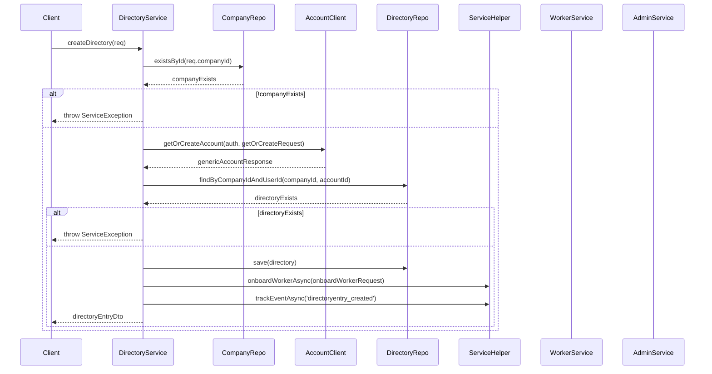

# 基础信息

|      |      |
|------|------|
| 名称 | DirectoryService |
| 编码语言 | .java |
| 代码路径 | staffjoy/company-svc/src/main/java/xyz/staffjoy/company/service/DirectoryService.java |
| 包名 | xyz.staffjoy.company.service |
| 依赖项 | ['com.github.structlog4j.ILogger', 'com.github.structlog4j.SLoggerFactory', 'org.springframework.beans.factory.annotation.Autowired', 'org.springframework.data.domain.Page', 'org.springframework.data.domain.PageRequest', 'org.springframework.stereotype.Service', 'xyz.staffjoy.account.client.AccountClient', 'xyz.staffjoy.account.dto.AccountDto', 'xyz.staffjoy.account.dto.GenericAccountResponse', 'xyz.staffjoy.account.dto.GetOrCreateRequest', 'xyz.staffjoy.bot.dto.OnboardWorkerRequest', 'xyz.staffjoy.common.api.ResultCode', 'xyz.staffjoy.common.auditlog.LogEntry', 'xyz.staffjoy.common.auth.AuthConstant', 'xyz.staffjoy.common.auth.AuthContext', 'xyz.staffjoy.common.error.ServiceException', 'xyz.staffjoy.company.dto', 'xyz.staffjoy.company.model.Directory', 'xyz.staffjoy.company.repo.CompanyRepo', 'xyz.staffjoy.company.repo.DirectoryRepo', 'xyz.staffjoy.company.service.helper.ServiceHelper'] |
| 概述说明 | 目录服务类，包含创建、查询、更新目录及关联账户功能，处理公司内用户信息管理。 |

# 说明

DirectoryService是一个处理目录相关操作的Spring服务类，包含创建、查询、更新目录条目及获取关联信息的功能。它依赖多个组件如CompanyRepo、DirectoryRepo、AccountClient等。主要方法包括：createDirectory验证公司存在后创建目录条目并关联账户；listDirectory分页查询目录列表；getDirectoryEntry获取单个目录条目详情；updateDirectoryEntry更新条目信息并校验权限；getAssociations获取账户关联的团队和管理员信息。所有操作均包含错误处理和日志记录，并涉及异步任务如onboardWorker和事件跟踪。copyAccountToDirectory方法用于同步账户数据到目录条目。

# 类列表 Class Summary

| 名称   | 类型  | 说明 |
|-------|------|-------------|
| DirectoryService | class | 目录服务类，包含创建、查询、更新目录及关联账户功能，处理公司员工信息管理。 |

## 类 DirectoryService

|      |      |
|------|------|
| 访问范围 | @Service;public |
| 类型 | class |
| 名称 | DirectoryService |
| 说明 | 目录服务类，包含创建、查询、更新目录及关联账户功能，处理公司员工信息管理。 |

### UML类图

```mermaid
classDiagram
    class DirectoryService {
        -CompanyRepo companyRepo
        -DirectoryRepo directoryRepo
        -AccountClient accountClient
        -ServiceHelper serviceHelper
        -WorkerService workerService
        -AdminService adminService
        +createDirectory(NewDirectoryEntry req) DirectoryEntryDto
        +listDirectory(String companyId, int offset, int limit) DirectoryList
        +getDirectoryEntry(String companyId, String userId) DirectoryEntryDto
        +updateDirectoryEntry(DirectoryEntryDto request) DirectoryEntryDto
        +getAssociations(String companyId, int offset, int limit) AssociationList
        -copyAccountToDirectory(AccountDto a, DirectoryEntryDto d) void
    }

    class CompanyRepo {
        +existsById(String id) boolean
    }

    class DirectoryRepo {
        +findByCompanyIdAndUserId(String companyId, String userId) Directory
        +findByCompanyId(String companyId, PageRequest pageRequest) Page~Directory~
        +save(Directory directory) Directory
        +updateInternalIdByCompanyIdAndUserId(String internalId, String companyId, String userId) void
    }

    class AccountClient {
        +getOrCreateAccount(String auth, GetOrCreateRequest request) GenericAccountResponse
        +getAccount(String auth, String userId) GenericAccountResponse
        +updateAccount(String auth, AccountDto account) GenericAccountResponse
    }

    class ServiceHelper {
        +handleErrorAndThrowException(ILogger logger, Exception ex, String errMsg) void
        +handleErrorAndThrowException(ILogger logger, String message) void
        +onboardWorkerAsync(OnboardWorkerRequest request) void
        +trackEventAsync(String eventName) void
    }

    class WorkerService {
        +getWorkerOf(String userId) WorkerOfList
    }

    class AdminService {
        +getAdmin(String companyId, String userId) DirectoryEntryDto
    }

    DirectoryService --> CompanyRepo : 依赖
    DirectoryService --> DirectoryRepo : 依赖
    DirectoryService --> AccountClient : 依赖
    DirectoryService --> ServiceHelper : 依赖
    DirectoryService --> WorkerService : 依赖
    DirectoryService --> AdminService : 依赖
```

这段代码展示了一个企业目录服务系统，主要处理企业成员目录的创建、查询、更新和关联关系管理。DirectoryService作为核心服务类，依赖多个仓储类(CompanyRepo、DirectoryRepo)和客户端(AccountClient)完成数据操作，通过ServiceHelper处理异常和异步任务，并与WorkerService、AdminService协作获取员工团队和管理员信息。系统实现了完整的目录条目生命周期管理，包括账户同步、权限校验、审计日志和事件跟踪等功能。

### 内部方法调用关系图

```mermaid
graph TD
    A["DirectoryService类"]
    B["属性: CompanyRepo companyRepo"]
    C["属性: DirectoryRepo directoryRepo"]
    D["属性: AccountClient accountClient"]
    E["属性: ServiceHelper serviceHelper"]
    F["属性: WorkerService workerService"]
    G["属性: AdminService adminService"]
    H["方法: DirectoryEntryDto createDirectory(NewDirectoryEntry req)"]
    I["方法: DirectoryList listDirectory(String companyId, int offset, int limit)"]
    J["方法: DirectoryEntryDto getDirectoryEntry(String companyId, String userId)"]
    K["方法: DirectoryEntryDto updateDirectoryEntry(DirectoryEntryDto request)"]
    L["方法: AssociationList getAssociations(String companyId, int offset, int limit)"]
    M["私有方法: void copyAccountToDirectory(AccountDto a, DirectoryEntryDto d)"]

    A --> B
    A --> C
    A --> D
    A --> E
    A --> F
    A --> G
    A --> H
    A --> I
    A --> J
    A --> K
    A --> L
    A --> M
```

这段代码实现了一个企业目录服务，主要功能包括创建目录条目、列出目录、获取单个目录条目、更新目录条目以及获取关联信息。核心流程涉及公司验证、账户创建/获取、目录条目存储和事件跟踪，通过多个Repository和Service协作完成。代码包含完善的错误处理和日志记录机制，确保数据一致性和可追溯性。

### 字段列表 Field List

| 名称  | 类型  | 说明 |
|-------|-------|------|
| serviceHelper | ServiceHelper | 自动注入ServiceHelper实例 |
| adminService | AdminService | 自动注入AdminService服务实例。 |
| directoryRepo | DirectoryRepo | 自动注入DirectoryRepo实例。 |
| logger = SLoggerFactory.getLogger(DirectoryService.class) | ILogger | 声明静态日志记录器，用于DirectoryService类。 |
| workerService | WorkerService | 自动注入WorkerService实例。 |
| companyRepo | CompanyRepo | 自动注入公司仓库实例 |
| accountClient | AccountClient | 自动注入AccountClient实例 |

### 方法列表 Method List

| 名称  | 类型  | 说明 |
|-------|-------|------|
| copyAccountToDirectory | void | 将账户信息复制到目录条目，包括ID、姓名、状态、电话、照片和邮箱。 |
| listDirectory | DirectoryList | 方法列出公司目录：默认每页20条，分页查询并填充账户信息，异常处理错误。 |
| createDirectory | DirectoryEntryDto | 创建目录条目，验证公司存在，处理账户信息，保存目录并记录审计日志。 |
| getDirectoryEntry | DirectoryEntryDto | 根据公司ID和用户ID获取目录条目，处理异常并返回结果。 |
| updateDirectoryEntry | DirectoryEntryDto | 更新目录条目：验证账户信息，检查修改权限，更新账户数据并记录日志。 |
| getAssociations | AssociationList | 获取公司关联列表，包含账户、团队及管理员信息。 |

