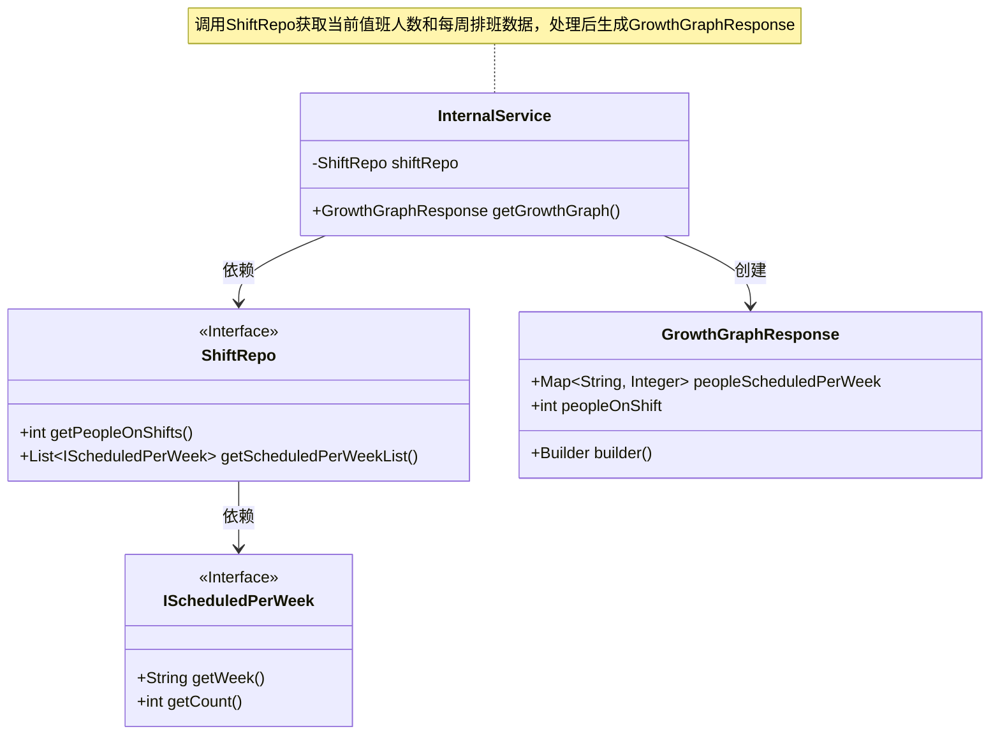
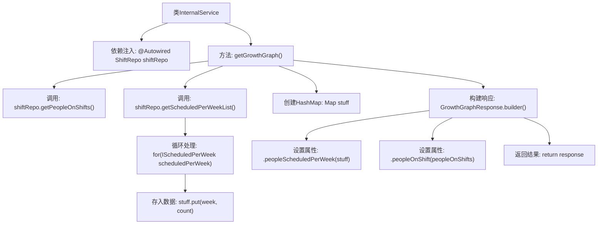

# 基础信息

|      |      |
|------|------|
| 名称 | InternalService |
| 编码语言 | .java |
| 代码路径 | staffjoy/company-svc/src/main/java/xyz/staffjoy/company/service/InternalService.java |
| 包名 | xyz.staffjoy.company.service |
| 依赖项 | ['org.springframework.beans.factory.annotation.Autowired', 'org.springframework.stereotype.Service', 'xyz.staffjoy.company.dto.GrowthGraphResponse', 'xyz.staffjoy.company.repo.ShiftRepo', 'java.util.HashMap', 'java.util.List', 'java.util.Map'] |
| 概述说明 | 内部服务类，获取当前值班人数和每周排班数，返回增长图数据。 |

# 说明

该代码定义了一个名为InternalService的服务类，包含获取增长图表数据的方法。方法通过ShiftRepo获取当前在班人数和每周排班计划列表，将每周排班数据转换为以周为键的映射，最后构建并返回包含每周排班人数和当前在班人数的GrowthGraphResponse对象。整个过程不涉及复杂逻辑，主要完成数据获取和格式转换。

# 类列表 Class Summary

| 名称   | 类型  | 说明 |
|-------|------|-------------|
| InternalService | class | InternalService类通过shiftRepo获取当前值班人数和每周排班数，构建GrowthGraphResponse返回。 |

## 类 InternalService

|      |      |
|------|------|
| 访问范围 | @Service;public |
| 类型 | class |
| 名称 | InternalService |
| 说明 | InternalService类通过shiftRepo获取当前值班人数和每周排班数，构建GrowthGraphResponse返回。 |

### UML类图

这段代码描述了一个服务类InternalService，它通过ShiftRepo接口获取当前值班人数和每周排班数据，处理后构建并返回GrowthGraphResponse对象。ShiftRepo接口定义了获取数据的方法，IScheduledPerWeek是嵌套接口表示每周排班数据。GrowthGraphResponse是包含处理结果的数据传输对象，使用建造者模式构建。类图清晰地展示了这些组件之间的依赖关系和职责划分。

### 内部方法调用关系图

这段代码流程图展示了InternalService类中getGrowthGraph()方法的完整执行流程。该方法首先通过ShiftRepo获取当前值班人数和每周排班计划列表，然后处理排班数据并存入HashMap，最后构建包含处理结果的GrowthGraphResponse对象。整个过程包含数据获取、循环处理、映射构建和响应组装四个主要阶段，体现了从数据源到最终响应的完整转换逻辑。

### 字段列表 Field List

| 名称  | 类型  | 说明 |
|-------|-------|------|
| shiftRepo | ShiftRepo | 自动注入ShiftRepo实例 |

### 方法列表 Method List

| 名称  | 类型  | 说明 |
|-------|-------|------|
| getGrowthGraph | GrowthGraphResponse | 获取当前在岗人数和每周排班数，构建增长图响应。 |

