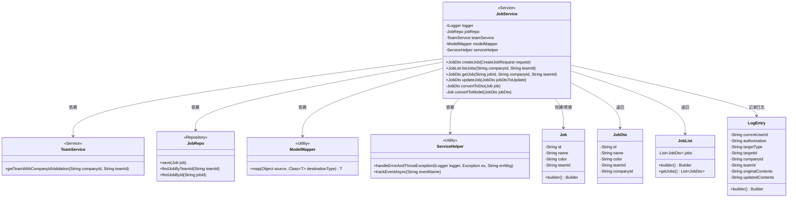

# 基础信息

|      |      |
|------|------|
| 名称 | JobService |
| 编码语言 | .java |
| 代码路径 | staffjoy/company-svc/src/main/java/xyz/staffjoy/company/service/JobService.java |
| 包名 | xyz.staffjoy.company.service |
| 依赖项 | ['com.github.structlog4j.ILogger', 'com.github.structlog4j.SLoggerFactory', 'org.modelmapper.ModelMapper', 'org.springframework.beans.factory.annotation.Autowired', 'org.springframework.stereotype.Service', 'xyz.staffjoy.common.api.ResultCode', 'xyz.staffjoy.common.auditlog.LogEntry', 'xyz.staffjoy.common.auth.AuthContext', 'xyz.staffjoy.common.error.ServiceException', 'xyz.staffjoy.company.dto.CreateJobRequest', 'xyz.staffjoy.company.dto.JobDto', 'xyz.staffjoy.company.dto.JobList', 'xyz.staffjoy.company.model.Job', 'xyz.staffjoy.company.repo.JobRepo', 'xyz.staffjoy.company.service.helper.ServiceHelper', 'java.util.List'] |
| 概述说明 | JobService类提供作业管理功能，包括创建、查询、更新作业，并记录审计日志和事件跟踪。 |

# 说明

JobService是一个服务类，提供作业管理功能。它依赖JobRepo、TeamService、ModelMapper和ServiceHelper。主要功能包括创建作业、列出作业、获取作业详情和更新作业。创建作业时会验证团队和公司信息，保存作业并记录审计日志和事件。列出作业根据团队ID查询并转换为DTO。获取作业详情会验证并返回指定作业的DTO。更新作业会验证并保存修改，记录审计日志和事件。DTO与模型转换通过ModelMapper实现。所有操作均包含错误处理和日志记录。

# 类列表 Class Summary

| 名称   | 类型  | 说明 |
|-------|------|-------------|
| JobService | class | JobService类提供创建、查询、更新Job功能，包含团队验证、日志记录和异常处理。 |

## 类 JobService

|      |      |
|------|------|
| 访问范围 | @Service;public |
| 类型 | class |
| 名称 | JobService |
| 说明 | JobService类提供创建、查询、更新Job功能，包含团队验证、日志记录和异常处理。 |

### UML类图

这段代码展示了一个JobService类，它是一个Spring服务，负责处理与工作(Job)相关的业务逻辑。该类依赖TeamService进行团队验证，使用JobRepo进行数据持久化，通过ModelMapper进行对象转换，并借助ServiceHelper处理错误和跟踪事件。主要功能包括创建、查询、更新Job，以及相关的日志记录和事件跟踪。类图中清晰地展示了这些类之间的关系和依赖。

### 内部方法调用关系图

```mermaid
graph TD
    A["JobService类"]
    B["属性: JobRepo jobRepo"]
    C["属性: TeamService teamService"]
    D["属性: ModelMapper modelMapper"]
    E["属性: ServiceHelper serviceHelper"]
    F["方法: createJob(CreateJobRequest request)"]
    G["方法: listJobs(String companyId, String teamId)"]
    H["方法: getJob(String jobId, String companyId, String teamId)"]
    I["方法: updateJob(JobDto jobDtoToUpdate)"]
    J["方法: convertToDto(Job job)"]
    K["方法: convertToModel(JobDto jobDto)"]

    A --> B
    A --> C
    A --> D
    A --> E
    A --> F
    A --> G
    A --> H
    A --> I
    A --> J
    A --> K

    F --> C1["调用teamService.getTeamWithCompanyIdValidation"]
    F --> C2["构建Job对象"]
    F --> C3["调用jobRepo.save"]
    F --> C4["构建LogEntry审计日志"]
    F --> C5["调用logger.info记录日志"]
    F --> C6["调用serviceHelper.trackEventAsync"]
    F --> C7["调用convertToDto转换并返回"]

    G --> D1["调用teamService.getTeamWithCompanyIdValidation"]
    G --> D2["调用jobRepo.findJobByTeamId"]
    G --> D3["循环转换Job到JobDto"]
    G --> D4["返回JobList"]

    H --> E1["调用teamService.getTeamWithCompanyIdValidation"]
    H --> E2["调用jobRepo.findJobById"]
    H --> E3["调用convertToDto转换并返回"]

    I --> F1["调用teamService.getTeamWithCompanyIdValidation"]
    I --> F2["调用getJob获取原始数据"]
    I --> F3["调用convertToModel转换"]
    I --> F4["调用jobRepo.save"]
    I --> F5["构建LogEntry审计日志"]
    I --> F6["调用logger.info记录日志"]
    I --> F7["调用serviceHelper.trackEventAsync"]
    I --> F8["返回更新后的jobDto"]
```

这段代码是JobService类的实现，主要包含作业(Job)的增删改查功能。通过流程图可以看到，该类依赖JobRepo进行数据持久化，使用TeamService进行团队验证，通过ModelMapper实现DTO转换，并借助ServiceHelper处理异常和事件跟踪。核心方法包括创建作业(createJob)、查询作业列表(listJobs)、获取单个作业(getJob)和更新作业(updateJob)，每个方法都包含完整的业务验证、数据操作和日志记录流程。审计日志和异步事件跟踪贯穿所有写操作，体现了完善的可观测性设计。

### 字段列表 Field List

| 名称  | 类型  | 说明 |
|-------|-------|------|
| modelMapper | ModelMapper | 自动注入ModelMapper对象。 |
| jobRepo | JobRepo | 自动注入JobRepo实例。 |
| logger = SLoggerFactory.getLogger(JobService.class) | ILogger | 声明JobService类的静态日志记录器实例。 |
| serviceHelper | ServiceHelper | 自动注入ServiceHelper实例 |
| teamService | TeamService | 自动注入TeamService实例 |

### 方法列表 Method List

| 名称  | 类型  | 说明 |
|-------|-------|------|
| getJob | JobDto | 获取职位信息：验证公司和团队，查询职位并转换为DTO返回。 |
| convertToDto | JobDto | 将Job对象转换为JobDto对象。 |
| updateJob | JobDto | 更新职位信息，验证后保存并记录审计日志。 |
| createJob | JobDto | 创建职位并验证团队，保存日志和事件，返回职位信息。 |
| listJobs | JobList | 根据公司ID和团队ID获取职位列表，验证后转换为DTO返回。 |
| convertToModel | Job | 将JobDto对象转换为Job模型。 |

