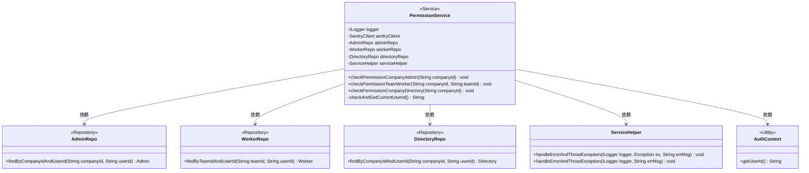
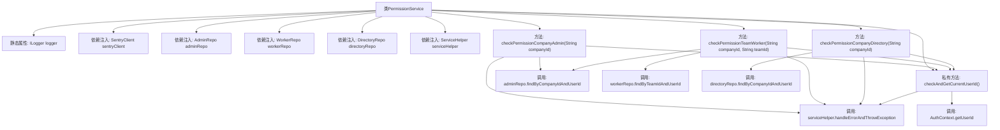

# 基础信息

|      |      |
|------|------|
| 名称 | PermissionService |
| 编码语言 | .java |
| 代码路径 | staffjoy/company-svc/src/main/java/xyz/staffjoy/company/service/PermissionService.java |
| 包名 | xyz.staffjoy.company.service |
| 依赖项 | ['com.github.structlog4j.ILogger', 'com.github.structlog4j.SLoggerFactory', 'io.sentry.SentryClient', 'org.springframework.beans.factory.annotation.Autowired', 'org.springframework.stereotype.Service', 'org.springframework.util.StringUtils', 'xyz.staffjoy.common.auth.AuthContext', 'xyz.staffjoy.common.auth.PermissionDeniedException', 'xyz.staffjoy.company.model.Admin', 'xyz.staffjoy.company.model.Directory', 'xyz.staffjoy.company.model.Worker', 'xyz.staffjoy.company.repo.AdminRepo', 'xyz.staffjoy.company.repo.DirectoryRepo', 'xyz.staffjoy.company.repo.WorkerRepo', 'xyz.staffjoy.company.service.helper.ServiceHelper'] |
| 概述说明 | 权限服务类，检查用户是否为公司管理员、团队成员或目录成员。 |

# 说明

这是一个权限服务类，提供三种权限检查方法。类中注入了日志记录器、错误监控客户端和多个数据仓库。checkPermissionCompanyAdmin方法检查用户是否为指定公司的管理员；checkPermissionTeamWorker方法检查用户是否为指定团队的成员或公司管理员；checkPermissionCompanyDirectory方法检查用户是否存在于公司目录中，是最低级别的权限验证。所有方法都会先获取当前用户ID，若验证失败会抛出权限拒绝异常。错误处理统一通过serviceHelper处理并记录日志。

# 类列表 Class Summary

| 名称   | 类型  | 说明 |
|-------|------|-------------|
| PermissionService | class | 权限服务类，检查用户公司、团队和管理员权限。 |

## 类 PermissionService

|      |      |
|------|------|
| 访问范围 | @Service;public |
| 类型 | class |
| 名称 | PermissionService |
| 说明 | 权限服务类，检查用户公司、团队和管理员权限。 |

### UML类图

这段代码展示了一个权限服务类(PermissionService)，它通过三个主要方法检查不同级别的用户权限：公司管理员权限、团队成员权限和公司目录成员权限。该类依赖多个仓储接口(AdminRepo、WorkerRepo、DirectoryRepo)来查询用户身份，使用ServiceHelper处理异常，并通过AuthContext获取当前用户ID。每个权限检查方法都有明确的错误处理流程，当权限不足时会抛出PermissionDeniedException异常。整个设计体现了分层架构思想，服务层与数据访问层分离，同时包含了完善的错误处理机制。

### 内部方法调用关系图

这段代码展示了一个权限服务类，主要包含三个核心权限检查方法和一个辅助方法。流程图清晰地展示了类结构、依赖注入关系和主要方法调用链。权限检查流程都遵循相同模式：先获取当前用户ID，然后查询不同数据源(admin/worker/directory)进行验证，处理异常情况，最后根据查询结果决定是否抛出权限异常。私有方法checkAndGetCurrentUserId()被所有公开方法共享用于获取当前用户ID，serviceHelper被统一用于错误处理，体现了良好的代码复用和异常处理机制。

### 字段列表 Field List

| 名称  | 类型  | 说明 |
|-------|-------|------|
| adminRepo | AdminRepo | 自动注入AdminRepo实例。 |
| workerRepo | WorkerRepo | 自动注入WorkerRepo实例。 |
| serviceHelper | ServiceHelper | 自动注入ServiceHelper实例 |
| directoryRepo | DirectoryRepo | 自动注入DirectoryRepo实例。 |
| sentryClient | SentryClient | 自动注入Sentry客户端实例。 |
| logger = SLoggerFactory.getLogger(PermissionService.class) | ILogger | 权限服务日志初始化 |

### 方法列表 Method List

| 名称  | 类型  | 说明 |
|-------|-------|------|
| checkAndGetCurrentUserId | String | 检查并获取当前用户ID，若为空则报错。 |
| checkPermissionCompanyDirectory | void | 检查用户是否有公司目录权限，无权限则抛出异常。 |
| checkPermissionTeamWorker | void | 检查用户权限：公司管理员或团队成员可访问，否则拒绝。 |
| checkPermissionCompanyAdmin | void | 检查用户是否为指定公司的管理员，否则抛出权限异常。 |

