# 基础信息

|      |      |
|------|------|
| 名称 | ShiftService |
| 编码语言 | .java |
| 代码路径 | staffjoy/company-svc/src/main/java/xyz/staffjoy/company/service/ShiftService.java |
| 包名 | xyz.staffjoy.company.service |
| 依赖项 | ['com.github.structlog4j.ILogger', 'com.github.structlog4j.SLoggerFactory', 'org.modelmapper.ModelMapper', 'org.springframework.beans.factory.annotation.Autowired', 'org.springframework.stereotype.Service', 'org.springframework.util.StringUtils', 'xyz.staffjoy.bot.dto.AlertNewShiftRequest', 'xyz.staffjoy.bot.dto.AlertRemovedShiftRequest', 'xyz.staffjoy.common.auditlog.LogEntry', 'xyz.staffjoy.common.auth.AuthContext', 'xyz.staffjoy.company.dto', 'xyz.staffjoy.company.model.Shift', 'xyz.staffjoy.company.repo.ShiftRepo', 'xyz.staffjoy.company.service.helper.ServiceHelper', 'xyz.staffjoy.company.service.helper.ShiftHelper', 'java.time.Instant', 'java.util'] |
| 概述说明 | ShiftService类提供班次管理功能，包括创建、查询、更新、删除及批量发布班次，支持团队、职位和用户验证，记录审计日志并发送通知。 |

# 说明

ShiftService类提供班次管理功能，包括创建、查询、更新和删除班次。创建班次时验证团队、职位和用户信息，保存班次记录并生成审计日志。若班次已发布且关联用户，会异步发送通知。提供按团队、用户或职位查询班次列表的功能，支持批量发布班次操作。更新班次时跟踪变更并发送相应通知。删除班次时记录审计日志，若班次已发布且未开始则通知用户。所有操作均包含错误处理和事件跟踪。

# 类列表 Class Summary

| 名称   | 类型  | 说明 |
|-------|------|-------------|
| ShiftService | class | ShiftService类提供班次管理功能，包括创建、查询、更新、删除及批量发布班次，支持团队、职位和用户验证。 |

## 类 ShiftService

|      |      |
|------|------|
| 访问范围 | @Service;public |
| 类型 | class |
| 名称 | ShiftService |
| 说明 | ShiftService类提供班次管理功能，包括创建、查询、更新、删除及批量发布班次，支持团队、职位和用户验证。 |

### UML类图

```mermaid
classDiagram
    class ShiftService {
        -ShiftRepo shiftRepo
        -TeamService teamService
        -JobService jobService
        -DirectoryService directoryService
        -ServiceHelper serviceHelper
        -ShiftHelper shiftHelper
        -ModelMapper modelMapper
        +createShift(CreateShiftRequest req) ShiftDto
        +listWorkerShifts(WorkerShiftListRequest req) ShiftList
        +listShifts(ShiftListRequest req) ShiftList
        +bulkPublishShifts(BulkPublishShiftsRequest req) ShiftList
        +getShift(String shiftId, String teamId, String companyId) ShiftDto
        +updateShift(ShiftDto shiftDtoToUpdate) ShiftDto
        +deleteShift(String shiftId, String teamId, String companyId) void
        -convertToShiftList(ShiftList shiftList, List~Shift~ shifts, String companyId) ShiftList
        -quickTime(long startTime) long
    }

    class ShiftRepo {
        <<Interface>>
        +save(Shift shift) void
        +listWorkerShifts(String teamId, String workerId, Instant shiftStartAfter, Instant shiftStartBefore) List~Shift~
        +listShiftByJobId(String teamId, String jobId, Instant shiftStartAfter, Instant shiftStartBefore) List~Shift~
        +listShiftByUserIdAndJobId(String teamId, String userId, String jobId, Instant shiftStartAfter, Instant shiftStartBefore) List~Shift~
        +listShiftByTeamIdOnly(String teamId, Instant shiftStartAfter, Instant shiftStartBefore) List~Shift~
        +deleteShiftById(String shiftId) void
    }

    class TeamService {
        <<Interface>>
        +getTeamWithCompanyIdValidation(String companyId, String teamId) void
    }

    class JobService {
        <<Interface>>
        +getJob(String jobId, String companyId, String teamId) void
    }

    class DirectoryService {
        <<Interface>>
        +getDirectoryEntry(String companyId, String userId) void
    }

    class ServiceHelper {
        <<Interface>>
        +handleErrorAndThrowException(ILogger logger, Exception ex, String errMsg) void
        +alertNewShiftAsync(AlertNewShiftRequest request) void
        +trackEventAsync(String eventName) void
        +buildShiftNotificationAsync(Map~String,List~ShiftDto~~ notifs, boolean isPublished) void
        +alertRemovedShiftAsync(AlertRemovedShiftRequest request) void
    }

    class ShiftHelper {
        <<Interface>>
        +convertToDto(Shift shift) ShiftDto
        +updateShift(ShiftDto shiftDto, boolean isBulk) ShiftDto
        +getShift(String shiftId, String teamId, String companyId) ShiftDto
    }

    ShiftService --> ShiftRepo : 依赖
    ShiftService --> TeamService : 依赖
    ShiftService --> JobService : 依赖
    ShiftService --> DirectoryService : 依赖
    ShiftService --> ServiceHelper : 依赖
    ShiftService --> ShiftHelper : 依赖
```

这段代码展示了一个ShiftService类，它负责处理与班次相关的业务逻辑，包括创建、查询、更新和删除班次等操作。该类依赖于多个服务接口，如ShiftRepo、TeamService、JobService等，通过这些依赖完成数据持久化、团队验证、职位验证等功能。核心方法createShift通过构建Shift对象并保存到数据库，同时处理相关的事件通知和日志记录。其他方法如listShifts和bulkPublishShifts提供了灵活的班次查询和批量发布功能。整个设计体现了清晰的职责分离和模块化思想。

### 内部方法调用关系图

```mermaid
graph TD
    A["ShiftService类"]
    B["依赖注入: ShiftRepo"]
    C["依赖注入: TeamService"]
    D["依赖注入: JobService"]
    E["依赖注入: DirectoryService"]
    F["依赖注入: ServiceHelper"]
    G["依赖注入: ShiftHelper"]
    H["核心方法: createShift"]
    I["核心方法: listWorkerShifts"]
    J["核心方法: listShifts"]
    K["核心方法: bulkPublishShifts"]
    L["核心方法: getShift"]
    M["核心方法: updateShift"]
    N["核心方法: deleteShift"]
    O["辅助方法: convertToShiftList"]
    P["辅助方法: quickTime"]

    A --> B
    A --> C
    A --> D
    A --> E
    A --> F
    A --> G
    A --> H
    A --> I
    A --> J
    A --> K
    A --> L
    A --> M
    A --> N
    A --> O
    A --> P

    H --> C["调用teamService.getTeamWithCompanyIdValidation"]
    H --> D["条件调用jobService.getJob"]
    H --> E["条件调用directoryService.getDirectoryEntry"]
    H --> B["调用shiftRepo.save"]
    H --> F["异常处理serviceHelper.handleErrorAndThrowException"]
    H --> G["调用shiftHelper.convertToDto"]
    H --> F["调用serviceHelper.alertNewShiftAsync"]
    H --> F["调用serviceHelper.trackEventAsync"]

    I --> C["调用teamService.getTeamWithCompanyIdValidation"]
    I --> B["调用shiftRepo.listWorkerShifts"]
    I --> O["调用convertToShiftList"]

    J --> C["调用teamService.getTeamWithCompanyIdValidation"]
    J --> B["4种条件查询shiftRepo方法"]
    J --> O["调用convertToShiftList"]

    K --> P["调用quickTime计时"]
    K --> J["调用listShifts"]
    K --> G["调用shiftHelper.updateShift"]
    K --> F["调用serviceHelper.buildShiftNotificationAsync"]

    N --> L["调用getShift获取原始数据"]
    N --> B["调用shiftRepo.deleteShiftById"]
    N --> F["异常处理serviceHelper.handleErrorAndThrowException"]
    N --> F["调用serviceHelper.alertRemovedShiftAsync"]
    N --> F["调用serviceHelper.trackEventAsync"]
```

这段代码是ShiftService类的完整实现，主要处理班次(shift)相关的业务逻辑。该服务包含创建、查询、批量发布、更新和删除班次等核心功能，通过依赖注入整合了团队服务、职位服务、目录服务等多个协作组件。所有数据库操作都通过ShiftRepo完成，并包含完善的错误处理、日志记录和事件跟踪机制。特别值得注意的是bulkPublishShifts方法实现了复杂的批量发布逻辑，包含状态变更跟踪和异步通知功能。整个服务采用建造者模式创建对象，并通过辅助类ShiftHelper进行DTO转换，体现了清晰的职责划分。

### 字段列表 Field List

| 名称  | 类型  | 说明 |
|-------|-------|------|
| shiftRepo | ShiftRepo | 自动注入ShiftRepo实例 |
| teamService | TeamService | 自动注入TeamService实例 |
| serviceHelper | ServiceHelper | 自动注入ServiceHelper实例 |
| directoryService | DirectoryService | 自动注入DirectoryService实例 |
| modelMapper | ModelMapper | 自动注入模型映射工具。 |
| logger = SLoggerFactory.getLogger(ShiftService.class) | ILogger | 静态日志记录器，用于ShiftService类。 |
| shiftHelper | ShiftHelper | 自动注入ShiftHelper工具类 |
| jobService | JobService | 自动注入JobService实例 |

### 方法列表 Method List

| 名称  | 类型  | 说明 |
|-------|-------|------|
| convertToShiftList | ShiftList | 私有方法将Shift列表转换为带公司ID的ShiftList对象。 |
| listWorkerShifts | ShiftList | 根据请求参数查询并返回指定团队和员工的排班列表。 |
| quickTime | long | 计算耗时秒数，输入开始时间，返回当前时间差秒数。 |
| bulkPublishShifts | ShiftList | 批量发布班次：根据请求参数筛选班次，更新发布状态并记录变更，最后发送通知。 |
| createShift | ShiftDto | 创建班次并验证团队、岗位和用户，记录日志并发送通知。 |
| listShifts | ShiftList | 根据条件查询团队班次列表，返回符合要求的班次信息。 |
| getShift | ShiftDto | 获取指定团队和公司的班次信息。 |
| updateShift | ShiftDto | 更新班次信息，调用shiftHelper的updateShift方法，不强制更新。 |
| deleteShift | void | 删除班次并记录日志，失败报错，若需通知则异步处理。 |

