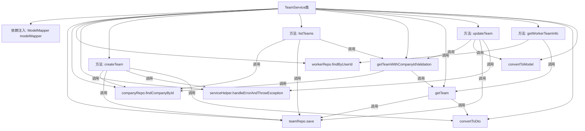

# 基础信息

|      |      |
|------|------|
| 名称 | TeamService |
| 编码语言 | .java |
| 代码路径 | staffjoy/company-svc/src/main/java/xyz/staffjoy/company/service/TeamService.java |
| 包名 | xyz.staffjoy.company.service |
| 依赖项 | ['com.github.structlog4j.ILogger', 'com.github.structlog4j.SLoggerFactory', 'org.modelmapper.ModelMapper', 'org.springframework.beans.factory.annotation.Autowired', 'org.springframework.stereotype.Service', 'org.springframework.util.StringUtils', 'xyz.staffjoy.common.api.ResultCode', 'xyz.staffjoy.common.auditlog.LogEntry', 'xyz.staffjoy.common.auth.AuthContext', 'xyz.staffjoy.common.error.ServiceException', 'xyz.staffjoy.company.dto', 'xyz.staffjoy.company.model.Company', 'xyz.staffjoy.company.model.Team', 'xyz.staffjoy.company.model.Worker', 'xyz.staffjoy.company.repo.CompanyRepo', 'xyz.staffjoy.company.repo.TeamRepo', 'xyz.staffjoy.company.repo.WorkerRepo', 'xyz.staffjoy.company.service.helper.ServiceHelper', 'java.util.List'] |
| 概述说明 | TeamService类处理团队创建、查询、更新及员工团队信息获取，包含日志和异常处理。 |

# 说明

TeamService是一个Spring服务类，负责团队相关业务逻辑。主要功能包括：创建团队（自动填充默认时区和周起始日）、查询团队列表、获取团队详情（带公司ID验证）、更新团队信息。内部方法包含员工团队信息查询（通过用户ID获取关联的公司和团队信息）。所有操作均进行公司存在性校验，异常时抛出ServiceException。关键操作会记录审计日志和异步事件跟踪。使用ModelMapper实现DTO与模型转换，依赖TeamRepo、CompanyRepo等仓储接口进行数据持久化。

# 类列表 Class Summary

| 名称   | 类型  | 说明 |
|-------|------|-------------|
| TeamService | class | TeamService类提供团队管理功能，包括创建、查询、更新团队及获取成员信息。 |

## 类 TeamService

|      |      |
|------|------|
| 访问范围 | @Service;public |
| 类型 | class |
| 名称 | TeamService |
| 说明 | TeamService类提供团队管理功能，包括创建、查询、更新团队及获取成员信息。 |

### UML类图

```mermaid
classDiagram
    class TeamService {
        <<Service>>
        -ILogger logger
        -ModelMapper modelMapper
        -TeamRepo teamRepo
        -CompanyRepo companyRepo
        -WorkerRepo workerRepo
        -ServiceHelper serviceHelper
        +TeamDto createTeam(CreateTeamRequest request)
        +TeamList listTeams(String companyId)
        +TeamDto getTeamWithCompanyIdValidation(String companyId, String teamId)
        +TeamDto getTeam(String teamId)
        +TeamDto updateTeam(TeamDto teamToUpdate)
        +WorkerDto getWorkerTeamInfo(String userId)
        -TeamDto convertToDto(Team team)
        -Team convertToModel(TeamDto teamDto)
    }

    class TeamRepo {
        <<Repository>>
        +save(Team team)
        +findByCompanyId(String companyId)
        +findById(String teamId)
    }

    class CompanyRepo {
        <<Repository>>
        +findCompanyById(String companyId)
    }

    class WorkerRepo {
        <<Repository>>
        +findByUserId(String userId)
    }

    class ServiceHelper {
        <<Helper>>
        +handleErrorAndThrowException(ILogger logger, Exception ex, String errMsg)
        +trackEventAsync(String eventName)
    }

    class ModelMapper {
        <<Mapper>>
        +map(Object source, Class~T~ destinationType)
    }

    class Team {
        <<Entity>>
        -String companyId
        -String name
        -String dayWeekStarts
        -String timezone
        -String color
        +builder() TeamBuilder
    }

    class TeamDto {
        <<DTO>>
        -String companyId
        -String id
        -String name
        -String dayWeekStarts
        -String timezone
        -String color
        +builder() TeamDtoBuilder
    }

    class WorkerDto {
        <<DTO>>
        -String teamId
        -String userId
        -String companyId
        +builder() WorkerDtoBuilder
    }

    class TeamList {
        <<DTO>>
        -List~TeamDto~ teams
        +builder() TeamListBuilder
    }

    class LogEntry {
        <<Entity>>
        -String currentUserId
        -String authorization
        -String targetType
        -String targetId
        -String companyId
        -String teamId
        -String originalContents
        -String updatedContents
        +builder() LogEntryBuilder
    }

    TeamService --> TeamRepo : 依赖
    TeamService --> CompanyRepo : 依赖
    TeamService --> WorkerRepo : 依赖
    TeamService --> ServiceHelper : 依赖
    TeamService --> ModelMapper : 依赖
    TeamService --> Team : 创建/更新
    TeamService --> TeamDto : 转换
    TeamService --> WorkerDto : 转换
    TeamService --> TeamList : 返回
    TeamService --> LogEntry : 记录日志
```

这段类图展示了TeamService的核心结构和依赖关系。TeamService是一个Spring服务类，负责团队相关的业务逻辑，包括创建、查询、更新团队以及获取工人团队信息等功能。它依赖于多个Repository（TeamRepo、CompanyRepo、WorkerRepo）进行数据访问，使用ServiceHelper处理错误和跟踪事件，通过ModelMapper进行DTO和实体之间的转换。类图中还包含了相关的DTO（TeamDto、WorkerDto、TeamList）和实体类（Team、LogEntry）的定义，清晰地展现了系统的分层架构和数据流转关系。

### 内部方法调用关系图

这段代码是TeamService类的完整实现，主要处理团队相关的业务逻辑。流程图展示了类结构、依赖注入关系和方法调用链。核心功能包括团队创建、列表查询、更新操作和成员信息获取，所有操作都包含公司ID验证和异常处理。通过ModelMapper实现DTO与模型转换，使用ServiceHelper统一处理错误和事件跟踪，各方法间形成清晰的调用层级关系。

### 字段列表 Field List

| 名称  | 类型  | 说明 |
|-------|-------|------|
| companyRepo | CompanyRepo | 自动注入公司仓库实例 |
| modelMapper | ModelMapper | 自动注入ModelMapper对象。 |
| serviceHelper | ServiceHelper | 自动注入ServiceHelper实例 |
| workerRepo | WorkerRepo | 自动注入WorkerRepo实例。 |
| teamRepo | TeamRepo | 自动注入TeamRepo实例 |
| logger = SLoggerFactory.getLogger(TeamService.class) | ILogger | 声明TeamService类的静态日志记录器实例。 |

### 方法列表 Method List

| 名称  | 类型  | 说明 |
|-------|-------|------|
| getTeamWithCompanyIdValidation | TeamDto | 获取团队信息前验证公司ID有效性，无效则抛异常。 |
| createTeam | TeamDto | 创建团队方法：检查公司存在，设置默认值，保存团队，记录日志并返回结果。 |
| getWorkerTeamInfo | WorkerDto | 获取员工团队信息：根据用户ID查询员工及所属团队，返回包含团队和公司ID的DTO。无数据时抛异常。 |
| listTeams | TeamList | 根据公司ID查询团队列表，若公司不存在则抛出异常，返回团队列表。 |
| updateTeam | TeamDto | 更新团队信息并记录日志和事件。 |
| convertToModel | Team | 私有方法将TeamDto转换为Team模型。 |
| convertToDto | TeamDto | 私有方法将Team对象转换为TeamDto对象。 |
| getTeam | TeamDto | 获取团队信息，若不存在则抛出异常。 |

