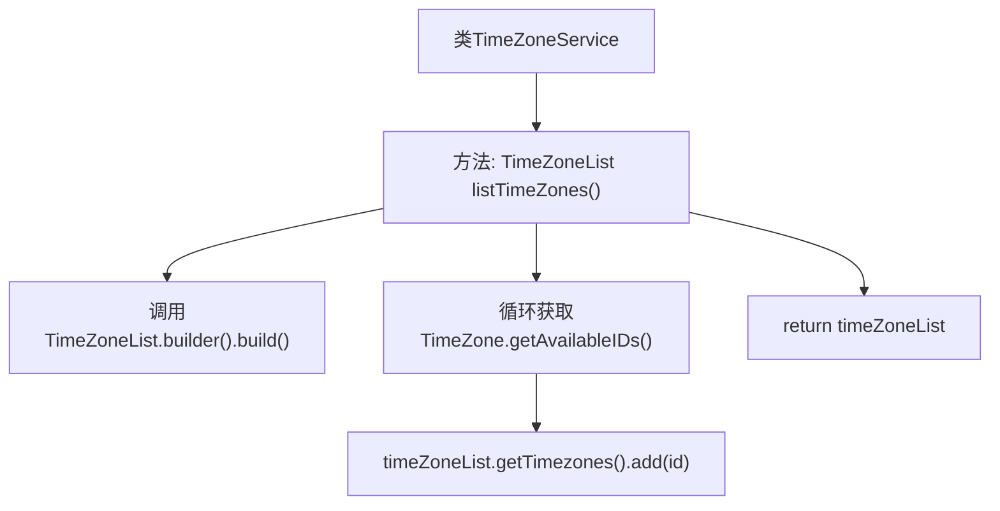

# 基础信息

|      |      |
|------|------|
| 名称 | TimeZoneService |
| 编码语言 | .java |
| 代码路径 | staffjoy/company-svc/src/main/java/xyz/staffjoy/company/service/TimeZoneService.java |
| 包名 | xyz.staffjoy.company.service |
| 依赖项 | ['org.springframework.stereotype.Service', 'xyz.staffjoy.company.dto.TimeZoneList', 'java.util.TimeZone'] |
| 概述说明 | Java服务类TimeZoneService提供获取所有时区ID列表的方法。 |

# 说明

这段内容描述了一个名为TimeZoneService的Java服务类，包含一个listTimeZones方法。该方法通过调用TimeZone.getAvailableIDs()获取所有可用时区ID，将它们逐个添加到TimeZoneList对象中，最后返回填充好的TimeZoneList。整个过程展示了如何收集系统支持的时区信息并封装成特定数据结构。

# 类列表 Class Summary

| 名称   | 类型  | 说明 |
|-------|------|-------------|
| TimeZoneService | class | Java服务类TimeZoneService提供获取所有时区ID列表的方法。 |


## 类 TimeZoneService

|      |      |
|------|------|
| 访问范围 | @Service;public |
| 类型 | class |
| 名称 | TimeZoneService |
| 说明 | Java服务类TimeZoneService提供获取所有时区ID列表的方法。 |


### UML类图

```mermaid
classDiagram
    class TimeZoneService {
        +TimeZoneList listTimeZones()
    }

    class TimeZoneList {
        -List~String~ timezones
        +builder() TimeZoneList$Builder
        +getTimezones() List~String~
    }

    class TimeZoneList$Builder {
        +build() TimeZoneList
    }

    class TimeZone {
        <<static>>
        +getAvailableIDs() String[]
    }

    TimeZoneService --> TimeZoneList : 创建
    TimeZoneService --> TimeZone : 查询ID列表
    TimeZoneList --> TimeZoneList$Builder : 构建实例
```

这段类图展示了时间时区服务的核心结构。TimeZoneService作为服务类，依赖Java原生TimeZone类获取可用时区ID列表，并通过建造者模式构建TimeZoneList对象。TimeZoneList包含时区字符串集合，其内部建造者类负责实例化操作。整体设计简洁，采用标准建造者模式封装集合数据，服务方法直接返回完整时区列表，适用于需要获取系统支持时区信息的场景。


### 内部方法调用关系图



该流程图展示了TimeZoneService类的核心方法listTimeZones()的执行流程。方法首先构建TimeZoneList对象，随后遍历Java内置的所有可用时区ID，逐个添加到列表中，最后返回填充完毕的列表对象。整个过程清晰地反映了数据从获取到封装的处理路径，突出了构建器模式的使用和集合操作的关键步骤。

### 字段列表 Field List

| 名称  | 类型  | 说明 |
|-------|-------|------|

### 方法列表 Method List

| 名称  | 类型  | 说明 |
|-------|-------|------|
| listTimeZones | TimeZoneList | 获取所有可用时区ID并返回列表。 |


